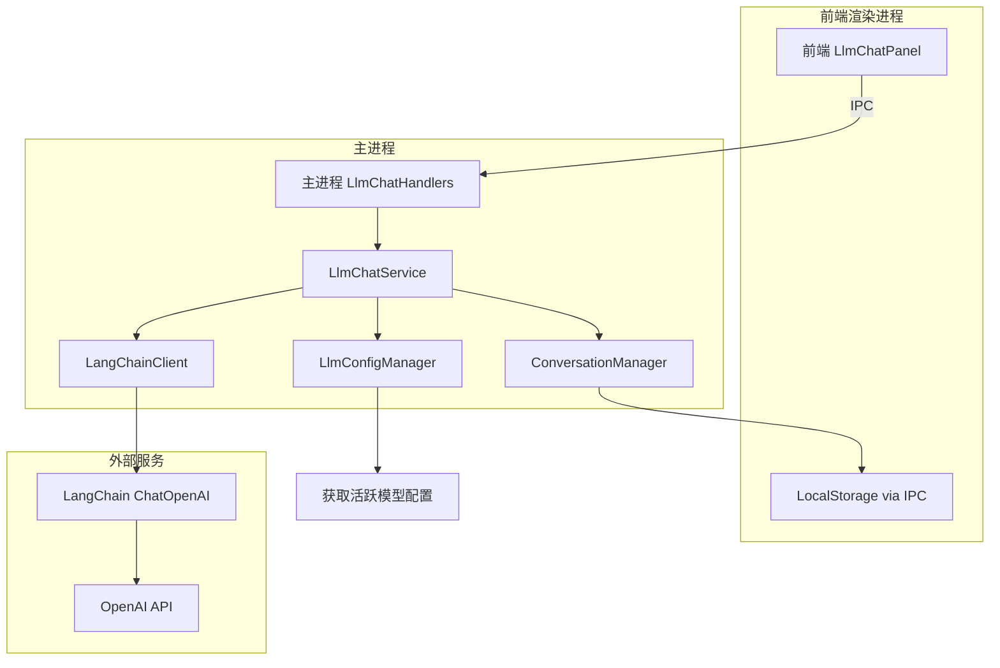

# Nimbria LLM Chat 服务设计文档

**版本**: v1.0  
**创建时间**: 2025年10月15日  
**技术栈**: LangChain + Electron + LocalStorage  

---

## 📋 系统概述

Nimbria 的 LLM Chat 服务提供了一个基于 LangChain 的通用对话系统，支持多模型对话、流式响应、对话历史管理、上下文控制等功能。该服务在 Electron 主进程中运行，通过 IPC 与前端通信，对话数据存储在 LocalStorage 中。

### 🎯 核心特性

- **LangChain 集成**: 使用 LangChain 的 ChatOpenAI 和相关组件
- **多模型支持**: 基于现有的活跃模型配置系统
- **流式响应**: 支持实时流式输出
- **对话管理**: 创建、删除、切换对话
- **历史管理**: 自动保存对话历史到 LocalStorage
- **上下文控制**: Token 计数和自动裁剪
- **错误处理**: 完善的错误处理和重试机制
- **模型配置集成**: 基于现有ModelConfig的智能上下文管理

---

## 🏗️ 系统架构

### 整体架构图



### 数据流

```
用户输入消息
    ↓
前端 ChatInput 组件
    ↓
llmChatStore.sendMessage()
    ↓
IPC: llm-chat:send-message
    ↓
主进程 LlmChatHandlers
    ↓
LlmChatService.sendMessage()
    ↓
LangChainClient.chat() [流式]
    ↓
逐块返回内容
    ↓
IPC: llm-chat:stream-chunk
    ↓
前端更新 UI
    ↓
对话完成，保存到 LocalStorage
```

---

## 📁 文件架构

```
Nimbria/
├── src-electron/
│   ├── services/
│   │   └── llm-chat-service/
│   │       ├── llm-chat-service.ts          # 主服务类
│   │       ├── langchain-client.ts          # LangChain 客户端封装
│   │       ├── conversation-manager.ts      # 对话管理器
│   │       ├── context-manager.ts           # 上下文管理器
│   │       ├── types.ts                     # 类型定义
│   │       └── utils.ts                     # 工具函数
│   ├── ipc/main-renderer/
│   │   └── llm-chat-handlers.ts             # IPC 处理器
│   └── core/
│       └── app-manager.ts                   # 注册服务
├── Client/
│   ├── stores/
│   │   └── llmChat/
│   │       ├── llmChatStore.ts              # 前端 LlmChat Store
│   │       └── types.ts                     # 前端类型定义
│   └── GUI/components/ProjectPage.Shell/Navbar.content/LlmChat/
│       ├── LlmChatPanel.vue                 # 主面板
│       ├── ChatTabs.vue                     # 对话标签页
│       ├── ChatMessages.vue                 # 消息列表
│       ├── ChatInput.vue                    # 输入框
│       └── ModelSelector.vue                # 模型选择器
└── package.json                             # 添加 LangChain 依赖
```

---

## 🔧 核心组件设计

### 1. LangChainClient (LangChain 客户端)

**职责**: 封装 LangChain 的调用逻辑

**核心方法**:
```typescript
class LangChainClient {
  // 初始化客户端
  constructor(config: {
    modelName: string
    apiKey: string
    baseUrl: string
    temperature?: number
    maxTokens?: number
  })
  
  // 发送消息（流式）
  async chatStream(
    messages: ChatMessage[],
    onChunk: (chunk: string) => void,
    onComplete: () => void,
    onError: (error: Error) => void
  ): Promise<void>
  
  // 发送消息（非流式）
  async chat(messages: ChatMessage[]): Promise<string>
  
  // 计算 Token 数量
  async countTokens(messages: ChatMessage[]): Promise<number>
}
```

**LangChain 组件使用**:
- `ChatOpenAI`: 基础聊天模型
- `HumanMessage`, `AIMessage`, `SystemMessage`: 消息类型
- `CallbackManager`: 流式回调管理
- `encoding_for_model`: Token 计数

**ModelConfig 集成**:
- 从 `LlmConfigManager` 获取模型的 `contextLength`、`maxTokens` 等配置
- 根据 `completionMode` 选择使用 Chat 或 Completion API
- 使用 `timeout` 和 `maxRetries` 进行错误处理
- 应用 `systemPromptSeparator` 格式化系统提示词

---

### 2. ConversationManager (对话管理器)

**职责**: 管理对话的创建、删除、历史记录

**数据结构**:
```typescript
interface Conversation {
  id: string                    // 对话ID
  title: string                 // 对话标题
  modelId: string               // 使用的模型ID (providerId.modelName)
  messages: ChatMessage[]       // 消息列表
  createdAt: Date              // 创建时间
  updatedAt: Date              // 更新时间
  settings: ConversationSettings // 对话设置
}

interface ChatMessage {
  id: string
  role: 'system' | 'user' | 'assistant'
  content: string
  timestamp: Date
  metadata?: {
    fileReferences?: FileReference[]  // 文件引用
    tokenCount?: number               // Token 数量
  }
}

interface ConversationSettings {
  temperature: number           // 温度参数 (0-1)
  maxTokens: number            // 最大生成 Token (从ModelConfig继承)
  systemPrompt?: string        // 系统提示词
  contextWindow: number        // 上下文窗口大小 (从ModelConfig.contextLength继承)
  
  // 从 ModelConfig 继承的设置
  timeout: number              // 请求超时 (ms)
  maxRetries: number           // 最大重试次数
  completionMode: '对话' | '补全' // API模式
}
```

**核心方法**:
```typescript
class ConversationManager {
  // 创建新对话
  async createConversation(
    modelId: string,
    settings?: Partial<ConversationSettings>
  ): Promise<Conversation>
  
  // 获取对话
  async getConversation(conversationId: string): Promise<Conversation | null>
  
  // 获取所有对话列表
  async getAllConversations(): Promise<Conversation[]>
  
  // 删除对话
  async deleteConversation(conversationId: string): Promise<void>
  
  // 添加消息到对话
  async addMessage(
    conversationId: string,
    message: Omit<ChatMessage, 'id' | 'timestamp'>
  ): Promise<ChatMessage>
  
  // 更新对话标题
  async updateTitle(conversationId: string, title: string): Promise<void>
  
  // 更新对话设置
  async updateSettings(
    conversationId: string,
    settings: Partial<ConversationSettings>
  ): Promise<void>
  
  // 清空对话消息
  async clearMessages(conversationId: string): Promise<void>
  
  // 保存到 LocalStorage
  private async saveToStorage(): Promise<void>
  
  // 从 LocalStorage 加载
  private async loadFromStorage(): Promise<void>
}
```

**LocalStorage 存储结构**:
```typescript
// Key: nimbria_llm_conversations
{
  conversations: Conversation[]
}
```

---

### 3. ContextManager (上下文管理器)

**职责**: 管理对话上下文，防止超出 Token 限制

**核心方法**:
```typescript
class ContextManager {
  // 裁剪消息列表以适应上下文窗口
  async trimMessages(
    messages: ChatMessage[],
    maxTokens: number,
    preserveSystemPrompt: boolean = true
  ): Promise<ChatMessage[]>
  
  // 计算消息列表的总 Token 数
  async calculateTotalTokens(messages: ChatMessage[]): Promise<number>
  
  // 智能裁剪策略 (基于ModelConfig.contextLength)
  // 1. 保留系统提示词
  // 2. 保留最新的消息
  // 3. 从最旧的消息开始删除，保持对话连贯性
  async smartTrim(
    messages: ChatMessage[],
    maxTokens: number
  ): Promise<ChatMessage[]>
}
```

**裁剪策略**:
```
1. 始终保留系统提示词（如果有）
2. 始终保留最新的用户消息
3. 从最旧的消息开始删除，直到满足 Token 限制
4. 保留对话的连贯性（成对保留 user-assistant）
```

---

### 4. LlmChatService (主服务类)

**职责**: 协调各个组件，提供统一的服务接口

**核心方法**:
```typescript
class LlmChatService {
  private conversationManager: ConversationManager
  private contextManager: ContextManager
  private llmConfigManager: LlmConfigManager
  private activeClients: Map<string, LangChainClient>
  
  // 初始化服务
  async initialize(): Promise<void>
  
  // 创建新对话
  async createConversation(
    modelId: string,
    settings?: Partial<ConversationSettings>
  ): Promise<Conversation>
  
  // 发送消息（流式）
  async sendMessage(
    conversationId: string,
    content: string,
    options?: {
      onChunk?: (chunk: string) => void
      onComplete?: () => void
      onError?: (error: Error) => void
    }
  ): Promise<void>
  
  // 重新生成最后一条消息
  async regenerateLastMessage(
    conversationId: string,
    options?: {
      onChunk?: (chunk: string) => void
      onComplete?: () => void
      onError?: (error: Error) => void
    }
  ): Promise<void>
  
  // 删除消息
  async deleteMessage(
    conversationId: string,
    messageId: string
  ): Promise<void>
  
  // 获取对话列表
  async getConversations(): Promise<Conversation[]>
  
  // 删除对话
  async deleteConversation(conversationId: string): Promise<void>
  
  // 更新对话设置
  async updateConversationSettings(
    conversationId: string,
    settings: Partial<ConversationSettings>
  ): Promise<void>
  
  // 获取可用模型列表
  async getAvailableModels(): Promise<ActiveModel[]>
  
  // 切换对话使用的模型
  async switchModel(
    conversationId: string,
    modelId: string
  ): Promise<void>
  
  // 获取或创建 LangChain 客户端
  private async getOrCreateClient(modelId: string): Promise<LangChainClient>
  
  // 准备发送的消息列表（包含上下文管理）
  private async prepareMessages(
    conversation: Conversation,
    newMessage: string
  ): Promise<ChatMessage[]>
}
```

---

## 🔧 ModelConfig 集成设计

### 从现有系统获取模型配置

**LlmChatService 初始化时**:
```typescript
class LlmChatService {
  private async getModelConfig(modelId: string): Promise<ModelConfig> {
    // 解析 modelId: "providerId.modelName"
    const [providerId, modelName] = modelId.split('.')
    
    // 从 LlmConfigManager 获取提供商配置
    const provider = await this.llmConfigManager.getProvider(providerId)
    if (!provider) {
      throw new Error(`提供商 ${providerId} 不存在`)
    }
    
    // 获取模型特定配置（如果有）
    const modelGroup = provider.supportedModels.find(g => 
      g.models.some(m => m.name === modelName)
    )
    const model = modelGroup?.models.find(m => m.name === modelName)
    
    // 合并配置：默认配置 + 模型特定配置
    return {
      ...provider.defaultConfig,
      ...model?.config
    }
  }
}
```

### 对话设置继承

**创建对话时自动继承ModelConfig**:
```typescript
async createConversation(modelId: string, userSettings?: Partial<ConversationSettings>) {
  const modelConfig = await this.getModelConfig(modelId)
  
  // 从 ModelConfig 继承默认设置
  const defaultSettings: ConversationSettings = {
    temperature: 0.7,                           // 用户可调整
    maxTokens: modelConfig.maxTokens,           // 从模型配置继承
    contextWindow: modelConfig.contextLength,   // 从模型配置继承
    timeout: modelConfig.timeout,               // 从模型配置继承
    maxRetries: modelConfig.maxRetries,         // 从模型配置继承
    completionMode: modelConfig.completionMode, // 从模型配置继承
    systemPrompt: undefined                     // 用户可设置
  }
  
  // 用户设置覆盖默认设置
  const finalSettings = { ...defaultSettings, ...userSettings }
  
  return this.conversationManager.createConversation(modelId, finalSettings)
}
```

### 上下文管理集成

**ContextManager 使用 ModelConfig**:
```typescript
class ContextManager {
  async trimMessages(
    messages: ChatMessage[],
    conversation: Conversation
  ): Promise<ChatMessage[]> {
    const modelConfig = await this.getModelConfig(conversation.modelId)
    
    // 使用模型的实际上下文长度
    const maxContextTokens = modelConfig.contextLength
    
    // 为生成预留空间
    const reservedTokens = Math.min(
      conversation.settings.maxTokens,
      modelConfig.maxTokens
    )
    
    const availableTokens = maxContextTokens - reservedTokens
    
    return this.smartTrim(messages, availableTokens)
  }
}
```

### LangChain 客户端配置

**根据 ModelConfig 配置 LangChain**:
```typescript
private async createLangChainClient(modelId: string): Promise<LangChainClient> {
  const modelConfig = await this.getModelConfig(modelId)
  const [providerId, modelName] = modelId.split('.')
  const provider = await this.llmConfigManager.getProvider(providerId)
  
  return new LangChainClient({
    modelName,
    apiKey: provider.apiKey,
    baseUrl: provider.baseUrl,
    temperature: 0.7,                    // 对话时可调整
    maxTokens: modelConfig.maxTokens,    // 从配置继承
    timeout: modelConfig.timeout,        // 从配置继承
    maxRetries: modelConfig.maxRetries,  // 从配置继承
    
    // 根据 completionMode 选择 API 类型
    useChat: modelConfig.completionMode === '对话'
  })
}
```

### 实时配置更新

**监听模型配置变更**:
```typescript
class LlmChatService {
  async initialize() {
    // 监听模型配置变更
    this.llmConfigManager.onProviderUpdated((providerId) => {
      // 清理相关的客户端缓存
      for (const [modelId, client] of this.activeClients.entries()) {
        if (modelId.startsWith(`${providerId}.`)) {
          this.activeClients.delete(modelId)
        }
      }
    })
  }
}
```

---

## 🔗 IPC 通信协议

### 对话管理 IPC

| 通道名 | 请求类型 | 响应类型 | 用途 |
|-------|---------|----------|------|
| `llm-chat:create-conversation` | `{ modelId: string; settings?: Partial<ConversationSettings> }` | `{ success: boolean; conversation?: Conversation }` | 创建新对话 |
| `llm-chat:get-conversations` | `undefined` | `{ success: boolean; conversations?: Conversation[] }` | 获取所有对话 |
| `llm-chat:get-conversation` | `{ conversationId: string }` | `{ success: boolean; conversation?: Conversation }` | 获取单个对话 |
| `llm-chat:delete-conversation` | `{ conversationId: string }` | `{ success: boolean }` | 删除对话 |
| `llm-chat:update-title` | `{ conversationId: string; title: string }` | `{ success: boolean }` | 更新对话标题 |
| `llm-chat:update-settings` | `{ conversationId: string; settings: Partial<ConversationSettings> }` | `{ success: boolean }` | 更新对话设置 |

### 消息管理 IPC

| 通道名 | 请求类型 | 响应类型 | 用途 |
|-------|---------|----------|------|
| `llm-chat:send-message` | `{ conversationId: string; content: string; fileReferences?: FileReference[] }` | `{ success: boolean; messageId?: string }` | 发送消息 |
| `llm-chat:stream-chunk` | - | `{ conversationId: string; messageId: string; chunk: string }` | 流式响应块（主进程 → 渲染进程） |
| `llm-chat:stream-complete` | - | `{ conversationId: string; messageId: string }` | 流式响应完成 |
| `llm-chat:stream-error` | - | `{ conversationId: string; error: string }` | 流式响应错误 |
| `llm-chat:regenerate-message` | `{ conversationId: string; messageId: string }` | `{ success: boolean }` | 重新生成消息 |
| `llm-chat:delete-message` | `{ conversationId: string; messageId: string }` | `{ success: boolean }` | 删除消息 |

### 模型管理 IPC

| 通道名 | 请求类型 | 响应类型 | 用途 |
|-------|---------|----------|------|
| `llm-chat:get-available-models` | `undefined` | `{ success: boolean; models?: ActiveModel[] }` | 获取可用模型 |
| `llm-chat:switch-model` | `{ conversationId: string; modelId: string }` | `{ success: boolean }` | 切换对话模型 |

---

## 📊 前端 Store 设计

### llmChatStore.ts 状态结构

```typescript
interface ChatState {
  // 对话列表
  conversations: Conversation[]
  
  // 当前活跃对话ID
  activeConversationId: string | null
  
  // 加载状态
  isLoading: boolean
  isSending: boolean
  
  // 选中的模型列表（用户在 ModelSelector 中选择的）
  selectedModels: string[]  // modelId 数组
  
  // 默认模型
  defaultModel: string | null
  
  // 流式响应临时内容
  streamingContent: {
    conversationId: string
    messageId: string
    content: string
  } | null
  
  // 错误信息
  error: string | null
}
```

### llmChatStore.ts 核心方法

```typescript
export const useLlmChatStore = defineStore('llmChat', () => {
  // 状态
  const conversations = ref<Conversation[]>([])
  const activeConversationId = ref<string | null>(null)
  const isLoading = ref(false)
  const isSending = ref(false)
  const selectedModels = ref<string[]>([])
  const defaultModel = ref<string | null>(null)
  const streamingContent = ref<StreamingContent | null>(null)
  const error = ref<string | null>(null)
  
  // 计算属性
  const activeConversation = computed(() => 
    conversations.value.find(c => c.id === activeConversationId.value)
  )
  
  const sortedConversations = computed(() => 
    [...conversations.value].sort((a, b) => 
      b.updatedAt.getTime() - a.updatedAt.getTime()
    )
  )
  
  // 初始化
  async function initialize() {
    await loadConversations()
    await loadSelectedModels()
    setupStreamListeners()
  }
  
  // 加载对话列表
  async function loadConversations() {
    const result = await window.api.llmChat.getConversations()
    if (result.success) {
      conversations.value = result.conversations || []
    }
  }
  
  // 创建新对话
  async function createConversation(modelId?: string) {
    const model = modelId || defaultModel.value || selectedModels.value[0]
    if (!model) {
      error.value = '请先选择一个模型'
      return null
    }
    
    const result = await window.api.llmChat.createConversation({ modelId: model })
    if (result.success && result.conversation) {
      conversations.value.push(result.conversation)
      activeConversationId.value = result.conversation.id
      return result.conversation
    }
    return null
  }
  
  // 发送消息
  async function sendMessage(content: string) {
    if (!activeConversationId.value) {
      error.value = '没有活跃的对话'
      return
    }
    
    isSending.value = true
    error.value = null
    
    // 添加用户消息到本地
    const userMessage: ChatMessage = {
      id: nanoid(),
      role: 'user',
      content,
      timestamp: new Date()
    }
    
    const conversation = activeConversation.value
    if (conversation) {
      conversation.messages.push(userMessage)
    }
    
    // 创建占位 AI 消息
    const aiMessage: ChatMessage = {
      id: nanoid(),
      role: 'assistant',
      content: '',
      timestamp: new Date()
    }
    conversation?.messages.push(aiMessage)
    
    // 初始化流式内容
    streamingContent.value = {
      conversationId: activeConversationId.value,
      messageId: aiMessage.id,
      content: ''
    }
    
    // 发送到主进程
    const result = await window.api.llmChat.sendMessage({
      conversationId: activeConversationId.value,
      content
    })
    
    if (!result.success) {
      error.value = result.error || '发送失败'
      isSending.value = false
    }
  }
  
  // 设置流式监听器
  function setupStreamListeners() {
    // 接收流式块
    window.api.llmChat.onStreamChunk((data) => {
      if (streamingContent.value?.messageId === data.messageId) {
        streamingContent.value.content += data.chunk
        
        // 更新对话中的消息
        const conversation = conversations.value.find(c => c.id === data.conversationId)
        const message = conversation?.messages.find(m => m.id === data.messageId)
        if (message) {
          message.content = streamingContent.value.content
        }
      }
    })
    
    // 流式完成
    window.api.llmChat.onStreamComplete((data) => {
      if (streamingContent.value?.messageId === data.messageId) {
        streamingContent.value = null
        isSending.value = false
        
        // 更新对话时间
        const conversation = conversations.value.find(c => c.id === data.conversationId)
        if (conversation) {
          conversation.updatedAt = new Date()
        }
      }
    })
    
    // 流式错误
    window.api.llmChat.onStreamError((data) => {
      error.value = data.error
      streamingContent.value = null
      isSending.value = false
    })
  }
  
  // 删除对话
  async function deleteConversation(conversationId: string) {
    const result = await window.api.llmChat.deleteConversation({ conversationId })
    if (result.success) {
      conversations.value = conversations.value.filter(c => c.id !== conversationId)
      if (activeConversationId.value === conversationId) {
        activeConversationId.value = null
      }
    }
  }
  
  // 切换活跃对话
  function setActiveConversation(conversationId: string) {
    activeConversationId.value = conversationId
  }
  
  // 加载选中的模型
  async function loadSelectedModels() {
    const stored = localStorage.getItem('nimbria_llm_chat_selected_models')
    if (stored) {
      selectedModels.value = JSON.parse(stored)
    }
  }
  
  // 保存选中的模型
  function saveSelectedModels() {
    localStorage.setItem('nimbria_llm_chat_selected_models', JSON.stringify(selectedModels.value))
  }
  
  // 设置选中的模型
  function setSelectedModels(models: string[]) {
    selectedModels.value = models
    saveSelectedModels()
    
    // 设置默认模型为第一个
    if (models.length > 0 && !defaultModel.value) {
      defaultModel.value = models[0]
    }
  }
  
  return {
    // 状态
    conversations,
    activeConversationId,
    isLoading,
    isSending,
    selectedModels,
    defaultModel,
    streamingContent,
    error,
    
    // 计算属性
    activeConversation,
    sortedConversations,
    
    // 方法
    initialize,
    loadConversations,
    createConversation,
    sendMessage,
    deleteConversation,
    setActiveConversation,
    setSelectedModels
  }
})
```

---

## 🔄 完整交互流程

### 1. 初始化流程

```
1. 用户打开项目页面
   ↓
2. LlmChatPanel 组件挂载
   ↓
3. llmChatStore.initialize()
   ↓
4. 加载对话列表 (从 LocalStorage)
   ↓
5. 加载选中的模型列表 (从 LocalStorage)
   ↓
6. 设置流式监听器
   ↓
7. 显示对话列表
```

### 2. 创建对话流程

```
1. 用户点击"新建对话"
   ↓
2. llmChatStore.createConversation()
   ↓
3. IPC: llm-chat:create-conversation
   ↓
4. 主进程 LlmChatService.createConversation()
   ↓
5. ConversationManager 创建对话对象
   ↓
6. 保存到 LocalStorage
   ↓
7. 返回对话对象
   ↓
8. 前端添加到列表并设为活跃
```

### 3. 发送消息流程（流式）

```
1. 用户输入消息并点击发送
   ↓
2. llmChatStore.sendMessage(content)
   ↓
3. 本地添加用户消息到对话
   ↓
4. 创建占位 AI 消息
   ↓
5. IPC: llm-chat:send-message
   ↓
6. 主进程 LlmChatService.sendMessage()
   ↓
7. 准备消息列表（上下文管理）
   ↓
8. 获取 LangChainClient
   ↓
9. 调用 chatStream()
   ↓
10. LangChain 开始流式返回
    ↓
11. 每个块通过 IPC 发送到前端
    ↓ (循环)
12. 前端接收块，更新 UI
    ↓
13. 流式完成，保存完整消息
    ↓
14. 更新 LocalStorage
```

---

## 📦 依赖包

### 需要安装的 npm 包

```json
{
  "dependencies": {
    "langchain": "^0.1.0",
    "@langchain/openai": "^0.0.19",
    "@langchain/core": "^0.1.0",
    "tiktoken": "^1.0.10"
  }
}
```

---

## 🚀 实现优先级

### Phase 1: 基础对话功能 (核心)
- ✅ LangChainClient 基础封装
- ✅ ConversationManager 对话管理
- ✅ LlmChatService 主服务
- ✅ IPC 通信协议
- ✅ 前端 chatStore
- ✅ 流式响应

### Phase 2: 上下文管理
- ⏳ ContextManager 实现
- ⏳ Token 计数
- ⏳ 智能裁剪

### Phase 3: 体验优化
- ⏳ 重新生成消息
- ⏳ 对话导出
- ⏳ 搜索历史消息
- ⏳ 对话标题自动生成

### Phase 4: 高级功能
- ⏳ 错误重试机制
- ⏳ 性能优化
- ⏳ 上下文使用可视化
- ⏳ 对话设置预设

---

## 🐛 错误处理策略

### 常见错误类型

| 错误类型 | 处理策略 |
|---------|---------|
| 网络错误 | 自动重试 3 次，指数退避 |
| API 密钥无效 | 提示用户检查配置 |
| Token 超限 | 自动裁剪上下文 |
| 模型不可用 | 提示切换模型 |
| 流式中断 | 保存已接收内容，标记为未完成 |

### 错误恢复机制

```typescript
// 自动重试
async function sendMessageWithRetry(
  conversationId: string,
  content: string,
  maxRetries: number = 3
) {
  for (let i = 0; i < maxRetries; i++) {
    try {
      await sendMessage(conversationId, content)
      return
    } catch (error) {
      if (i === maxRetries - 1) throw error
      await delay(Math.pow(2, i) * 1000) // 指数退避
    }
  }
}
```

---

## 📈 性能优化

### 1. 消息加载优化
- 分页加载历史消息
- 虚拟滚动长对话列表

### 2. Token 计数缓存
- 缓存已计算的 Token 数
- 避免重复计算

### 3. 流式响应优化
- 批量更新 UI（防抖）
- 使用 Web Worker 处理大量文本

### 4. LocalStorage 优化
- 压缩存储数据
- 定期清理旧对话
- 限制单个对话的消息数量

---

## 📖 相关文档

- [AI模型服务与调用系统设计文档](../Ai 模型服务专项/AI模型服务与调用系统设计文档.md)
- [LLM配置系统设计文档](../Ai 模型服务专项/LLM配置系统设计文档.md)
- [LLM对话系统交互设计](./Design.md)

---

**最后更新**: 2025年10月15日  
**负责人**: Nimbria 开发团队

