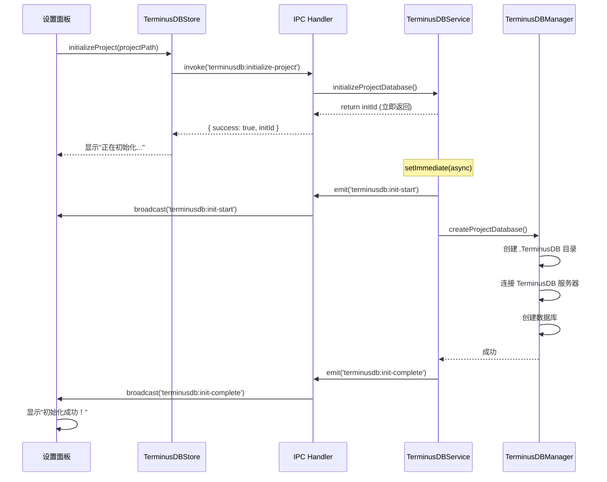

# TerminusDB 集成设计文档

**版本**: v1.0  
**创建时间**: 2025年10月16日  
**架构范式**: 严格遵循事件驱动架构  
**参考文档**: SQLite数据库系统实现、事件驱动架构范式总结

---

## 📋 系统概述

TerminusDB 集成系统是 Nimbria 小说创作工具的**图数据库**解决方案，专门用于管理小说设定（人物、组织、事件、关系等）。采用**严格的事件驱动架构模式**，实现**一个项目一个独立数据库**的设计。

### 🎯 核心目标

1. ✅ **项目独立数据库**：每个项目拥有独立的 TerminusDB 实例
2. ✅ **基础初始化功能**：仅实现数据库初始化，暂不涉及复杂数据操作
3. ✅ **Web 工具访问**：支持通过浏览器访问 TerminusDB 管理界面
4. ✅ **事件驱动操作**：所有异步操作立即返回ID，通过事件反馈状态
5. ✅ **设置面板集成**：在项目设置面板提供初始化和访问按钮

### 🎨 核心特性

- **事件驱动架构**: 继承 EventEmitter，通过事件发射状态
- **立即返回标识**: 异步方法立即返回 initId，不阻塞主流程
- **多窗口支持**: 事件自动广播到所有窗口
- **TypeScript 类型安全**: 完整的类型定义和编译时检查
- **详细日志输出**: 控制台显示完整的操作过程

---

## 🏗️ 系统架构

### 组件层次结构

```
AppManager (应用管理器)
└── TerminusDBService (主服务类, EventEmitter)
    ├── TerminusDBManager (连接管理)
    │   └── ProjectTerminusDB[] (项目数据库池)
    └── Schema System (Schema管理, 暂未实现)
        └── v1.0.0.schema.ts (版本化Schema)
```

### 数据流架构

```
Vue组件 ↔ TerminusDBStore (Pinia) ↔ IPC通信 ↔ TerminusDBService ↔ TerminusDB Server
```

### 事件驱动流程



---

## 📁 文件结构

### 后端服务

| 文件路径 | 职责 | 状态 |
|---------|------|------|
| `src-electron/services/terminusdb-service/terminusdb-service.ts` | 主服务类，事件驱动的核心接口 | 待创建 |
| `src-electron/services/terminusdb-service/terminusdb-manager.ts` | TerminusDB 连接管理，数据库创建 | 待创建 |
| `src-electron/services/terminusdb-service/project-terminusdb.ts` | 项目级数据库操作封装 | 待创建 |

### Schema定义（暂不实现）

| 文件路径 | 职责 | 状态 |
|---------|------|------|
| `src-electron/services/terminusdb-service/schema/base-schema.ts` | 基础Schema类型定义 | 待创建 |
| `src-electron/services/terminusdb-service/schema/versions/v1.0.0.schema.ts` | v1.0.0版本Schema定义 | 待创建 |
| `src-electron/services/terminusdb-service/schema/versions/index.ts` | Schema版本导出 | 待创建 |

### IPC通信

| 文件路径 | 职责 | 状态 |
|---------|------|------|
| `src-electron/ipc/main-renderer/terminusdb-handlers.ts` | TerminusDB IPC处理器，事件转发 | 待创建 |

### 前端状态管理

| 文件路径 | 职责 | 状态 |
|---------|------|------|
| `Client/stores/terminusdb/terminusdbStore.ts` | 前端数据库状态管理，操作监控 | 待创建 |

### UI组件

| 文件路径 | 职责 | 状态 |
|---------|------|------|
| `Client/GUI/components/ProjectPage.Shell/Navbar.content/Settings/SettingsPanel.vue` | 设置面板，添加TerminusDB控制按钮 | 待修改 |

---

## 🔧 技术实现细节

### 1. 事件驱动架构实现

#### TerminusDBService 核心特性

```typescript
export class TerminusDBService extends EventEmitter {
  // ✅ 立即返回操作ID，通过事件反馈状态
  async initializeProjectDatabase(projectPath: string): Promise<string> {
    const initId = `terminusdb-init-${Date.now()}_${Math.random().toString(36).slice(2, 11)}`
    
    // 立即发射开始事件
    this.emit('terminusdb:init-start', { initId, projectPath })
    
    // 异步处理，不阻塞返回
    setImmediate(async () => {
      try {
        const projectDB = await this.terminusManager.createProjectDatabase(projectPath)
        this.projectDatabases.set(projectPath, projectDB)
        this.emit('terminusdb:init-complete', { initId, projectPath, success: true })
      } catch (error: any) {
        this.emit('terminusdb:init-error', { initId, projectPath, error: error.message })
      }
    })
    
    return initId  // 立即返回
  }
}
```

#### 事件类型定义

```typescript
interface TerminusDBServiceEvents {
  'terminusdb:init-start': { initId: string; projectPath: string }
  'terminusdb:init-complete': { initId: string; projectPath: string; success: boolean }
  'terminusdb:init-error': { initId: string; projectPath: string; error: string }
}
```

### 2. 项目数据库设计

#### 目录结构
```
{项目根目录}/
└── .TerminusDB/           # TerminusDB 相关文件目录
    └── config.json        # 配置文件（可选）
```

#### 数据库命名规则
- 使用项目目录名作为数据库名
- 自动处理特殊字符：`project_name.replace(/[^a-zA-Z0-9_]/g, '_')`
- 示例：`My Novel Project` → `My_Novel_Project`

### 3. TerminusDB 连接配置

```typescript
export class ProjectTerminusDB {
  private client: TerminusClient | null = null
  private serverPort: number = 6363  // TerminusDB 默认端口
  
  async initialize(): Promise<void> {
    // 连接到本地 TerminusDB 服务器
    this.client = new TerminusClient(`http://localhost:${this.serverPort}/`)
    
    // 创建数据库（如果不存在）
    await this.client.createDatabase(this.dbName, {
      label: `${this.dbName} - 小说设定数据库`,
      comment: '用于存储小说人物、组织、事件等设定的图数据库'
    })
  }
}
```

---

## 🗄️ 状态管理详解

### TerminusDBStore 核心状态

```typescript
interface TerminusDBStore {
  // 项目数据库状态
  projectDatabases: Map<string, boolean>     // 项目路径 -> 是否已初始化
  
  // 操作监控
  activeOperations: Map<string, TerminusDBOperation>  // 操作ID -> 操作状态
  
  // 操作历史
  operationHistory: TerminusDBOperation[]    // 历史操作记录（最近10条）
}
```

### 关键方法

```typescript
// 初始化项目 TerminusDB
async initializeProject(projectPath: string): Promise<string | null>

// 打开 Web 工具（使用系统默认浏览器）
async openWebTool(projectPath: string): Promise<void>

// 设置事件监听器
setupListeners(): void

// 清理已完成的操作
clearCompletedOperations(): void
```

---

## 🔗 IPC 通信协议

### TerminusDB 操作 IPC 通道

| 通道名 | 请求类型 | 响应类型 | 用途 |
|-------|---------|----------|------|
| `terminusdb:initialize-project` | `{ projectPath: string }` | `{ success: boolean, initId?: string }` | 初始化项目数据库 |
| `terminusdb:get-web-tool-url` | `{ projectPath: string }` | `{ success: boolean, url?: string }` | 获取Web工具地址 |
| `terminusdb:open-web-tool` | `{ projectPath: string }` | `{ success: boolean, url?: string }` | 打开Web工具 |

### 事件广播通道

| 事件名 | 数据类型 | 用途 |
|-------|---------|------|
| `terminusdb:init-start` | `{ initId, projectPath }` | 初始化开始 |
| `terminusdb:init-complete` | `{ initId, projectPath, success }` | 初始化完成 |
| `terminusdb:init-error` | `{ initId, projectPath, error }` | 初始化失败 |

---

## 🎨 UI 设计

### 设置面板布局

```
┌─────────────────────────────────┐
│ 设置                             │
├─────────────────────────────────┤
│  [DemoPage]                     │
│                                  │
│ TerminusDB 设定数据库            │
│ ┌─────────────────────────────┐ │
│ │ [✓ 已初始化] / [初始化...]  │ │
│ │ [打开 Web 工具]              │ │
│ │ ✓ TerminusDB 已就绪          │ │
│ └─────────────────────────────┘ │
└─────────────────────────────────┘
```

### 按钮状态

| 状态 | 初始化按钮 | Web工具按钮 | 状态提示 |
|------|-----------|------------|---------|
| 未初始化 | `[初始化 TerminusDB]` (可点击, 绿色) | `[打开 Web 工具]` (禁用) | 无 |
| 初始化中 | `[初始化中...]` (loading) | `[打开 Web 工具]` (禁用) | 无 |
| 已初始化 | `[已初始化]` (禁用) | `[打开 Web 工具]` (可点击, 蓝色) | `✓ TerminusDB 已就绪` |
| 初始化失败 | `[初始化 TerminusDB]` (可点击, 绿色) | `[打开 Web 工具]` (禁用) | 错误消息 |

---

## 🚀 性能优化

### 1. 连接池管理

```typescript
export class TerminusDBManager {
  private projectDbs: Map<string, ProjectTerminusDB> = new Map()
  
  // 连接复用，避免重复创建
  getProjectDatabase(projectPath: string): ProjectTerminusDB | null {
    return this.projectDbs.get(projectPath) || null
  }
}
```

### 2. 懒加载策略

- 只在用户主动点击"初始化"时才创建数据库
- 不在项目打开时自动初始化（与SQLite不同）

### 3. 资源清理

```typescript
// 应用关闭时清理所有连接
async cleanup(): Promise<void> {
  for (const [projectPath, projectDB] of this.projectDatabases.entries()) {
    await projectDB.close()
  }
  this.projectDatabases.clear()
}
```

---

## 🔧 开发指南

### 添加新的IPC接口

1. **在 TerminusDBService 中添加方法**
   ```typescript
   async yourOperation(projectPath: string, params: any): Promise<string> {
     const opId = generateId()
     this.emit('terminusdb:operation-start', { opId, projectPath })
     this.processAsync(opId, projectPath, params)
     return opId
   }
   ```

2. **在 IPC Handler 中注册**
   ```typescript
   // 事件监听器
   terminusDBService.on('terminusdb:operation-complete', (data) => {
     BrowserWindow.getAllWindows().forEach(win => {
       win.webContents.send('terminusdb:operation-complete', data)
     })
   })
   
   // IPC Handler
   ipcMain.handle('terminusdb:your-operation', async (_event, { projectPath, params }) => {
     const opId = await terminusDBService.yourOperation(projectPath, params)
     return { success: true, opId }
   })
   ```

3. **在 Store 中添加方法**
   ```typescript
   const yourOperation = async (projectPath: string, params: any) => {
     const result = await window.electronAPI.invoke('terminusdb:your-operation', { projectPath, params })
     if (result.success) {
       // 记录操作状态
     }
     return result.opId
   }
   ```

---

## 🧪 测试策略

### 测试前提条件

1. ✅ **TerminusDB 服务器运行中**
   ```powershell
   # Docker 方式（推荐）
   docker run -d --name terminusdb -p 6363:6363 terminusdb/terminusdb-server:latest
   
   # 验证服务器状态
   curl http://localhost:6363
   ```

2. ✅ **已安装依赖**
   ```powershell
   npm install @terminusdb/terminusdb-client
   ```

### 单元测试重点

1. **TerminusDBService**
   - 事件发射和监听测试
   - 操作ID生成和管理测试
   - 错误处理测试

2. **TerminusDBManager**
   - 数据库连接创建测试
   - 目录创建测试
   - 连接复用测试

3. **ProjectTerminusDB**
   - 初始化流程测试
   - 数据库创建测试
   - URL生成测试

### 集成测试场景

| 测试场景 | 验证点 | 预期结果 |
|---------|-------|---------|
| 应用启动 | TerminusDB服务初始化 | 无报错，服务注册成功 |
| 点击初始化按钮 | 完整初始化流程 | `.TerminusDB`目录创建，事件正确发射 |
| 点击Web工具按钮 | 浏览器打开 | 默认浏览器打开`http://localhost:6363` |
| 服务器未启动 | 错误处理 | 显示错误消息，按钮可重试 |
| 多项目切换 | 状态隔离 | 每个项目状态独立 |

### E2E 测试步骤

详见测试文档的**测试步骤**部分（测试1-6）。

---

## 📊 监控与调试

### 关键日志格式

```typescript
// 统一日志格式
console.log(`🎬 [TerminusDBService] 开始初始化项目 TerminusDB: ${projectPath}`)
console.log(`📦 [TerminusDBManager] 创建项目 TerminusDB...`)
console.log(`📁 [TerminusDBManager] 创建 TerminusDB 目录: ${dir}`)
console.log(`🔗 [ProjectTerminusDB] 连接到 TerminusDB 服务器: ${url}`)
console.log(`✅ [TerminusDBService] 项目 TerminusDB 初始化成功`)
console.log(`❌ [TerminusDBService] 项目 TerminusDB 初始化失败: ${error}`)
```

### 调试技巧

1. **控制台日志**：关注 `[TerminusDBService]` 前缀的日志
2. **Electron DevTools**：查看前端 Store 状态
3. **TerminusDB Dashboard**：访问 `http://localhost:6363` 查看数据库状态

---

## 🔄 版本历史与路线图

### 当前版本 (v1.0) - 基础初始化

- ✅ 项目独立数据库架构
- ✅ 事件驱动的初始化流程
- ✅ Web 工具访问功能
- ✅ 设置面板UI集成
- ❌ Schema 定义（预留）
- ❌ 数据操作API（预留）

### 计划中的功能 (v1.1+)

- [ ] Schema 定义系统（人物、组织、事件）
- [ ] 数据CRUD操作接口
- [ ] 关系查询功能
- [ ] 版本控制和分支管理
- [ ] 图可视化界面
- [ ] AI写作集成（设定上下文查询）

---

## 📖 相关文档

- [SQLite数据库系统功能文档](../功能与架构设计/数据服务专项/Sqlite数据库系统功能文档.md)
- [事件驱动架构范式总结文档](../Workflow/事件驱动架构范式总结文档.md)
- [数据库系统初始实现总结](../总结/数据库系统初始实现总结_2025年10月15日.md)
- [better-sqlite3配置总结](../总结/better-sqlite3配置总结_2025年10月15日.md)

---

## ✅ 实施检查清单

### 开发阶段
- [ ] 创建 `terminusdb-service.ts`
- [ ] 创建 `terminusdb-manager.ts`
- [ ] 创建 `project-terminusdb.ts`
- [ ] 创建 `terminusdb-handlers.ts`
- [ ] 创建 `terminusdbStore.ts`
- [ ] 修改 `SettingsPanel.vue`
- [ ] 修改 `app-manager.ts`
- [ ] 更新 `package.json`

### 测试阶段
- [ ] 完成单元测试
- [ ] 完成集成测试
- [ ] 完成E2E测试
- [ ] 验证多项目支持
- [ ] 验证错误处理

### 文档阶段
- [ ] 编写测试文档
- [ ] 编写开发指南
- [ ] 更新架构文档

---

**最后更新**: 2025年10月16日  
**负责人**: Nimbria 开发团队  
**状态**: 设计完成，等待实施

---

## 💡 关键差异：TerminusDB vs SQLite

| 维度 | SQLite | TerminusDB |
|------|--------|-----------|
| **初始化时机** | 应用启动时自动创建全局DB<br/>项目打开时自动创建项目DB | **用户手动触发初始化**<br/>不自动创建 |
| **数据库类型** | 关系型数据库 | **图数据库** |
| **Web 工具** | 无（需第三方工具） | **内置 Web Dashboard** |
| **连接方式** | 文件系统 | **HTTP API（需服务器运行）** |
| **用途** | 存储项目元数据、文档 | **存储小说设定关系图** |

---

