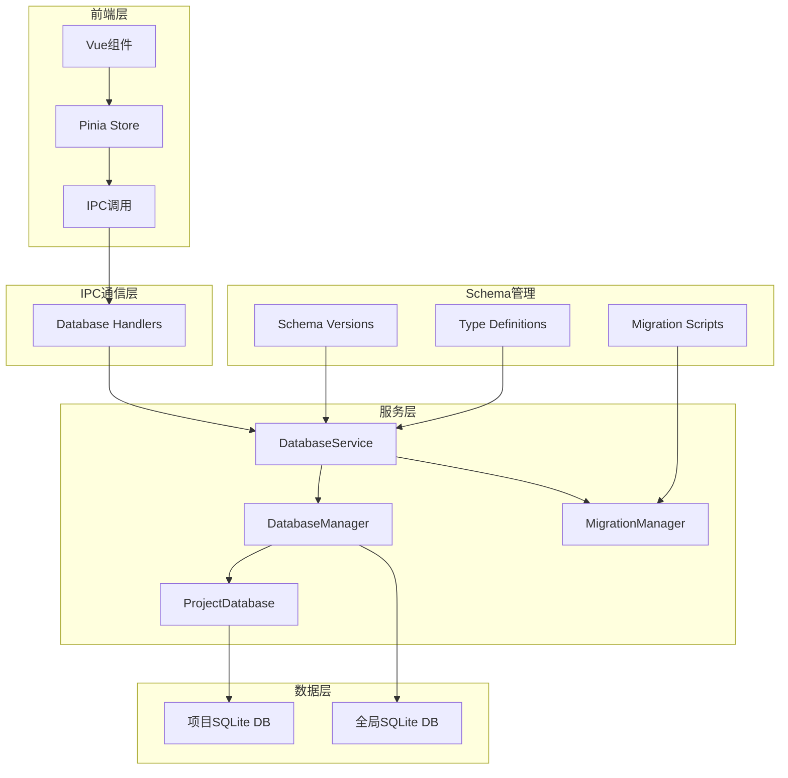

# Nimbria 数据库系统设计文档

**文档版本**: v1.0.0  
**创建时间**: 2025年10月15日  
**最后更新**: 2025年10月15日  
**负责人**: Nimbria 开发团队

---

## 📋 目录

1. [系统概述](#系统概述)
2. [架构设计](#架构设计)
3. [数据库结构](#数据库结构)
4. [服务层设计](#服务层设计)
5. [迁移系统](#迁移系统)
6. [类型系统](#类型系统)
7. [集成方案](#集成方案)
8. [性能优化](#性能优化)
9. [安全考虑](#安全考虑)
10. [部署策略](#部署策略)

---

## 🎯 系统概述

### 设计目标

Nimbria数据库系统旨在为小说创作工具提供高效、可靠的本地数据存储解决方案，支持：

- **项目级数据隔离**: 每个项目拥有独立的数据库实例
- **版本化Schema管理**: 支持数据库结构的渐进式升级
- **事件驱动架构**: 遵循Nimbria的EventEmitter模式
- **TypeScript原生支持**: 所有Schema和迁移脚本使用TypeScript编写
- **高性能本地存储**: 基于SQLite的WAL模式优化

### 核心特性

- ✅ **双层数据库架构**: 全局数据库 + 项目数据库
- ✅ **TypeScript化Schema**: 所有数据库定义使用.ts文件
- ✅ **自动迁移系统**: 支持版本间的自动升级和回滚
- ✅ **事件驱动操作**: 异步操作通过事件反馈状态
- ✅ **类型安全**: 完整的TypeScript类型定义
- ✅ **性能优化**: WAL模式、索引优化、连接池管理

### 🎯 事件驱动架构要求

**严格遵循 [事件驱动架构范式](../../../Workflow/事件驱动架构范式总结文档.md)**：

1. **Service层纯净**: DatabaseService继承EventEmitter，只负责业务逻辑
2. **立即返回ID**: 所有异步方法立即返回操作ID（initId、operationId、migrationId）
3. **事件发射状态**: 通过`this.emit()`发射进度、完成、错误事件
4. **IPC层薄薄的**: IPC Handler只监听事件并转发，不参与业务逻辑
5. **前端事件监听**: Store通过事件监听器更新本地状态
6. **多窗口支持**: 事件自动广播到所有窗口

**核心原则**：
- ❌ 禁止在回调中使用未返回的值
- ✅ 异步操作使用`setImmediate()`延迟执行
- ✅ 事件监听器只在注册时执行一次
- ✅ 支持操作进度反馈和错误处理

---

## 🏗️ 架构设计

### 整体架构图



### 文件结构设计

```
Nimbria/src-electron/services/database-service/
├── database-service.ts              # 主服务类（EventEmitter）
├── database-manager.ts              # 数据库连接管理
├── project-database.ts              # 项目级数据库操作
├── migration-manager.ts             # 迁移管理器
├── schema/                          # Schema定义
│   ├── versions/                    # 版本化Schema
│   │   ├── v1.0.0.schema.ts        # 基础版本Schema
│   │   ├── v1.1.0.schema.ts        # 新版本Schema
│   │   └── index.ts                # 版本导出管理
│   ├── migrations/                  # 迁移脚本
│   │   ├── v1.0.0/
│   │   │   ├── 001-initial.migration.ts
│   │   │   └── 002-indexes.migration.ts
│   │   ├── v1.1.0/
│   │   │   ├── 003-user-preferences.migration.ts
│   │   │   └── 004-encryption-status.migration.ts
│   │   └── registry.ts             # 迁移注册表
│   ├── base-schema.ts              # 基础Schema类型
│   └── schema-config.ts            # Schema配置
├── types/                          # 类型定义
│   ├── database-v1.0.0.ts         # v1.0.0类型定义
│   ├── database-v1.1.0.ts         # v1.1.0类型定义
│   └── index.ts                    # 类型导出
└── utils/                          # 工具函数
    ├── backup.ts                   # 备份工具
    ├── validation.ts               # 数据验证
    └── performance.ts              # 性能监控
```

---

## 🗄️ 数据库结构

### 双层数据库设计

#### 1. 全局数据库 (`nimbria.db`)

**位置**: `%USERDATA%/Database/nimbria.db`

**用途**: 存储应用级全局数据

```typescript
// 全局数据库表结构
export const GLOBAL_SCHEMA_TABLES = [
  // 应用配置表
  {
    name: 'app_settings',
    sql: `CREATE TABLE IF NOT EXISTS app_settings (
      id INTEGER PRIMARY KEY AUTOINCREMENT,
      key TEXT UNIQUE NOT NULL,
      value TEXT,
      type TEXT DEFAULT 'string',
      created_at DATETIME DEFAULT CURRENT_TIMESTAMP,
      updated_at DATETIME DEFAULT CURRENT_TIMESTAMP
    )`
  },
  
  // 最近项目表
  {
    name: 'recent_projects',
    sql: `CREATE TABLE IF NOT EXISTS recent_projects (
      id INTEGER PRIMARY KEY AUTOINCREMENT,
      project_path TEXT UNIQUE NOT NULL,
      project_name TEXT,
      last_opened DATETIME DEFAULT CURRENT_TIMESTAMP,
      open_count INTEGER DEFAULT 1,
      is_favorite BOOLEAN DEFAULT FALSE
    )`
  },
  
  // 用户偏好表
  {
    name: 'user_preferences',
    sql: `CREATE TABLE IF NOT EXISTS user_preferences (
      id INTEGER PRIMARY KEY AUTOINCREMENT,
      category TEXT NOT NULL,
      key TEXT NOT NULL,
      value TEXT,
      type TEXT DEFAULT 'string',
      created_at DATETIME DEFAULT CURRENT_TIMESTAMP,
      updated_at DATETIME DEFAULT CURRENT_TIMESTAMP,
      UNIQUE(category, key)
    )`
  }
]
```

#### 2. 项目数据库 (`project.db`)

**位置**: `{项目根目录}/.Database/project.db`

**用途**: 存储项目特定数据

```typescript
// 项目数据库表结构
export const PROJECT_SCHEMA_V1_0_0 = [
  // 项目元数据表
  {
    name: 'project_metadata',
    sql: `CREATE TABLE IF NOT EXISTS project_metadata (
      id INTEGER PRIMARY KEY AUTOINCREMENT,
      key TEXT UNIQUE NOT NULL,
      value TEXT,
      type TEXT DEFAULT 'string',
      created_at DATETIME DEFAULT CURRENT_TIMESTAMP,
      updated_at DATETIME DEFAULT CURRENT_TIMESTAMP
    )`
  },

  // 文档表
  {
    name: 'documents',
    sql: `CREATE TABLE IF NOT EXISTS documents (
      id INTEGER PRIMARY KEY AUTOINCREMENT,
      path TEXT UNIQUE NOT NULL,
      title TEXT,
      content_hash TEXT,
      word_count INTEGER DEFAULT 0,
      character_count INTEGER DEFAULT 0,
      status TEXT DEFAULT 'draft',
      created_at DATETIME DEFAULT CURRENT_TIMESTAMP,
      updated_at DATETIME DEFAULT CURRENT_TIMESTAMP,
      last_accessed DATETIME DEFAULT CURRENT_TIMESTAMP
    )`
  },

  // 章节表
  {
    name: 'chapters',
    sql: `CREATE TABLE IF NOT EXISTS chapters (
      id INTEGER PRIMARY KEY AUTOINCREMENT,
      document_id INTEGER,
      title TEXT NOT NULL,
      order_index INTEGER DEFAULT 0,
      word_count INTEGER DEFAULT 0,
      status TEXT DEFAULT 'draft',
      created_at DATETIME DEFAULT CURRENT_TIMESTAMP,
      updated_at DATETIME DEFAULT CURRENT_TIMESTAMP,
      FOREIGN KEY (document_id) REFERENCES documents(id) ON DELETE CASCADE
    )`
  },

  // 标签表
  {
    name: 'tags',
    sql: `CREATE TABLE IF NOT EXISTS tags (
      id INTEGER PRIMARY KEY AUTOINCREMENT,
      name TEXT UNIQUE NOT NULL,
      color TEXT DEFAULT '#666666',
      description TEXT,
      created_at DATETIME DEFAULT CURRENT_TIMESTAMP
    )`
  },

  // 文档标签关联表
  {
    name: 'document_tags',
    sql: `CREATE TABLE IF NOT EXISTS document_tags (
      document_id INTEGER,
      tag_id INTEGER,
      created_at DATETIME DEFAULT CURRENT_TIMESTAMP,
      PRIMARY KEY (document_id, tag_id),
      FOREIGN KEY (document_id) REFERENCES documents(id) ON DELETE CASCADE,
      FOREIGN KEY (tag_id) REFERENCES tags(id) ON DELETE CASCADE
    )`
  },

  // 项目统计表
  {
    name: 'project_stats',
    sql: `CREATE TABLE IF NOT EXISTS project_stats (
      id INTEGER PRIMARY KEY AUTOINCREMENT,
      date TEXT NOT NULL,
      total_words INTEGER DEFAULT 0,
      total_characters INTEGER DEFAULT 0,
      documents_count INTEGER DEFAULT 0,
      chapters_count INTEGER DEFAULT 0,
      writing_time_minutes INTEGER DEFAULT 0,
      created_at DATETIME DEFAULT CURRENT_TIMESTAMP
    )`
  },

  // 写作会话表
  {
    name: 'writing_sessions',
    sql: `CREATE TABLE IF NOT EXISTS writing_sessions (
      id INTEGER PRIMARY KEY AUTOINCREMENT,
      document_id INTEGER,
      start_time DATETIME NOT NULL,
      end_time DATETIME,
      words_written INTEGER DEFAULT 0,
      characters_written INTEGER DEFAULT 0,
      session_type TEXT DEFAULT 'writing',
      notes TEXT,
      FOREIGN KEY (document_id) REFERENCES documents(id) ON DELETE CASCADE
    )`
  }
]
```

### 索引策略

```typescript
export const PROJECT_INDEXES = [
  // 文档相关索引
  `CREATE INDEX IF NOT EXISTS idx_documents_path ON documents(path)`,
  `CREATE INDEX IF NOT EXISTS idx_documents_status ON documents(status)`,
  `CREATE INDEX IF NOT EXISTS idx_documents_updated ON documents(updated_at)`,
  `CREATE INDEX IF NOT EXISTS idx_documents_word_count ON documents(word_count)`,
  
  // 章节相关索引
  `CREATE INDEX IF NOT EXISTS idx_chapters_document ON chapters(document_id)`,
  `CREATE INDEX IF NOT EXISTS idx_chapters_order ON chapters(order_index)`,
  `CREATE INDEX IF NOT EXISTS idx_chapters_status ON chapters(status)`,
  
  // 统计相关索引
  `CREATE INDEX IF NOT EXISTS idx_project_stats_date ON project_stats(date)`,
  `CREATE INDEX IF NOT EXISTS idx_writing_sessions_document ON writing_sessions(document_id)`,
  `CREATE INDEX IF NOT EXISTS idx_writing_sessions_start_time ON writing_sessions(start_time)`,
  
  // 标签相关索引
  `CREATE INDEX IF NOT EXISTS idx_tags_name ON tags(name)`,
  `CREATE INDEX IF NOT EXISTS idx_document_tags_document ON document_tags(document_id)`,
  `CREATE INDEX IF NOT EXISTS idx_document_tags_tag ON document_tags(tag_id)`
]
```

---

## ⚙️ 服务层设计

### DatabaseService (主服务类)

**遵循事件驱动架构范式**：继承EventEmitter，立即返回操作ID，通过事件发射状态

```typescript
import { EventEmitter } from 'events'

// 事件数据类型定义
export interface DatabaseInitEvent {
  initId: string
  success?: boolean
}

export interface DatabaseProjectCreatedEvent {
  operationId: string
  projectPath: string
  databasePath: string
}

export interface DatabaseMigrationEvent {
  migrationId: string
  projectPath: string
  fromVersion: string
  toVersion: string
  progress?: number
}

export interface DatabaseErrorEvent {
  operationId?: string
  projectPath?: string
  error: string
}

export class DatabaseService extends EventEmitter {
  private databaseManager: DatabaseManager
  private migrationManager: MigrationManager
  private projectDatabases: Map<string, ProjectDatabase> = new Map()
  private isInitialized = false

  /**
   * ✅ 事件驱动方法：立即返回initId，通过事件反馈状态
   */
  async initialize(): Promise<string> {
    const initId = `init-${Date.now()}_${Math.random().toString(36).slice(2, 11)}`
    
    // 立即发射开始事件
    this.emit('database:init-start', { initId } as DatabaseInitEvent)
    
    // 异步处理，不阻塞返回
    setImmediate(async () => {
      try {
        await this.databaseManager.initialize()
        await this.migrationManager.runBaseMigrations()
        
        this.isInitialized = true
        this.emit('database:init-complete', { initId, success: true } as DatabaseInitEvent)
      } catch (error) {
        this.emit('database:init-error', { 
          initId, 
          error: error instanceof Error ? error.message : String(error) 
        } as DatabaseErrorEvent)
      }
    })
    
    return initId
  }

  /**
   * ✅ 事件驱动方法：立即返回operationId，通过事件反馈状态
   */
  async createProjectDatabase(projectPath: string): Promise<string> {
    const operationId = `create-db-${Date.now()}_${Math.random().toString(36).slice(2, 11)}`
    
    // 立即发射开始事件
    this.emit('database:project-create-start', { operationId, projectPath })
    
    // 异步处理
    setImmediate(async () => {
      try {
        if (!this.isInitialized) {
          throw new Error('Database service not initialized')
        }

        const databaseDir = path.join(projectPath, '.Database')
        await fs.ensureDir(databaseDir)
        
        const projectDb = new ProjectDatabase(projectPath, this.databaseManager)
        await projectDb.initialize()
        
        this.projectDatabases.set(projectPath, projectDb)
        
        this.emit('database:project-created', {
          operationId,
          projectPath,
          databasePath: path.join(databaseDir, 'project.db')
        } as DatabaseProjectCreatedEvent)
        
      } catch (error) {
        this.emit('database:project-error', {
          operationId,
          projectPath,
          error: error instanceof Error ? error.message : String(error)
        } as DatabaseErrorEvent)
      }
    })
    
    return operationId
  }

  /**
   * ✅ 事件驱动方法：立即返回migrationId，通过事件反馈进度
   */
  async migrateProjectDatabase(projectPath: string, targetVersion: string): Promise<string> {
    const migrationId = `migrate-${Date.now()}_${Math.random().toString(36).slice(2, 11)}`
    
    // 立即发射开始事件
    this.emit('database:migration-start', { 
      migrationId, 
      projectPath, 
      toVersion: targetVersion 
    } as DatabaseMigrationEvent)
    
    // 异步处理
    setImmediate(async () => {
      try {
        const projectDb = this.projectDatabases.get(projectPath)
        if (!projectDb) {
          throw new Error('Project database not found')
        }

        const currentVersion = await this.getCurrentVersion(projectDb)
        
        // 发射进度事件
        this.emit('database:migration-progress', {
          migrationId,
          projectPath,
          fromVersion: currentVersion,
          toVersion: targetVersion,
          progress: 50
        } as DatabaseMigrationEvent)
        
        await this.migrationManager.migrateToVersion(projectDb.getRawConnection(), targetVersion)
        
        // 发射完成事件
        this.emit('database:migration-complete', {
          migrationId,
          projectPath,
          fromVersion: currentVersion,
          toVersion: targetVersion
        } as DatabaseMigrationEvent)
        
      } catch (error) {
        this.emit('database:migration-error', {
          migrationId,
          projectPath,
          error: error instanceof Error ? error.message : String(error)
        } as DatabaseErrorEvent)
      }
    })
    
    return migrationId
  }

  // 同步方法（不需要事件）
  getProjectDatabase(projectPath: string): ProjectDatabase | null {
    return this.projectDatabases.get(projectPath) || null
  }

  async closeProjectDatabase(projectPath: string): Promise<void> {
    const projectDb = this.projectDatabases.get(projectPath)
    if (projectDb) {
      await projectDb.close()
      this.projectDatabases.delete(projectPath)
    }
  }

  async cleanup(): Promise<void> {
    for (const [projectPath, projectDb] of this.projectDatabases) {
      await projectDb.close()
    }
    this.projectDatabases.clear()
    await this.databaseManager.cleanup()
    this.isInitialized = false
  }

  private async getCurrentVersion(projectDb: ProjectDatabase): Promise<string> {
    // 实现获取当前版本逻辑
    return '1.0.0'
  }
}

// 类型增强
declare interface DatabaseService {
  on<K extends keyof DatabaseServiceEvents>(
    event: K, 
    listener: (data: DatabaseServiceEvents[K]) => void
  ): this
  emit<K extends keyof DatabaseServiceEvents>(
    event: K, 
    data: DatabaseServiceEvents[K]
  ): boolean
}

export interface DatabaseServiceEvents {
  'database:init-start': DatabaseInitEvent
  'database:init-complete': DatabaseInitEvent
  'database:init-error': DatabaseErrorEvent
  'database:project-create-start': { operationId: string; projectPath: string }
  'database:project-created': DatabaseProjectCreatedEvent
  'database:project-error': DatabaseErrorEvent
  'database:migration-start': DatabaseMigrationEvent
  'database:migration-progress': DatabaseMigrationEvent
  'database:migration-complete': DatabaseMigrationEvent
  'database:migration-error': DatabaseErrorEvent
}
```

### DatabaseManager (连接管理)

```typescript
export class DatabaseManager {
  private globalDb: Database.Database | null = null
  private projectDbs: Map<string, Database.Database> = new Map()

  // 核心方法
  async initialize(): Promise<void>
  createProjectDatabase(projectPath: string): Database.Database
  getGlobalDatabase(): Database.Database
  getProjectDatabase(projectPath: string): Database.Database | null
  closeProjectDatabase(projectPath: string): void
  async cleanup(): Promise<void>
}
```

### ProjectDatabase (项目数据库操作)

```typescript
export class ProjectDatabase {
  private db: Database.Database | null = null
  private projectPath: string
  private databaseManager: DatabaseManager

  // 基础操作
  query(sql: string, params?: unknown[]): unknown[]
  queryOne(sql: string, params?: unknown[]): unknown | null
  execute(sql: string, params?: unknown[]): Database.RunResult
  transaction<T>(fn: () => T): T
  
  // 高级操作
  async getDocuments(filter?: DocumentFilter): Promise<ProjectDocument[]>
  async createDocument(doc: Partial<ProjectDocument>): Promise<number>
  async updateDocument(id: number, updates: Partial<ProjectDocument>): Promise<void>
  async deleteDocument(id: number): Promise<void>
  
  // 统计操作
  async getProjectStats(dateRange?: DateRange): Promise<ProjectStats[]>
  async updateDailyStats(): Promise<void>
}
```

---

## 🔄 迁移系统

### 迁移脚本结构

```typescript
export interface MigrationDefinition {
  version: string
  fromVersion: string
  toVersion: string
  description: string
  steps: MigrationStep[]
}

export interface MigrationStep {
  type: 'CREATE_TABLE' | 'ALTER_TABLE' | 'DROP_TABLE' | 'CREATE_INDEX' | 'DROP_INDEX' | 'CUSTOM'
  sql: string
  rollback?: string
  description?: string
  validation?: (db: Database.Database) => boolean
}
```

### 迁移示例

```typescript
// schema/migrations/v1.1.0/003-add-encryption.migration.ts
export const ADD_ENCRYPTION_MIGRATION: MigrationDefinition = {
  version: '1.1.0',
  fromVersion: '1.0.0',
  toVersion: '1.1.0',
  description: '添加文档加密支持',
  steps: [
    {
      type: 'ALTER_TABLE',
      sql: `ALTER TABLE documents ADD COLUMN encryption_status TEXT DEFAULT 'none'`,
      rollback: `ALTER TABLE documents DROP COLUMN encryption_status`,
      description: '为documents表添加加密状态字段',
      validation: (db) => {
        const result = db.prepare(`PRAGMA table_info(documents)`).all()
        return result.some((col: any) => col.name === 'encryption_status')
      }
    },
    {
      type: 'CREATE_INDEX',
      sql: `CREATE INDEX IF NOT EXISTS idx_documents_encryption ON documents(encryption_status)`,
      rollback: `DROP INDEX IF EXISTS idx_documents_encryption`,
      description: '为加密状态字段创建索引'
    }
  ]
}
```

### 迁移管理器

```typescript
export class MigrationManager extends EventEmitter {
  async migrateToVersion(db: Database.Database, targetVersion: string): Promise<string>
  async rollbackToVersion(db: Database.Database, targetVersion: string): Promise<string>
  async validateMigration(db: Database.Database, migration: MigrationDefinition): Promise<boolean>
  private executeMigrationStep(db: Database.Database, step: MigrationStep): void
  private createBackup(db: Database.Database): Promise<string>
}
```

---

## 📝 类型系统

### 版本化类型定义

```typescript
// types/database-v1.0.0.ts
export interface ProjectDocument {
  id?: number
  path: string
  title?: string
  content_hash?: string
  word_count?: number
  character_count?: number
  status?: 'draft' | 'writing' | 'completed' | 'published'
  created_at?: string
  updated_at?: string
  last_accessed?: string
}

export interface ProjectChapter {
  id?: number
  document_id: number
  title: string
  order_index?: number
  word_count?: number
  status?: 'draft' | 'writing' | 'completed'
  created_at?: string
  updated_at?: string
}

// types/database-v1.1.0.ts
export interface ProjectDocument_V1_1_0 extends Omit<ProjectDocument, 'id'> {
  id?: number
  encryption_status?: 'none' | 'encrypted' | 'pending'
}

// 导出最新版本
export type { ProjectDocument_V1_1_0 as ProjectDocument }
```

### 操作接口定义

```typescript
export interface DatabaseOperations {
  // 文档操作
  getDocuments(filter?: DocumentFilter): Promise<ProjectDocument[]>
  getDocument(id: number): Promise<ProjectDocument | null>
  createDocument(doc: Partial<ProjectDocument>): Promise<number>
  updateDocument(id: number, updates: Partial<ProjectDocument>): Promise<void>
  deleteDocument(id: number): Promise<void>
  
  // 章节操作
  getChapters(documentId: number): Promise<ProjectChapter[]>
  createChapter(chapter: Partial<ProjectChapter>): Promise<number>
  updateChapter(id: number, updates: Partial<ProjectChapter>): Promise<void>
  deleteChapter(id: number): Promise<void>
  reorderChapters(documentId: number, chapterIds: number[]): Promise<void>
  
  // 标签操作
  getTags(): Promise<ProjectTag[]>
  createTag(tag: Partial<ProjectTag>): Promise<number>
  updateTag(id: number, updates: Partial<ProjectTag>): Promise<void>
  deleteTag(id: number): Promise<void>
  
  // 统计操作
  getProjectStats(dateRange?: DateRange): Promise<ProjectStats[]>
  updateDailyStats(): Promise<void>
  getWritingSessions(filter?: SessionFilter): Promise<WritingSession[]>
}
```

---

## 🔌 集成方案

### IPC处理器

**严格遵循事件驱动架构范式**：事件监听器只注册一次，IPC Handler只负责纯调用

```typescript
// ipc/main-renderer/database-handlers.ts
import { ipcMain, BrowserWindow } from 'electron'
import type { DatabaseService } from '../services/database-service/database-service'

export function registerDatabaseHandlers(databaseService: DatabaseService) {
  // ========== 事件监听器（只在注册时执行一次） ==========
  
  // 数据库初始化事件
  databaseService.on('database:init-start', (data) => {
    BrowserWindow.getAllWindows().forEach(win => {
      win.webContents.send('database:init-start', data)
    })
  })
  
  databaseService.on('database:init-complete', (data) => {
    BrowserWindow.getAllWindows().forEach(win => {
      win.webContents.send('database:init-complete', data)
    })
  })
  
  databaseService.on('database:init-error', (data) => {
    BrowserWindow.getAllWindows().forEach(win => {
      win.webContents.send('database:init-error', data)
    })
  })
  
  // 项目数据库创建事件
  databaseService.on('database:project-create-start', (data) => {
    BrowserWindow.getAllWindows().forEach(win => {
      win.webContents.send('database:project-create-start', data)
    })
  })
  
  databaseService.on('database:project-created', (data) => {
    BrowserWindow.getAllWindows().forEach(win => {
      win.webContents.send('database:project-created', data)
    })
  })
  
  databaseService.on('database:project-error', (data) => {
    BrowserWindow.getAllWindows().forEach(win => {
      win.webContents.send('database:project-error', data)
    })
  })
  
  // 数据库迁移事件
  databaseService.on('database:migration-start', (data) => {
    BrowserWindow.getAllWindows().forEach(win => {
      win.webContents.send('database:migration-start', data)
    })
  })
  
  databaseService.on('database:migration-progress', (data) => {
    BrowserWindow.getAllWindows().forEach(win => {
      win.webContents.send('database:migration-progress', data)
    })
  })
  
  databaseService.on('database:migration-complete', (data) => {
    BrowserWindow.getAllWindows().forEach(win => {
      win.webContents.send('database:migration-complete', data)
    })
  })
  
  databaseService.on('database:migration-error', (data) => {
    BrowserWindow.getAllWindows().forEach(win => {
      win.webContents.send('database:migration-error', data)
    })
  })
  
  // ========== IPC Handlers（纯调用，立即返回ID） ==========
  
  // 初始化数据库服务
  ipcMain.handle('database:initialize', async (_event) => {
    try {
      const initId = await databaseService.initialize()
      return { success: true, initId }
    } catch (error: any) {
      return { success: false, error: error.message }
    }
  })
  
  // 创建项目数据库
  ipcMain.handle('database:create-project', async (_event, { projectPath }) => {
    try {
      const operationId = await databaseService.createProjectDatabase(projectPath)
      return { success: true, operationId }
    } catch (error: any) {
      return { success: false, error: error.message }
    }
  })

  // 迁移项目数据库
  ipcMain.handle('database:migrate-project', async (_event, { projectPath, targetVersion }) => {
    try {
      const migrationId = await databaseService.migrateProjectDatabase(projectPath, targetVersion)
      return { success: true, migrationId }
    } catch (error: any) {
      return { success: false, error: error.message }
    }
  })

  // 同步操作（不需要事件）
  ipcMain.handle('database:get-documents', async (_event, { projectPath, filter }) => {
    try {
      const projectDb = databaseService.getProjectDatabase(projectPath)
      if (!projectDb) {
        return { success: false, error: 'Project database not found' }
      }
      
      const documents = await projectDb.getDocuments(filter)
      return { success: true, documents }
    } catch (error: any) {
      return { success: false, error: error.message }
    }
  })

  // 统计操作
  ipcMain.handle('database:get-stats', async (_event, { projectPath, dateRange }) => {
    try {
      const projectDb = databaseService.getProjectDatabase(projectPath)
      if (!projectDb) {
        return { success: false, error: 'Project database not found' }
      }
      
      const stats = await projectDb.getProjectStats(dateRange)
      return { success: true, stats }
    } catch (error: any) {
      return { success: false, error: error.message }
    }
  })
  
  console.log('Database IPC handlers registered')
}
```

### 前端Store集成

**遵循事件驱动架构范式**：立即获取操作ID，通过事件监听器更新本地状态

```typescript
// Client/stores/database/databaseStore.ts
import { defineStore } from 'pinia'
import { ref, readonly, onMounted } from 'vue'

interface DatabaseOperation {
  id: string
  type: 'init' | 'create-project' | 'migration'
  status: 'running' | 'completed' | 'error'
  projectPath?: string
  progress?: number
  error?: string
  result?: any
}

export const useDatabaseStore = defineStore('database', () => {
  const projectDatabases = ref<Map<string, boolean>>(new Map())
  const activeOperations = ref<Map<string, DatabaseOperation>>(new Map())
  
  // ✅ 事件驱动方法：立即获取initId，通过事件更新状态
  const initializeDatabase = async () => {
    const result = await window.api.database.initialize()
    if (result.success) {
      // 创建本地状态
      activeOperations.value.set(result.initId, {
        id: result.initId,
        type: 'init',
        status: 'running'
      })
      return result.initId
    }
    return null
  }
  
  // ✅ 事件驱动方法：立即获取operationId，通过事件更新状态
  const createProjectDatabase = async (projectPath: string) => {
    const result = await window.api.database.createProject({ projectPath })
    if (result.success) {
      // 创建本地状态
      activeOperations.value.set(result.operationId, {
        id: result.operationId,
        type: 'create-project',
        status: 'running',
        projectPath
      })
      return result.operationId
    }
    return null
  }
  
  // ✅ 事件驱动方法：立即获取migrationId，通过事件更新状态
  const migrateProjectDatabase = async (projectPath: string, targetVersion: string) => {
    const result = await window.api.database.migrateProject({ projectPath, targetVersion })
    if (result.success) {
      // 创建本地状态
      activeOperations.value.set(result.migrationId, {
        id: result.migrationId,
        type: 'migration',
        status: 'running',
        projectPath
      })
      return result.migrationId
    }
    return null
  }
  
  // 同步操作（不需要事件）
  const getDocuments = async (projectPath: string, filter?: DocumentFilter) => {
    return await window.api.database.getDocuments({ projectPath, filter })
  }
  
  const getProjectStats = async (projectPath: string, dateRange?: DateRange) => {
    return await window.api.database.getStats({ projectPath, dateRange })
  }
  
  // ✅ 设置事件监听器（在组件挂载时调用）
  const setupListeners = () => {
    // 数据库初始化事件
    window.api.database.onInitStart((data) => {
      console.log('Database initialization started:', data.initId)
    })
    
    window.api.database.onInitComplete((data) => {
      const operation = activeOperations.value.get(data.initId)
      if (operation) {
        operation.status = 'completed'
        operation.result = data
      }
      console.log('Database initialization completed:', data.initId)
    })
    
    window.api.database.onInitError((data) => {
      const operation = activeOperations.value.get(data.initId!)
      if (operation) {
        operation.status = 'error'
        operation.error = data.error
      }
      console.error('Database initialization failed:', data.error)
    })
    
    // 项目数据库创建事件
    window.api.database.onProjectCreateStart((data) => {
      console.log('Project database creation started:', data.operationId)
    })
    
    window.api.database.onProjectCreated((data) => {
      const operation = activeOperations.value.get(data.operationId)
      if (operation) {
        operation.status = 'completed'
        operation.result = data
      }
      
      // 更新项目数据库状态
      projectDatabases.value.set(data.projectPath, true)
      console.log('Project database created:', data.projectPath)
    })
    
    window.api.database.onProjectError((data) => {
      const operation = activeOperations.value.get(data.operationId!)
      if (operation) {
        operation.status = 'error'
        operation.error = data.error
      }
      console.error('Project database error:', data.error)
    })
    
    // 数据库迁移事件
    window.api.database.onMigrationStart((data) => {
      console.log('Database migration started:', data.migrationId)
    })
    
    window.api.database.onMigrationProgress((data) => {
      const operation = activeOperations.value.get(data.migrationId)
      if (operation) {
        operation.progress = data.progress
      }
      console.log(`Migration progress: ${data.progress}%`)
    })
    
    window.api.database.onMigrationComplete((data) => {
      const operation = activeOperations.value.get(data.migrationId)
      if (operation) {
        operation.status = 'completed'
        operation.result = data
      }
      console.log('Migration completed:', data.migrationId)
    })
    
    window.api.database.onMigrationError((data) => {
      const operation = activeOperations.value.get(data.migrationId)
      if (operation) {
        operation.status = 'error'
        operation.error = data.error
      }
      console.error('Migration failed:', data.error)
    })
  }
  
  // 清理已完成的操作
  const clearCompletedOperations = () => {
    for (const [id, operation] of activeOperations.value) {
      if (operation.status === 'completed' || operation.status === 'error') {
        activeOperations.value.delete(id)
      }
    }
  }
  
  return {
    // 状态
    projectDatabases: readonly(projectDatabases),
    activeOperations: readonly(activeOperations),
    
    // 操作方法
    initializeDatabase,
    createProjectDatabase,
    migrateProjectDatabase,
    getDocuments,
    getProjectStats,
    
    // 工具方法
    setupListeners,
    clearCompletedOperations
  }
})

// 在组件中使用
/*
<script setup>
import { onMounted } from 'vue'
import { useDatabaseStore } from '@stores/database/databaseStore'

const databaseStore = useDatabaseStore()

onMounted(() => {
  // ✅ 设置事件监听器
  databaseStore.setupListeners()
})

// ✅ 使用事件驱动方法
const handleCreateProject = async () => {
  const operationId = await databaseStore.createProjectDatabase('/path/to/project')
  if (operationId) {
    console.log('Operation started:', operationId)
    // 状态更新通过事件自动处理
  }
}
</script>
*/
```

---

## 🚀 性能优化

### 数据库配置优化

```typescript
export const DATABASE_CONFIG = {
  // WAL模式配置
  walMode: {
    journal_mode: 'WAL',
    synchronous: 'NORMAL',
    cache_size: 1000,
    temp_store: 'memory',
    mmap_size: 268435456, // 256MB
  },
  
  // 连接池配置
  connectionPool: {
    maxConnections: 10,
    idleTimeout: 30000,
    acquireTimeout: 60000,
  },
  
  // 查询优化
  queryOptimization: {
    enableQueryPlan: true,
    enableStatistics: true,
    autoVacuum: 'incremental',
  }
}
```

### 查询优化策略

```typescript
export class QueryOptimizer {
  // 批量操作
  static batchInsert<T>(db: Database.Database, table: string, records: T[]): void {
    const transaction = db.transaction((records: T[]) => {
      const stmt = db.prepare(`INSERT INTO ${table} VALUES (...)`)
      for (const record of records) {
        stmt.run(record)
      }
    })
    transaction(records)
  }
  
  // 预编译语句缓存
  private static statementCache = new Map<string, Database.Statement>()
  
  static getStatement(db: Database.Database, sql: string): Database.Statement {
    if (!this.statementCache.has(sql)) {
      this.statementCache.set(sql, db.prepare(sql))
    }
    return this.statementCache.get(sql)!
  }
}
```

---

## 🔒 安全考虑

### 数据验证

```typescript
export class DatabaseValidator {
  static validateDocument(doc: Partial<ProjectDocument>): ValidationResult {
    const errors: string[] = []
    
    if (!doc.path || typeof doc.path !== 'string') {
      errors.push('Document path is required and must be a string')
    }
    
    if (doc.word_count && (typeof doc.word_count !== 'number' || doc.word_count < 0)) {
      errors.push('Word count must be a non-negative number')
    }
    
    return {
      isValid: errors.length === 0,
      errors
    }
  }
}
```

### 备份策略

```typescript
export class DatabaseBackup {
  static async createBackup(projectPath: string): Promise<string> {
    const backupDir = path.join(projectPath, '.Database', 'backups')
    await fs.ensureDir(backupDir)
    
    const timestamp = new Date().toISOString().replace(/[:.]/g, '-')
    const backupPath = path.join(backupDir, `backup-${timestamp}.db`)
    
    const sourcePath = path.join(projectPath, '.Database', 'project.db')
    await fs.copy(sourcePath, backupPath)
    
    return backupPath
  }
  
  static async restoreBackup(projectPath: string, backupPath: string): Promise<void> {
    const targetPath = path.join(projectPath, '.Database', 'project.db')
    await fs.copy(backupPath, targetPath)
  }
}
```

---

## 📦 部署策略

### 构建配置

```typescript
// quasar.config.ts 中的数据库配置
electron: {
  extendElectronMainConf(esbuildConf) {
    // 排除better-sqlite3避免打包
    esbuildConf.external = esbuildConf.external || []
    esbuildConf.external.push('better-sqlite3')
  },
  
  builder: {
    extraResources: [
      // 确保数据库相关文件被包含
      {
        from: 'src-electron/services/database-service/schema',
        to: 'database-schema'
      }
    ]
  }
}
```

### 初始化流程

```typescript
export class DatabaseInitializer {
  static async initializeApplication(): Promise<void> {
    // 1. 检查better-sqlite3是否可用
    await this.checkSqliteAvailability()
    
    // 2. 初始化全局数据库
    await this.initializeGlobalDatabase()
    
    // 3. 运行必要的迁移
    await this.runGlobalMigrations()
    
    // 4. 清理旧的备份文件
    await this.cleanupOldBackups()
  }
}
```

---

## 📊 监控和日志

### 性能监控

```typescript
export class DatabaseMonitor {
  private static metrics = {
    queryCount: 0,
    slowQueries: [] as Array<{ sql: string; duration: number }>,
    connectionCount: 0,
    errorCount: 0
  }
  
  static logQuery(sql: string, duration: number): void {
    this.metrics.queryCount++
    
    if (duration > 1000) { // 超过1秒的慢查询
      this.metrics.slowQueries.push({ sql, duration })
    }
  }
  
  static getMetrics(): typeof DatabaseMonitor.metrics {
    return { ...this.metrics }
  }
}
```

### 错误处理

```typescript
export class DatabaseErrorHandler {
  static handleError(error: Error, context: string): void {
    const logger = getLogger('DatabaseError')
    
    if (error.message.includes('SQLITE_BUSY')) {
      logger.warn(`Database busy in ${context}, retrying...`)
      // 实现重试逻辑
    } else if (error.message.includes('SQLITE_CORRUPT')) {
      logger.error(`Database corruption detected in ${context}`)
      // 触发备份恢复流程
    } else {
      logger.error(`Database error in ${context}:`, error)
    }
  }
}
```

---

## 🔮 未来扩展

### 计划功能

1. **分布式同步**: 支持多设备间的数据同步
2. **增量备份**: 实现增量备份和恢复
3. **全文搜索**: 集成FTS5全文搜索引擎
4. **数据压缩**: 实现数据压缩存储
5. **加密存储**: 支持数据库级别的加密

### 扩展接口

```typescript
export interface DatabaseExtension {
  name: string
  version: string
  initialize(db: Database.Database): Promise<void>
  cleanup(db: Database.Database): Promise<void>
}

export class DatabaseExtensionManager {
  private extensions: Map<string, DatabaseExtension> = new Map()
  
  registerExtension(extension: DatabaseExtension): void {
    this.extensions.set(extension.name, extension)
  }
  
  async initializeExtensions(db: Database.Database): Promise<void> {
    for (const extension of this.extensions.values()) {
      await extension.initialize(db)
    }
  }
}
```

---

## 📚 参考资料

- [Better SQLite3 文档](https://github.com/WiseLibs/better-sqlite3)
- [SQLite WAL模式](https://www.sqlite.org/wal.html)
- [Electron 数据库最佳实践](https://www.electronjs.org/docs/latest/tutorial/sqlite)
- [Nimbria 事件驱动架构文档](../../../Workflow/事件驱动架构范式总结文档.md)

---

**文档结束**

> 本文档将随着系统的发展持续更新，请关注版本变更记录。
