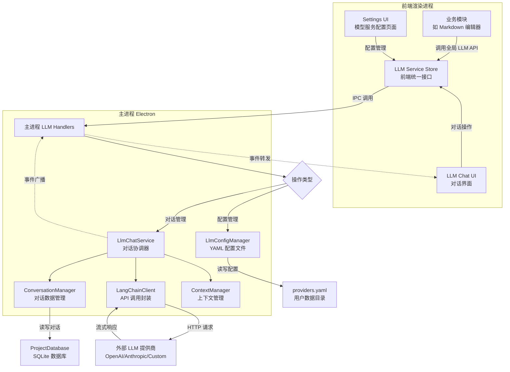
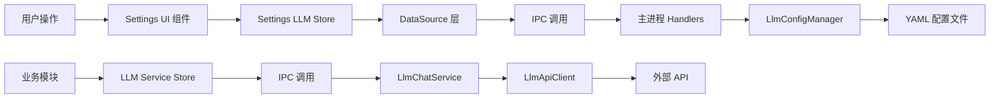

# Nimbria AI 模型服务与调用系统设计文档

**版本**: v1.0  
**创建时间**: 2025年10月14日  
**文档状态**: 反映实际实现  

---

## 📋 系统概述

Nimbria 的 AI 模型服务与调用系统提供了一个统一、类型安全的大语言模型交互平台。系统支持多提供商管理、活跃模型配置、实时对话交互，并为其他业务模块提供简洁的 API 接口。通过 Electron 主进程的安全隔离，确保 API 密钥和模型调用的安全性。

### 🎯 核心特性

- **多提供商支持**: 统一管理 OpenAI、Anthropic、自定义提供商等多种 LLM 服务
- **活跃模型配置**: 用户可选择和配置不同类型的活跃模型（LLM、文本嵌入、图像生成等）
- **配置持久化**: 所有配置自动保存到 YAML 文件，支持导入导出
- **类型安全调用**: 完整的 TypeScript 支持，编译时类型检查
- **实时对话系统**: 完整的 LLM Chat 功能，支持流式响应和对话管理
- **数据库持久化**: 对话历史存储在项目级 SQLite 数据库中
- **事件驱动架构**: 使用 EventEmitter 实现松耦合的消息传递
- **连接测试与模型发现**: 自动测试连接并发现可用模型
- **错误处理与重试**: 完善的错误处理机制和自动重试逻辑

---

## 🏗️ 系统架构

### 整体数据链路



### 文件架构

```
Nimbria/
├── Client/                                    # 前端代码
│   ├── stores/
│   │   ├── settings/                          # 配置管理 Store
│   │   │   ├── settings.llm.store.ts          # LLM 配置状态管理
│   │   │   ├── DataSource.ts                  # 数据源抽象层
│   │   │   ├── types.ts                       # 前端类型定义
│   │   │   └── llm.mock.ts                    # Mock 数据（已废弃）
│   │   └── llm/                               # 全局 LLM 服务 Store
│   │       ├── llm.service.store.ts           # 全局 LLM 调用接口
│   │       └── types.ts                       # 服务层类型定义
│   ├── GUI/components/HomeDashboardPage/Settings/  # 配置 UI 组件
│   │   ├── Settings.LlmConfig.vue             # 主配置页面
│   │   ├── Settings.LlmConfig.ProviderList.vue    # 提供商列表
│   │   ├── Settings.LlmConfig.ActiveModels.vue    # 活跃模型管理
│   │   └── Settings.LlmConfig.*.vue           # 其他配置组件
│   └── types/core/window.d.ts                 # 全局 API 类型定义
├── src-electron/                              # 主进程代码
│   ├── services/
│   │   ├── llm-service/                       # LLM 配置服务层
│   │   │   ├── llm-config-manager.ts          # 配置管理器
│   │   │   ├── llm-api-client.ts              # API 客户端封装
│   │   │   └── types.ts                       # 配置类型定义
│   │   ├── llm-chat-service/                  # LLM 对话服务层
│   │   │   ├── llm-chat-service.ts            # 主服务协调器
│   │   │   ├── conversation-manager.ts        # 对话数据管理
│   │   │   ├── langchain-client.ts            # LangChain API 封装
│   │   │   ├── context-manager.ts             # 上下文管理
│   │   │   └── types.ts                       # 对话类型定义
│   │   └── database-service/                  # 数据库服务
│   │       └── project-database.ts            # 项目数据库操作
│   ├── ipc/main-renderer/
│   │   ├── llm-handlers.ts                    # LLM 配置 IPC 处理器
│   │   └── llm-chat-handlers.ts               # LLM 对话 IPC 处理器
│   └── core/
│       ├── main-preload.ts                    # API 暴露
│       ├── project-preload.ts                 # 项目窗口 API 暴露
│       └── app-manager.ts                     # 服务注册
└── AppData/llm-config/                        # 配置文件存储
    └── providers.yaml                         # 提供商配置文件
```

---

## 🔧 核心组件详解

### 1. LlmConfigManager (配置管理)

**职责**: 管理提供商配置的 YAML 文件读写和持久化

**核心方法**:
```typescript
class LlmConfigManager {
  // 配置文件管理
  async loadProviders(): Promise<ModelProvider[]>
  async saveProviders(providers: ModelProvider[]): Promise<void>
  
  // 提供商管理
  async addProvider(provider: ModelProvider): Promise<ModelProvider>
  async updateProvider(providerId: string, updates: Partial<ModelProvider>): Promise<ModelProvider>
  async removeProvider(providerId: string): Promise<void>
  async getProvider(providerId: string): Promise<ModelProvider | null>
}
```

**配置文件结构**:
```yaml
providers:
  - id: openai
    name: openai
    displayName: OpenAI
    status: active
    apiKey: sk-xxxxx
    baseUrl: https://api.openai.com/v1
    activeModels:
      LLM:
        selectedModels: [gpt-4o, gpt-4]
        preferredModel: gpt-4o
      TEXT_EMBEDDING:
        selectedModels: [text-embedding-3-large]
        preferredModel: text-embedding-3-large
```

### 2. LlmChatService (对话服务协调器)

**职责**: 协调各个组件，提供统一的对话服务接口，使用 EventEmitter 实现事件驱动架构

**核心方法**:
```typescript
class LlmChatService extends EventEmitter {
  // 服务管理
  async initialize(projectPath?: string): Promise<void>
  async switchProject(projectPath: string): Promise<void>
  
  // 对话管理
  async createConversation(modelId: string, settings?: Partial<ConversationSettings>): Promise<string>
  async sendMessage(conversationId: string, content: string): Promise<string>
  async regenerateMessage(conversationId: string): Promise<void>
  async deleteMessage(conversationId: string, messageId: string): Promise<void>
  
  // 数据访问
  getConversations(): Conversation[]
  getConversation(conversationId: string): Conversation | null
  async updateConversationTitle(conversationId: string, title: string): Promise<void>
  async deleteConversation(conversationId: string): Promise<void>
}
```

### 3. ConversationManager (对话数据管理)

**职责**: 管理对话的创建、删除、历史记录，数据存储在项目数据库中

**核心方法**:
```typescript
class ConversationManager {
  // 数据库管理
  setProjectDatabase(projectDatabase: ProjectDatabase): void
  async initialize(): Promise<void>
  
  // 对话操作
  async createConversation(conversationId: string, modelId: string, settings: ConversationSettings): Promise<Conversation>
  async addMessage(conversationId: string, message: ChatMessage): Promise<ChatMessage>
  async updateConversationTitle(conversationId: string, title: string): Promise<void>
  async deleteConversation(conversationId: string): Promise<void>
  async deleteMessage(conversationId: string, messageId: string): Promise<void>
}
```

### 4. LangChainClient (API 调用封装)

**职责**: 封装 LangChain 的 ChatOpenAI，提供流式和非流式聊天功能

**核心方法**:
```typescript
class LangChainClient {
  // 聊天调用
  async chatStream(messages: ChatMessage[], callbacks: StreamCallbacks): Promise<void>
  async chat(messages: ChatMessage[]): Promise<string>
  
  // 工具方法
  countTokens(messages: ChatMessage[]): number
  private convertMessages(messages: ChatMessage[]): BaseMessage[]
}
```

### 5. LLM Chat Store (前端对话状态管理)

**职责**: 管理前端的对话状态，与后端 LlmChatService 通信，处理流式响应

**核心状态**:
```typescript
export const useLlmChatStore = defineStore('llmChat', {
  state: () => ({
    // 对话数据
    conversations: Conversation[],
    activeConversationId: string | null,
    
    // 加载状态
    isLoading: boolean,
    isSending: boolean,
    
    // 流式响应状态
    streamingMessageId: string | null,
    streamingContent: string,
    
    // 模型管理
    selectedModels: string[]
  }),
  
  // 核心操作
  async initialize(): Promise<void>
  async createConversation(modelId?: string): Promise<string | null>
  async sendMessage(content: string): Promise<void>
  async updateConversationTitle(conversationId: string, title: string): Promise<void>
  async deleteConversation(conversationId: string): Promise<void>
})
```

### 6. Settings LLM Store (前端配置状态管理)

**职责**: 管理前端的 LLM 配置状态，提供响应式数据和操作方法

**核心状态**:
```typescript
export const useSettingsLlmStore = defineStore('settings-llm', () => {
  // 基础状态
  const providers = ref<ModelProvider[]>([])
  const loading = ref(false)
  const error = ref<string | null>(null)
  
  // 计算属性
  const activeProviders = computed(() => providers.value.filter(p => p.status === 'active'))
  const activeModelTypes = computed(() => /* 获取所有活跃模型类型 */)
  
  // 操作方法
  async function initialize(): Promise<void>
  async function addProvider(provider: Omit<ModelProvider, 'id'>): Promise<boolean>
  async function toggleModelSelection(providerId: string, modelType: string, modelName: string): Promise<boolean>
  async function setPreferredModel(providerId: string, modelType: string, modelName: string): Promise<boolean>
})
```

### 7. 全局 LLM 服务 Store (待实现)

**职责**: 为其他业务模块提供统一的 LLM 调用接口

```typescript
export const useLlmServiceStore = defineStore('llm-service', () => {
  // 获取可用模型
  function getActiveModels(modelType: ModelType): ActiveModel[]
  function getPreferredModel(modelType: ModelType): ActiveModel | null
  
  // 模型调用
  async function chat(options: ChatOptions): Promise<ChatResponse>
  async function chatStream(options: ChatStreamOptions): Promise<ReadableStream>
  async function embed(text: string, modelId?: string): Promise<EmbeddingResponse>
  
  // 模型选择
  async function selectModel(modelType: ModelType): Promise<ActiveModel | null>
})
```

---

## 🔗 IPC 通信协议

### 配置管理 IPC

| 通道名 | 请求类型 | 响应类型 | 用途 |
|-------|---------|----------|------|
| `llm:get-providers` | `undefined` | `{ success: boolean; providers?: ModelProvider[] }` | 获取所有提供商 |
| `llm:add-provider` | `{ provider: Omit<ModelProvider, 'id'> }` | `{ success: boolean; provider?: ModelProvider }` | 添加新提供商 |
| `llm:remove-provider` | `{ providerId: string }` | `{ success: boolean }` | 删除提供商 |
| `llm:activate-provider` | `{ providerId: string }` | `{ success: boolean; provider?: ModelProvider }` | 激活提供商 |
| `llm:refresh-models` | `{ providerId: string }` | `{ success: boolean; modelsCount?: number }` | 刷新模型列表 |
| `llm:test-connection` | `{ providerId: string }` | `{ success: boolean; message?: string }` | 测试连接 |

### 活跃模型管理 IPC

| 通道名 | 请求类型 | 响应类型 | 用途 |
|-------|---------|----------|------|
| `llm:toggle-model-selection` | `{ providerId: string; modelType: string; modelName: string }` | `{ success: boolean }` | 切换模型选择状态 |
| `llm:set-preferred-model` | `{ providerId: string; modelType: string; modelName: string }` | `{ success: boolean }` | 设置首选模型 |

### LLM Chat 对话管理 IPC

| 通道名 | 请求类型 | 响应类型 | 用途 |
|-------|---------|----------|------|
| `llm-chat:create-conversation` | `{ modelId: string; settings?: Partial<ConversationSettings> }` | `{ success: boolean; conversationId?: string }` | 创建新对话 |
| `llm-chat:get-conversations` | `undefined` | `{ success: boolean; conversations?: Conversation[] }` | 获取所有对话 |
| `llm-chat:get-conversation` | `{ conversationId: string }` | `{ success: boolean; conversation?: Conversation }` | 获取单个对话 |
| `llm-chat:send-message` | `{ conversationId: string; content: string }` | `{ success: boolean; messageId?: string }` | 发送消息 |
| `llm-chat:update-title` | `{ conversationId: string; title: string }` | `{ success: boolean }` | 更新对话标题 |
| `llm-chat:delete-conversation` | `{ conversationId: string }` | `{ success: boolean }` | 删除对话 |
| `llm-chat:delete-message` | `{ conversationId: string; messageId: string }` | `{ success: boolean }` | 删除消息 |
| `llm-chat:regenerate-message` | `{ conversationId: string }` | `{ success: boolean }` | 重新生成消息 |

### LLM Chat 事件广播

| 事件名 | 数据类型 | 用途 |
|-------|---------|------|
| `llm-chat:conversation-start` | `{ conversationId: string; modelId: string }` | 对话创建开始 |
| `llm-chat:conversation-created` | `{ conversationId: string; conversation: Conversation }` | 对话创建完成 |
| `llm-chat:conversation-error` | `{ conversationId: string; error: string }` | 对话创建失败 |
| `llm-chat:message-start` | `{ conversationId: string; messageId: string }` | 消息生成开始 |
| `llm-chat:stream-chunk` | `{ conversationId: string; messageId: string; chunk: string }` | 流式响应片段 |
| `llm-chat:stream-complete` | `{ conversationId: string; messageId: string }` | 流式响应完成 |
| `llm-chat:stream-error` | `{ conversationId: string; messageId: string; error: string }` | 流式响应错误 |

### 全局模型调用 IPC (待实现)

| 通道名 | 请求类型 | 响应类型 | 用途 |
|-------|---------|----------|------|
| `llm:get-active-models` | `{ modelType: ModelType }` | `{ success: boolean; models?: ActiveModel[] }` | 获取活跃模型列表 |
| `llm:chat` | `{ modelId: string; messages: ChatMessage[] }` | `{ success: boolean; response?: ChatResponse }` | 发送聊天消息 |
| `llm:chat-stream` | `{ modelId: string; messages: ChatMessage[] }` | `{ success: boolean; streamId?: string }` | 流式聊天 |

---

## 📊 状态管理架构

### 数据流向



### 状态同步机制

1. **配置变更**: 用户在设置页面的操作会立即同步到主进程并持久化
2. **跨窗口同步**: 配置变更会通过 IPC 广播到所有窗口
3. **错误处理**: 操作失败时前端状态会回滚，确保数据一致性

---

## 🚀 业务模块调用指南

### 快速上手 - 获取活跃模型

```typescript
// 在任何 Vue 组件或业务逻辑中
import { useLlmServiceStore } from '@stores/llm/llm.service.store'

export default {
  setup() {
    const llmService = useLlmServiceStore()
    
    // 获取可用的 LLM 模型
    const availableModels = llmService.getActiveModels('LLM')
    
    // 获取首选模型
    const preferredModel = llmService.getPreferredModel('LLM')
    
    return { availableModels, preferredModel }
  }
}
```

### 发起聊天对话

```typescript
import { useLlmServiceStore } from '@stores/llm/llm.service.store'

async function startChat() {
  const llmService = useLlmServiceStore()
  
  // 让用户选择模型（如果有多个可用）
  const selectedModel = await llmService.selectModel('LLM')
  if (!selectedModel) {
    console.warn('没有可用的 LLM 模型')
    return
  }
  
  // 发送消息
  try {
    const response = await llmService.chat({
      modelId: selectedModel.id,
      messages: [
        { role: 'user', content: '你好，请介绍一下自己' }
      ],
      options: {
        temperature: 0.7,
        maxTokens: 1000
      }
    })
    
    console.log('AI 回复:', response.content)
  } catch (error) {
    console.error('聊天失败:', error)
  }
}
```

### 流式对话

```typescript
async function streamChat() {
  const llmService = useLlmServiceStore()
  const selectedModel = await llmService.selectModel('LLM')
  
  if (!selectedModel) return
  
  try {
    const stream = await llmService.chatStream({
      modelId: selectedModel.id,
      messages: [
        { role: 'user', content: '请写一首关于编程的诗' }
      ]
    })
    
    const reader = stream.getReader()
    let result = ''
    
    while (true) {
      const { done, value } = await reader.read()
      if (done) break
      
      result += value
      console.log('实时内容:', result)
    }
  } catch (error) {
    console.error('流式聊天失败:', error)
  }
}
```

### 文本嵌入

```typescript
async function getEmbedding() {
  const llmService = useLlmServiceStore()
  
  try {
    const embedding = await llmService.embed(
      '这是需要向量化的文本内容',
      'text-embedding-3-large' // 可选，不指定则使用首选模型
    )
    
    console.log('向量维度:', embedding.dimensions)
    console.log('向量数据:', embedding.vector)
  } catch (error) {
    console.error('嵌入失败:', error)
  }
}
```

---

## 💬 LLM Chat 功能使用指南

### 快速开始 - 创建对话

```typescript
// 在 Vue 组件中使用 LLM Chat
import { useLlmChatStore } from '@stores/llmChat/llmChatStore'

export default {
  setup() {
    const llmChatStore = useLlmChatStore()
    
    // 初始化 Chat Store
    onMounted(async () => {
      await llmChatStore.initialize()
    })
    
    // 创建新对话
    const createNewChat = async () => {
      const conversationId = await llmChatStore.createConversation('openai.gpt-4o')
      if (conversationId) {
        console.log('对话创建成功:', conversationId)
      }
    }
    
    return { createNewChat }
  }
}
```

### 发送消息和处理流式响应

```typescript
// 发送消息
const sendMessage = async (content: string) => {
  if (!llmChatStore.activeConversationId) {
    // 如果没有活跃对话，自动创建
    await llmChatStore.createConversation()
  }
  
  // 发送消息，自动处理流式响应
  await llmChatStore.sendMessage(content)
}

// 监听流式响应状态
const isStreaming = computed(() => llmChatStore.streamingMessageId !== null)
const streamingContent = computed(() => llmChatStore.streamingContent)
```

### 对话管理

```typescript
// 获取所有对话
const conversations = computed(() => llmChatStore.conversations)

// 切换活跃对话
const switchConversation = (conversationId: string) => {
  llmChatStore.activeConversationId = conversationId
}

// 重命名对话
const renameConversation = async (conversationId: string, newTitle: string) => {
  await llmChatStore.updateConversationTitle(conversationId, newTitle)
}

// 删除对话
const deleteConversation = async (conversationId: string) => {
  await llmChatStore.deleteConversation(conversationId)
}
```

### 事件监听

```typescript
// 在组件中监听对话事件
onMounted(() => {
  // 监听对话创建事件
  window.nimbria.llmChat.onConversationCreated((data) => {
    console.log('新对话创建:', data.conversation)
  })
  
  // 监听流式响应
  window.nimbria.llmChat.onStreamChunk((data) => {
    console.log('收到响应片段:', data.chunk)
  })
  
  // 监听响应完成
  window.nimbria.llmChat.onStreamComplete((data) => {
    console.log('响应完成:', data.conversationId)
  })
})
```

---

## 🎯 实际应用场景

### 1. Markdown 编辑器 AI 助手

```typescript
// Client/stores/projectPage/Markdown/ai-assistant.ts
import { useLlmServiceStore } from '@stores/llm/llm.service.store'

export class MarkdownAiAssistant {
  private llmService = useLlmServiceStore()
  
  async improveText(selectedText: string): Promise<string> {
    const model = await this.llmService.selectModel('LLM')
    if (!model) throw new Error('没有可用的 LLM 模型')
    
    const response = await this.llmService.chat({
      modelId: model.id,
      messages: [
        {
          role: 'system',
          content: '你是一个专业的文档编辑助手，请改进用户提供的文本，使其更加清晰、准确、易读。'
        },
        {
          role: 'user',
          content: `请改进以下文本：\n\n${selectedText}`
        }
      ]
    })
    
    return response.content
  }
  
  async generateOutline(content: string): Promise<string[]> {
    // 生成文档大纲逻辑
  }
  
  async translateText(text: string, targetLang: string): Promise<string> {
    // 文本翻译逻辑
  }
}
```

### 2. 智能搜索与推荐

```typescript
// Client/Service/SmartSearch/search.service.ts
import { useLlmServiceStore } from '@stores/llm/llm.service.store'

export class SmartSearchService {
  private llmService = useLlmServiceStore()
  
  async semanticSearch(query: string, documents: string[]): Promise<SearchResult[]> {
    // 1. 获取查询向量
    const queryEmbedding = await this.llmService.embed(query)
    
    // 2. 获取文档向量
    const docEmbeddings = await Promise.all(
      documents.map(doc => this.llmService.embed(doc))
    )
    
    // 3. 计算相似度并排序
    const results = this.calculateSimilarity(queryEmbedding, docEmbeddings)
    
    return results
  }
  
  async generateSearchSuggestions(partialQuery: string): Promise<string[]> {
    const model = await this.llmService.selectModel('LLM')
    if (!model) return []
    
    const response = await this.llmService.chat({
      modelId: model.id,
      messages: [
        {
          role: 'system',
          content: '根据用户的部分输入，生成5个相关的搜索建议。'
        },
        {
          role: 'user',
          content: partialQuery
        }
      ]
    })
    
    return this.parseSearchSuggestions(response.content)
  }
}
```

---

## 🔧 配置管理最佳实践

### 1. 提供商配置

```typescript
// 添加新的 OpenAI 提供商
const newProvider = {
  name: 'openai',
  displayName: 'OpenAI GPT',
  description: 'Official OpenAI API with GPT models',
  apiKey: 'sk-your-api-key-here',
  baseUrl: 'https://api.openai.com/v1',
  status: 'active' as const,
  defaultConfig: {
    timeout: 30000,
    maxRetries: 3,
    contextLength: 8192,
    maxTokens: 4096,
    completionMode: '对话' as const,
    functionCalling: '支持' as const,
    structuredOutput: '支持' as const,
    systemPromptSeparator: '\n\n'
  }
}

const settingsStore = useSettingsLlmStore()
await settingsStore.addProvider(newProvider)
```

### 2. 模型选择配置

```typescript
// 选择活跃模型
await settingsStore.toggleModelSelection('openai', 'LLM', 'gpt-4o')
await settingsStore.toggleModelSelection('openai', 'LLM', 'gpt-4')

// 设置首选模型
await settingsStore.setPreferredModel('openai', 'LLM', 'gpt-4o')
```

### 3. 配置导入导出

```typescript
// 导出配置
const configJson = await settingsStore.exportConfig()
localStorage.setItem('llm-backup', configJson)

// 导入配置
const backupConfig = localStorage.getItem('llm-backup')
if (backupConfig) {
  await settingsStore.importConfig(backupConfig)
}
```

---

## 🐛 错误处理与调试

### 常见错误类型

| 错误类型 | 原因 | 解决方案 |
|---------|------|----------|
| `API_KEY_INVALID` | API 密钥无效或过期 | 检查并更新 API 密钥 |
| `NETWORK_ERROR` | 网络连接问题 | 检查网络连接和代理设置 |
| `RATE_LIMIT_EXCEEDED` | 请求频率超限 | 降低请求频率或升级 API 计划 |
| `MODEL_NOT_FOUND` | 指定的模型不存在 | 刷新模型列表或选择其他模型 |
| `INSUFFICIENT_QUOTA` | API 配额不足 | 检查账户余额或使用限制 |

### 调试技巧

```typescript
// 1. 启用详细日志
const llmService = useLlmServiceStore()
llmService.setDebugMode(true)

// 2. 监听错误事件
llmService.onError((error) => {
  console.error('LLM 服务错误:', error)
  // 发送错误报告或显示用户友好的错误信息
})

// 3. 检查模型可用性
const models = llmService.getActiveModels('LLM')
console.log('可用模型:', models.map(m => m.name))

// 4. 测试连接
const testResult = await settingsStore.testProviderConnection('openai')
console.log('连接测试结果:', testResult)
```

---

## 📈 性能优化建议

### 1. 请求优化

- **批量处理**: 合并多个小请求为单个大请求
- **缓存策略**: 对相同输入的结果进行缓存
- **请求去重**: 避免同时发送相同的请求

### 2. 内存管理

- **流式处理**: 对于长文本生成使用流式 API
- **及时清理**: 清理不再使用的聊天历史和缓存
- **分页加载**: 对历史记录进行分页处理

### 3. 用户体验

- **加载状态**: 显示请求进度和预估时间
- **错误重试**: 自动重试失败的请求
- **离线处理**: 在网络不可用时提供基本功能

---

## 🔄 版本历史与路线图

### 当前版本 (v1.0)

- ✅ 多提供商配置管理
- ✅ 活跃模型选择与持久化
- ✅ 连接测试与模型发现
- ✅ 完整的前端配置 UI
- ✅ 类型安全的 IPC 通信
- ✅ 完整的 LLM Chat 对话系统
- ✅ 流式响应处理
- ✅ 对话历史管理（SQLite 数据库）
- ✅ 事件驱动架构
- ✅ Element Plus 标签页管理
- ✅ 对话数据持久化

### 计划中的功能 (v1.1+)

- [ ] 全局 LLM 服务接口（供其他业务模块使用）
- [ ] 文本嵌入 API 调用
- [ ] 模型使用统计和成本跟踪
- [ ] 自定义提示词模板
- [ ] 多模态支持（图像、音频）
- [ ] 插件化的模型后处理
- [ ] 对话导出功能
- [ ] 对话搜索和标签分类

---

## 📖 相关文档

- [架构设计总览](./架构设计总览.md)
- [多窗口系统设计文档](./多窗口系统设计文档.md)
- [文件系统与项目结构设计文档](./文件系统与项目结构设计文档.md)
- [命令面板与右栏-快速参考](./命令面板与右栏-快速参考.md)

---

**最后更新**: 2025年10月16日  
**负责人**: Nimbria 开发团队

### 更新日志

**v1.0 (2025-10-16)**:
- ✅ 新增完整的 LLM Chat 对话系统实现
- ✅ 新增事件驱动架构说明
- ✅ 新增数据库持久化方案
- ✅ 新增流式响应处理机制
- ✅ 新增 Element Plus 标签页管理
- ✅ 更新 IPC 通信协议（对话管理和事件广播）
- ✅ 新增 LLM Chat 使用指南和示例代码
