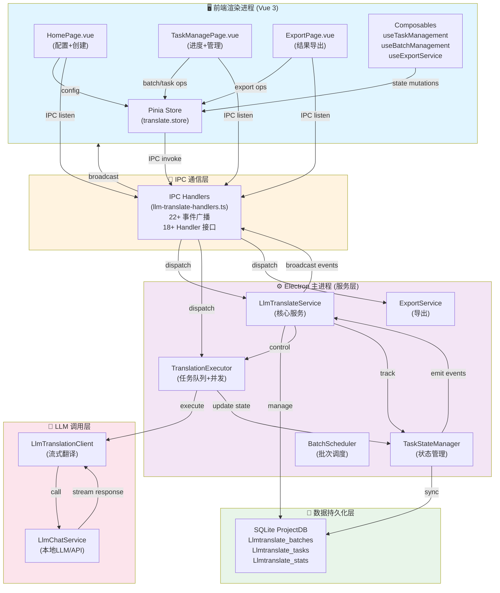
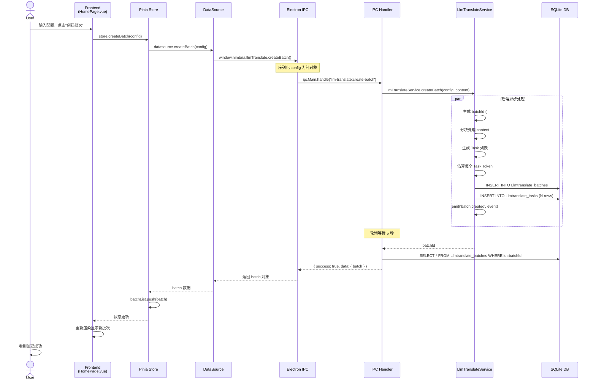
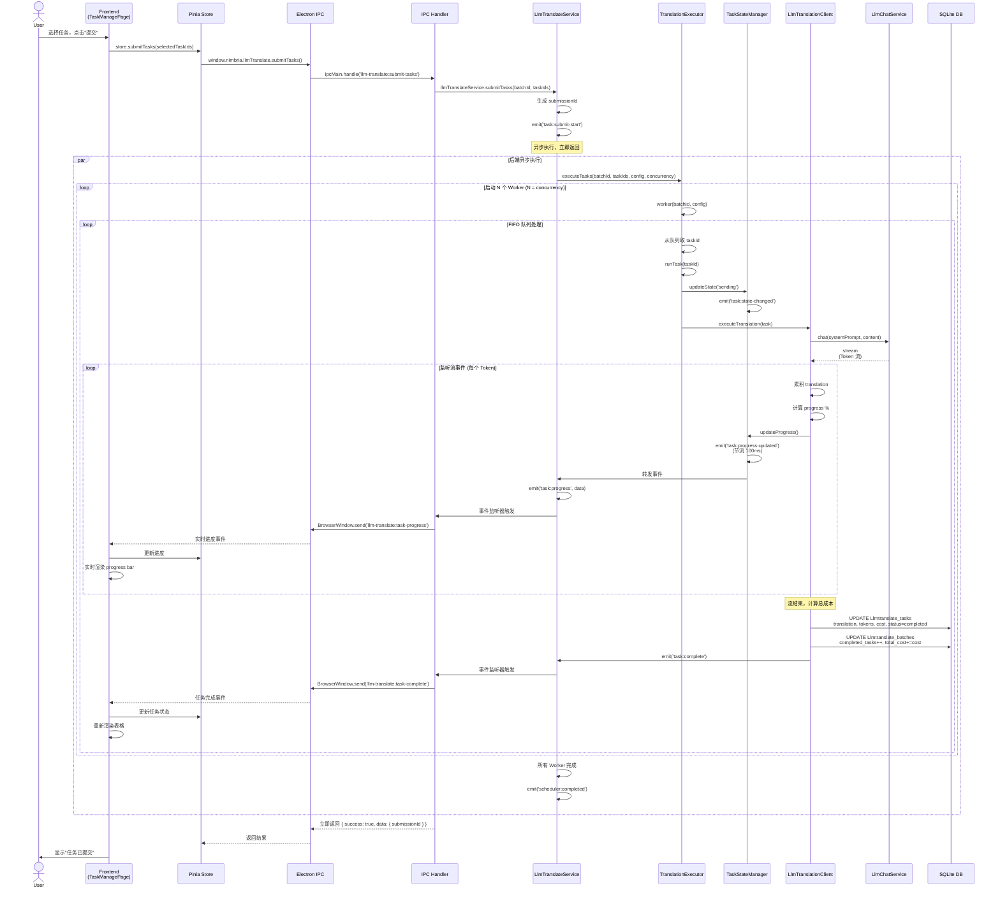
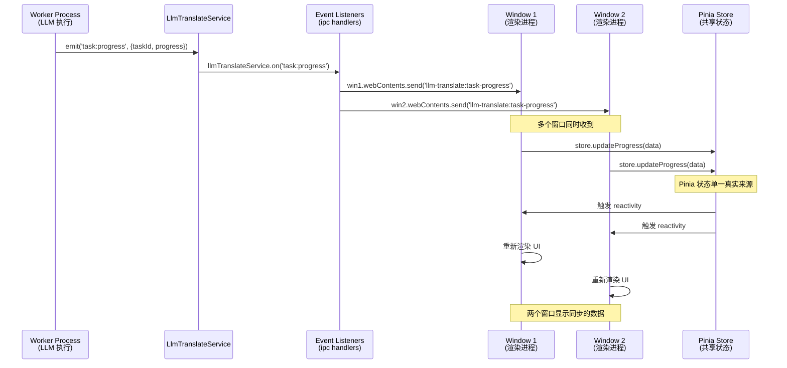
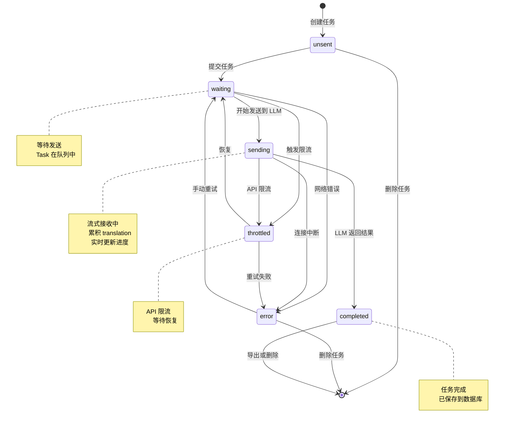
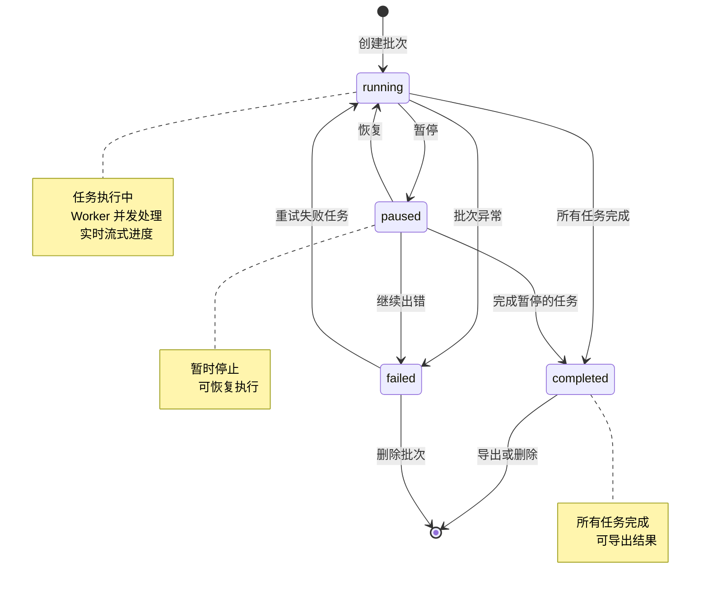
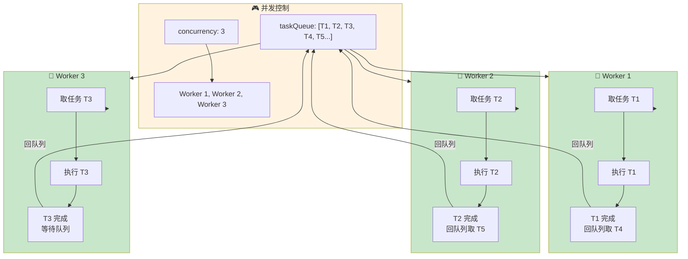
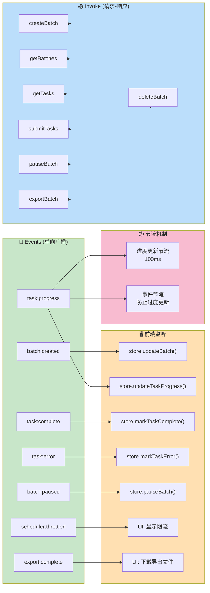

  

### 1. **系统整体架构图**

  



  

---

  

### 2. **创建批次流程序列图**

  



  

---

  

### 3. **任务提交与执行流程序列图**

  



  

---

  

### 4. **事件驱动广播 (多窗口同步)**

  



  

---

  

### 5. **数据库表结构关系图**

  

```mermaid

erDiagram

    LLMTRANSLATE_BATCHES ||--o{ LLMTRANSLATE_TASKS : contains

    LLMTRANSLATE_BATCHES ||--o| LLMTRANSLATE_STATS : has

  

    LLMTRANSLATE_BATCHES {

        string id PK

        string status

        string config_json

        int total_tasks

        int completed_tasks

        int failed_tasks

        int throttled_tasks

        int waiting_tasks

        int unsent_tasks

        real total_cost

        int total_input_tokens

        int total_output_tokens

        timestamp created_at

        timestamp started_at

        timestamp completed_at

        timestamp updated_at

    }

  

    LLMTRANSLATE_TASKS {

        string id PK

        string batch_id FK

        string status

        string content

        string translation

        int input_tokens

        int reply_tokens

        int predicted_tokens

        real progress

        string error_message

        string error_type

        int retry_count

        real cost

        string metadata_json

        timestamp created_at

        timestamp sent_time

        timestamp reply_time

        timestamp updated_at

    }

  

    LLMTRANSLATE_STATS {

        string batch_id PK-FK

        string fastest_task_id

        real fastest_time

        string slowest_task_id

        real slowest_time

        timestamp updated_at

    }

```

  

---

  

### 6. **状态机：任务生命周期**

  



  

---

  

### 7. **批次生命周期**

  



  

---

  

### 8. **数据流完整链路图**

```mermaid

graph LR

    subgraph Input["📥 输入"]

        File["文件上传"]

        Text["文本输入"]

    end

  

    subgraph Config["⚙️ 配置"]

        Model["选择模型"]

        Prompt["系统提示词"]

        Chunk["分块策略"]

        Concur["并发数"]

    end

  

    subgraph Frontend["🖥️ 前端"]

        UI["HomePage.vue"]

        Store["Pinia Store"]

    end

  

    subgraph Backend["⚙️ 后端服务"]

        Batch["创建 Batch"]

        Split["内容分块"]

        Token["Token 估算"]

        Task["生成 Task"]

    end

  

    subgraph Execution["🚀 执行"]

        Queue["任务队列<br/>FIFO"]

        Exec["TranslationExecutor<br/>N 并发 Worker"]

        Stream["流式处理<br/>Token 累积"]

    end

  

    subgraph LLM["🤖 LLM"]

        Chat["LlmChatService<br/>本地或 API"]

        Resp["流式响应<br/>Token 流"]

    end

  

    subgraph Processing["📊 数据处理"]

        Progress["进度计算<br/>动态更新"]

        Tokens["Token 统计<br/>输入/输出"]

        Cost["成本计算"]

    end

  

    subgraph Storage["💾 存储"]

        Cache["内存缓存<br/>TaskStateManager"]

        DB["SQLite DB<br/>持久化"]

    end

  

    subgraph Output["📤 输出"]

        Export["导出结果<br/>JSON/CSV/XLSX"]

        Display["实时显示<br/>前端更新"]

    end

  

    Input --> Config

    Config --> Frontend

    Frontend --> Backend

    Backend --> Batch

    Batch --> Split

    Split --> Token

    Token --> Task

    Task --> Execution

    Execution --> Queue

    Queue --> Exec

    Exec --> Stream

    Stream --> LLM

    LLM --> Chat

    Chat --> Resp

    Resp --> Processing

    Processing --> Progress

    Processing --> Tokens

    Processing --> Cost

    Progress --> Storage

    Tokens --> Storage

    Cost --> Storage

    Storage --> Cache

    Cache --> DB

    DB --> Output

    DB --> Export

    Cache --> Display

    Display --> Output

  

    style Input fill:#e3f2fd

    style Config fill:#f3e5f5

    style Frontend fill:#e1f5ff

    style Backend fill:#fff3e0

    style Execution fill:#fce4ec

    style LLM fill:#f3e5f5

    style Processing fill:#e8f5e9

    style Storage fill:#fce4ec

    style Output fill:#c8e6c9

```

  



  

---

  

### 9. **并发控制与队列处理**

  



  

---

  

### 10. **IPC 通信通道映射**

  



  

---

  

这些 Mermaid 图表全面展示了：

- 🏗️ **系统架构**：分层设计、组件关系

- ⏱️ **时序流程**：创建、执行、广播的完整流程

- 📊 **数据结构**：数据库表的关系

- 🔄 **状态管理**：任务和批次的生命周期

- 🚀 **并发控制**：队列处理和 Worker 机制

- 🔌 **IPC 通信**：invoke 和 events 的双通道模式

  

你可以复制这些代码到 Mermaid 编辑器或集成到文档中。