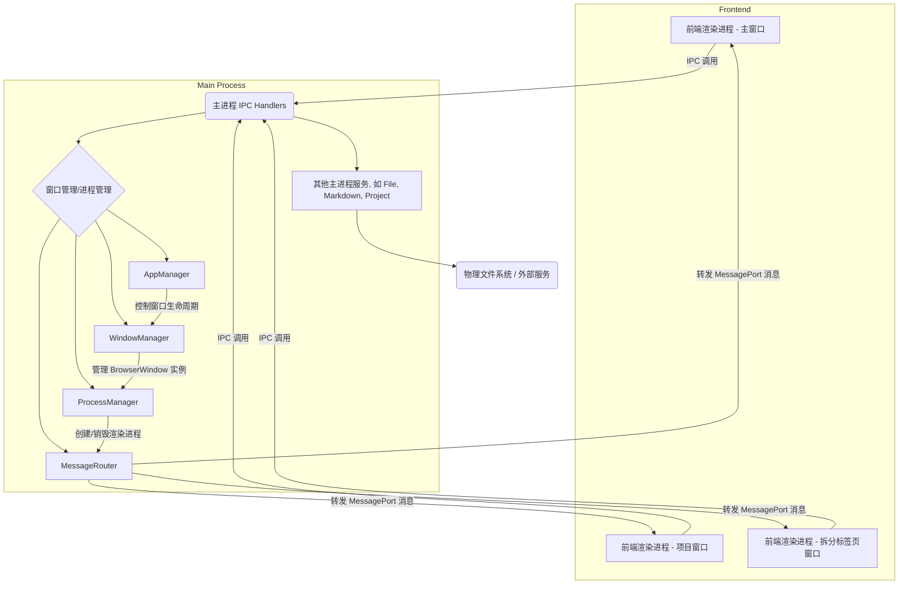

# Nimbria 多窗口系统设计文档

## 系统设计思想

### 核心理念：进程级隔离的多窗口架构

Nimbria 采用 **专家模式的多进程窗口架构**，实现真正的进程级隔离。每个项目窗口运行在独立的渲染进程中，确保：

- **稳定性保障**：单个项目崩溃不影响其他项目或主窗口
- **性能优化**：充分利用多核 CPU，每个进程独立运行
- **资源隔离**：内存、状态、插件环境完全独立
- **安全性增强**：进程间通信受控，避免意外的数据泄露
- **灵活的标签页管理**: 支持将标签页从一个项目窗口动态拆分到新的独立窗口，实现高度定制化的工作流

### 设计原则

1. **封装复杂性**：提供简洁的 API，开发者无需关心多窗口底层实现
2. **类型安全**：全面的 TypeScript 支持，编译时错误检查
3. **渐进增强**：支持单窗口到多窗口的平滑迁移
4. **可扩展性**：模块化设计，易于添加新功能

## 架构分层


/* 修复 G 行：分别连接到 A, A1, A2，避免 Mermaid 语法错误 */

## 文件架构指导

### 目录组织原则

#### 主进程相关 (`src-electron/`)
```
src-electron/
├── core/                    # 核心应用逻辑
│   ├── app-manager.ts       # 应用生命周期管理
│   ├── main-preload.ts      # 主窗口预加载脚本
│   └── project-preload.ts   # 项目窗口预加载脚本
├── services/                # 核心服务模块
│   └── window-service/      # 窗口管理服务
│       ├── process-manager.ts    # 进程创建与管理
│       ├── message-router.ts     # 消息路由
│       └── window-manager.ts     # 窗口管理抽象
├── store/                   # 数据持久化
│   └── recent-projects-store.ts  # 最近项目存储
├── types/                   # 主进程类型定义
│   ├── process.ts           # 进程相关类型
│   ├── window.ts            # 窗口配置类型
│   └── ipc.ts               # IPC 通道定义
└── ipc/                     # IPC 处理器
    └── main-renderer/       # 主进程-渲染进程通信
        ├── window-handlers.ts    # 窗口控制相关 IPC
        └── ... (其他模块的 handlers)
```

#### 前端相关 (`Client/`)
```
Client/
├── Types/                   # 前端类型定义
│   ├── window.d.ts          # 🎯 API 接口定义与调用示例
│   └── project.ts           # 业务实体类型
├── stores/                  # Pinia 状态管理
│   ├── projectSelection.ts  # 项目选择逻辑
│   └── projectPage/         # 项目页面相关状态
│       └── markdown.store.ts # Markdown 编辑器状态 (包含标签页信息)
├── GUI/                     # Vue 组件
│   ├── layouts/             # 布局组件
│   ├── components/          # 通用组件
│   │   └── ProjectPage.MainPanel/PaneSystem/ContextMenu.vue # 右键菜单，包含拆分选项
│   └── pages/               # 页面组件
│       └── ProjectPage.DetachedPage.vue # 拆分标签页专用页面
└── Service/                 # 业务逻辑服务
```

### 新功能开发指导

#### 添加新的 API 功能
1. **类型定义**：在 `Client/Types/window.d.ts` 中添加接口定义和详细注释
2. **IPC 通道**：在 `src-electron/types/ipc.ts` 中定义通信协议
3. **主进程处理**：在 `src-electron/core/app-manager.ts` 或对应模块的 `*-handlers.ts` 中注册 IPC 处理器
4. **预加载暴露**：在相应的 preload 脚本中暴露 API
5. **前端调用**：在 Store 或组件中使用 `window.nimbria.*` API

#### 添加新的窗口类型
1. **类型扩展**：在 `src-electron/types/process.ts` 中扩展 `WindowType`
2. **模板定义**：在 `src-electron/types/window.ts` 中定义窗口模板
3. **管理器扩展**：在 `ProcessManager` 中添加创建方法
4. **预加载脚本**：创建专用的 preload 脚本

#### 添加新的存储功能
1. **存储模块**：在 `src-electron/store/` 下创建专用存储模块
2. **类型定义**：定义数据架构和操作接口
3. **服务集成**：在相应服务中集成存储逻辑

## 核心通信机制

### IPC 通信流程
```
前端调用 → contextBridge → ipcRenderer.invoke → ipcMain.handle → 主进程处理 → 返回结果
```

### MessagePort 通信流程
```
渲染进程 → MessagePort → MessageChannelMain → MessageRouter → 目标进程
```

## 技术实现细节

### 1. 窗口生命周期管理 (AppManager)

- `AppManager` 负责应用程序的整体生命周期，包括启动、关闭和主/项目窗口的创建与管理。
- 集成了 `ProcessManager` 和 `WindowManager`，提供高层级的窗口操作接口。
- **重要**: 窗口控制按钮（最小化、最大化、关闭）现在通过 `window.nimbria.window.controlWindow` IPC 接口与主进程通信，主进程通过 `event.sender` 获取到发出请求的 `BrowserWindow` 实例，从而精确控制目标窗口，而非错误地控制主窗口。

### 2. 进程与窗口抽象 (ProcessManager & WindowManager)

- **ProcessManager**: 负责创建和管理不同类型的渲染进程（主窗口、项目窗口、拆分标签页窗口）。每个进程都有一个唯一的 `id` 和 `type`。
- **WindowManager**: 管理 `BrowserWindow` 实例的创建、查找和销毁，并将其与 `ProcessManager` 中的逻辑进程关联起来。
- `getProcessByWindowId(windowId)`: 根据 `BrowserWindow` 的 ID 查找对应的逻辑进程，确保 IPC 操作能够针对正确的窗口上下文进行。

### 3. 标签页拆分到新窗口

- **触发机制**: 在 `PaneContent.vue` 的 `ContextMenu.vue` 中提供“拆分到新窗口”选项，通过 `window.nimbria.project.detachTabToWindow(tabId)` IPC 调用触发。
- **主进程处理**: `project-handlers.ts` 中的 `detachTabToWindow` 处理器接收 `tabId`。
  1. 从 `MarkdownStore` 获取 `tabId` 对应的 Markdown 文件路径和内容。
  2. 通过 `ProcessManager` 和 `WindowManager` 创建一个新的 `BrowserWindow`，并加载 `/project-detached` 路由，将 `tabId` 和文件内容作为参数传递。
  3. 新窗口的 `project-preload.ts` 脚本会暴露必要的 `window.nimbria` API。
  4. 新窗口中的 `ProjectPage.DetachedPage.vue` 组件会根据传递的 `tabId` 渲染单个 Markdown 编辑器或预览器。
- **原窗口行为**: 拆分成功后，原项目窗口会关闭该标签页，并更新 `PaneLayoutStore` 和 `MarkdownStore` 状态。
- **状态同步**: 拆分出去的标签页在新窗口中独立运行，但其内容变更仍通过 IPC 与主进程通信，保存到同一个文件路径，保证数据一致性。
- **详细实现**: 参见 `Document/总结/标签页拆分到新窗口实现总结_2025年10月10日10-54.md`。

### 4. 滚动问题修复与 Flexbox 布局

- 在多窗口和多分屏场景中，正确的 Flexbox 布局对于内容滚动至关重要。
- **核心原则**：所有垂直方向的 Flex 容器及其子元素必须设置 `min-height: 0`；只有实际需要滚动的元素才设置 `overflow-y: auto`；父容器链上的非滚动元素应设置 `overflow: hidden`。
- **详细实现**: 参见 `Document/总结/多窗口系统滚动问题修复总结_2025年10月10日.md`。

## 开发最佳实践

### 类型安全开发
- **查看接口定义**：所有 API 的详细说明和调用示例都在 `Client/Types/window.d.ts` 中
- **遵循类型约束**：使用 TypeScript 的严格模式，确保类型安全
- **利用 IDE 提示**：通过 `.d.ts` 文件获得完整的智能提示

### 错误处理
- **优雅降级**：所有 API 调用都应包含错误处理逻辑
- **用户反馈**：使用 Quasar Notify 提供友好的错误提示
- **日志记录**：在主进程和渲染进程中记录关键操作

### 性能考虑
- **避免频繁 IPC**：批量处理相关操作
- **使用 MessagePort**：对于高频通信使用 MessagePort 而非 IPC
- **内存管理**：及时清理事件监听器和对象引用

## 扩展点识别

### 当前可扩展的功能点
1. **窗口模板系统**：支持自定义窗口配置
2. **插件架构**：通过 Worker 线程加载插件
3. **状态持久化**：可扩展的存储适配器模式
4. **消息广播**：支持自定义消息类型和处理器

### 未来增强方向
1. **窗口布局管理**：支持窗口停靠、分割视图
2. **跨项目协作**：项目间的数据共享和同步
3. **插件生态**：完善的插件开发和管理系统
4. **性能监控**：进程资源使用情况监控

## 学习路径

### 快速上手
1. **阅读 `Client/Types/window.d.ts`**：了解所有可用的 API 和调用方式
2. **查看 `Client/stores/projectSelection.ts`**：学习实际的 API 使用模式
3. **研究 `src-electron/core/app-manager.ts`**：理解主进程的 IPC 处理逻辑

### 深入理解
1. **进程管理**：研究 `ProcessManager` 的窗口创建和生命周期管理
2. **通信机制**：了解 `MessageRouter` 的消息路由实现
3. **类型系统**：掌握整个系统的 TypeScript 类型架构

---

**📝 重要提醒**: 
- 所有 API 的详细使用方法和示例代码都在 `Client/Types/window.d.ts` 中
- 开发时优先查阅该文件，避免重复实现已有功能
- 新增功能时遵循现有的架构模式，确保系统的一致性

## 📖 相关文档

- [架构设计总览](./架构设计总览.md)
- [Markdown编辑系统设计文档](./Markdown编辑系统设计文档.md)
- [Pane分屏系统设计文档](./Pane分屏系统设计文档.md)
- [文件系统与项目结构设计文档](./文件系统与项目结构设计文档.md)
- [多窗口系统滚动问题修复总结_2025年10月10日.md](../总结/多窗口系统滚动问题修复总结_2025年10月10日.md)
- [标签页拆分到新窗口实现总结_2025年10月10日10-54.md](../总结/标签页拆分到新窗口实现总结_2025年10月10日10-54.md)

---

**最后更新**: 2025年10月11日  
**负责人**: Nimbria 开发团队
