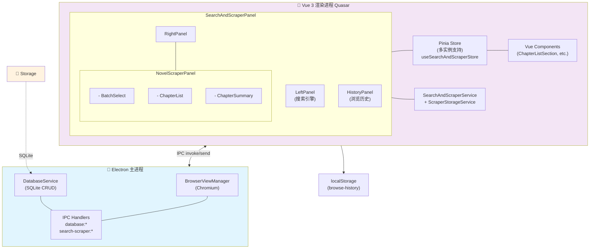
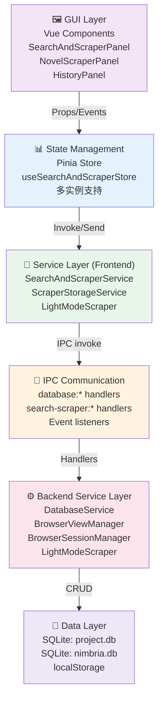
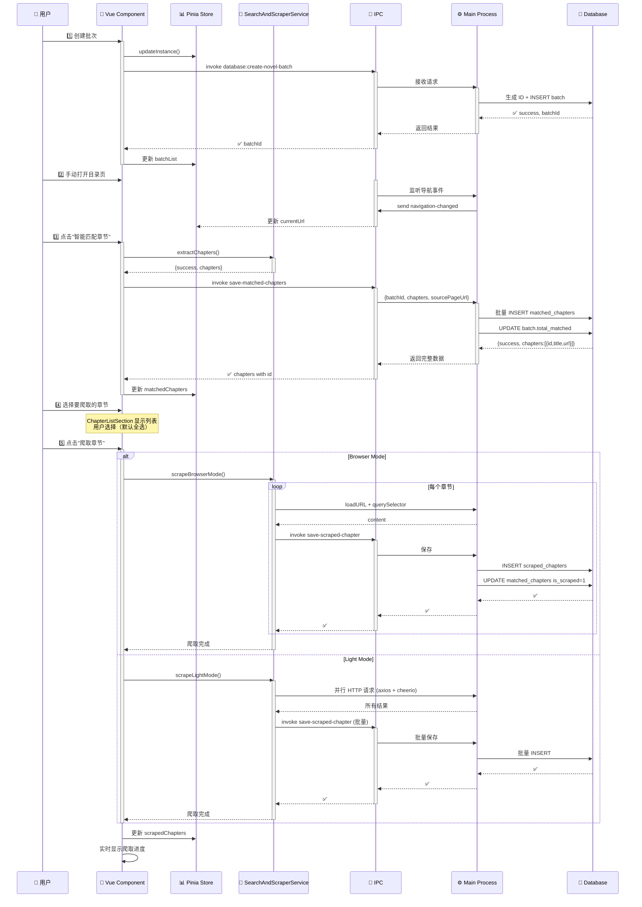

## 📚 SearchAndScraper 爬虫业务域完整文档

# SearchAndScraper（小说爬虫）业务域完整架构文档

**文档状态**：🟢 进行中 - 已实现Iteration 1-3（章节爬取）+ Advanced（工作流引擎）

**最后更新**：2025-10-27

---

## 📊 目录

1. [架构概览](#架构概览)
2. [系统分层](#系统分层)
3. [数据流向](#数据流向)
4. [核心服务](#核心服务)
5. [IPC 通信协议](#ipc-通信协议)
6. [前端 Pinia Store 设计](#前端-pinia-store-设计)
7. [数据存储层](#数据存储层)
8. [实现状态](#实现状态)

---

## 架构概览

### 整体架构图



---

## 系统分层

### 分层架构



---

## 数据流向

### 场景1：批次创建 → 章节匹配 → 章节爬取



---

## 核心服务

### 1. SearchAndScraperService（前端服务）

**位置**：`Nimbria/Client/Service/SearchAndScraper/search-and-scraper.service.ts`

**职责**：
- BrowserView 生命周期管理
- 导航控制（goBack, goForward, loadURL）
- 元素选取
- 章节提取（智能选择器）
- 章节爬取（点击、填充等）
- Cookie 管理

**核心方法**：

```typescript
// Session 管理
static async initSession(): Promise<SearchScraperInitResponse>
static async getCookies(url: string): Promise<SearchScraperCookiesResponse>
static async getAllCookies(): Promise<SearchScraperCookiesResponse>

// BrowserView 控制
static async createView(tabId: string): Promise<{ success: boolean }>
static async showView(tabId: string, bounds: BrowserViewBounds): Promise<{ success: boolean }>
static async hideView(tabId: string): Promise<{ success: boolean }>
static async destroyView(tabId: string): Promise<{ success: boolean }>
static async loadURL(tabId: string, url: string): Promise<{ success: boolean }>

// 导航控制
static async goBack(tabId: string): Promise<{ success: boolean }>
static async goForward(tabId: string): Promise<{ success: boolean }>
static async reload(tabId: string): Promise<{ success: boolean }>

// 元素选取
static async startSelectingElement(tabId: string, elementPath?: string): Promise<{ success: boolean }>
static async stopSelectingElement(tabId: string): Promise<{ success: boolean }>

// 章节相关
static async extractChapters(tabId: string): Promise<{
  success: boolean
  chapters?: Array<{ title: string; url: string }>
  error?: string
}>
static async scrapeChapter(tabId: string, url: string): Promise<{
  success: boolean
  chapter?: { title: string; content: string }
  error?: string
}>
static async scrapeChaptersLight(
  tabId: string,
  chapters: Array<{ title: string; url: string }>,
  options: LightScrapeOptions
): Promise<{
  success: boolean
  results?: ScrapeResult[]
  error?: string
}>

// 获取状态
static async getNavigationState(tabId: string): Promise<NavigationState>
```

---

### 2. ScraperStorageService（存储服务）🟡 已实现

**位置**：`Nimbria/Client/Service/SearchAndScraper/scraper-storage.service.ts`

**职责**：
- 隔离数据存储逻辑
- 为不同爬取方式提供统一接口
- 处理数据库 IPC 调用

**核心方法**：

```typescript
// 单个保存
static async saveScrapedChapter(
  projectPath: string,
  data: {
    matchedChapterId: string
    batchId: string
    title: string
    url: string
    content: string
    summary: string
    scrapeDuration: number
  }
): Promise<{ success: boolean; error?: string }>

// 批量保存
static async batchSaveScrapedChapters(
  projectPath: string,
  chapters: Array<{...}>
): Promise<{
  successCount: number
  failedChapters: Array<{ title: string; error: string }>
}>

// 获取数据
static async getScrapedChapters(
  projectPath: string,
  batchId: string
): Promise<{
  success: boolean
  chapters?: NovelScrapedChapter[]
  error?: string
}>

static async getBatchSummary(
  projectPath: string,
  batchId: string
): Promise<{
  success: boolean
  summary?: NovelBatchSummary
  error?: string
}>

// 辅助方法
static generateSummary(content: string, maxLength: number = 200): string
```

---

### 3. LightModeScraper（轻量爬虫）🟡 已实现

**位置**：`Nimbria/src-electron/services/search-scraper-service/light-mode-scraper.ts`

**职责**：
- 使用 HTTP 请求并行爬取
- 使用 cheerio 解析 HTML
- 支持批量并行控制

**核心方法**：

```typescript
export class LightModeScraper {
  // 并行爬取多个章节
  public async scrapeChapters(
    chapters: ChapterData[],
    options: LightScrapeOptions,
    onProgress?: (current: number, total: number, currentChapter: string) => void
  ): Promise<ScrapeResult[]>

  // 爬取单个章节（私有方法）
  private async scrapeChapter(
    chapter: ChapterData,
    options: LightScrapeOptions
  ): Promise<ScrapeResult>
}

// 配置接口
export interface LightScrapeOptions {
  selector: string              // CSS 选择器
  parallelCount: number         // 并行数（默认3）
  timeout: number               // 超时（毫秒）
  urlPrefix?: string            // URL 前缀
  headers?: Record<string, string>  // 自定义 Headers
}

// 结果接口
export interface ScrapeResult {
  success: boolean
  chapter: ChapterData
  content?: string
  error?: string
}
```

**并行机制**：使用 `p-limit` 库控制并行数量

```typescript
const limit = pLimit(options.parallelCount)
const tasks = chapters.map(chapter =>
  limit(async () => {
    // 爬取逻辑
    return await this.scrapeChapter(chapter, options)
  })
)
return await Promise.all(tasks)
```

---

### 4. BrowserViewManager（浏览器管理）

**位置**：`Nimbria/src-electron/services/search-scraper-service/browser-view-manager.ts`

**职责**：
- 创建和管理 BrowserView 实例
- 监听导航事件、加载事件
- 处理 console 消息（元素选取、缩放控制）
- 提供 JavaScript 注入

**核心事件**：

```typescript
// Chromium 事件（BrowserView 内部）
view.webContents.on('did-navigate', ...)          // 页面导航完成
view.webContents.on('did-navigate-in-page', ...)  // 页面内导航
view.webContents.on('did-start-loading', ...)     // 开始加载
view.webContents.on('did-stop-loading', ...)      // 加载完成
view.webContents.on('did-finish-load', ...)       // 页面加载完毕
view.webContents.on('did-fail-load', ...)         // 加载失败
view.webContents.on('console-message', ...)       // console 消息

// 转发给主窗口（window.webContents.send）
'search-scraper:navigation-changed'       // 导航状态变化
'search-scraper:loading-changed'          // 加载状态变化
'search-scraper:load-failed'              // 加载失败
'search-scraper:element-selected'         // 元素选取完成
```

---

### 5. DatabaseService（数据库服务）

**位置**：`Nimbria/src-electron/services/database-service/`

**职责**：
- 管理项目数据库和全局数据库
- 执行 CRUD 操作
- 版本管理和迁移

**项目数据库方法**（与爬虫相关）：

```typescript
// 批次管理
createNovelBatch(data: { name: string; description?: string }): string
getAllNovelBatches(): Array<SearchAndScraperNovelBatch>
getNovelBatch(batchId: string): SearchAndScraperNovelBatch | null
updateNovelBatchStats(batchId: string, stats: { totalMatched?: number; totalScraped?: number }): void

// 匹配章节
saveMatchedChapters(
  batchId: string, 
  chapters: Array<{ title: string; url: string }>,
  sourcePageUrl?: string
): Array<{ id: string; title: string; url: string; chapterIndex: number }>

getMatchedChapters(batchId: string): Array<NovelMatchedChapterRow>
toggleChapterSelection(chapterId: string, selected: boolean): void
toggleAllChaptersSelection(batchId: string, selected: boolean): void

// 爬取章节
saveScrapedChapter(data: {
  matchedChapterId: string
  batchId: string
  title: string
  url: string
  content: string
  summary: string
  scrapeDuration: number
}): void

getScrapedChapters(batchId: string): Array<NovelScrapedChapterRow>
getNovelBatchSummary(batchId: string): NovelBatchSummary
```

---

## IPC 通信协议

### 命名约定

- **数据库操作**：`database:*`
- **搜索爬虫操作**：`search-scraper:*`
- **事件广播**：`on` 监听（服务端发起）
- **方法调用**：`invoke` 调用（客户端发起）

### 核心 IPC 通道

#### 1. 数据库通道（database:*）

```typescript
// ================== 批次管理 ==================

// 创建批次
ipcRenderer.invoke('database:search-scraper-create-novel-batch', {
  projectPath: string
  data: { name: string; description?: string }
})
→ { success: boolean; batchId?: string; error?: string }

// 获取所有批次
ipcRenderer.invoke('database:search-scraper-get-all-novel-batches', {
  projectPath: string
})
→ { success: boolean; batches?: NovelBatch[]; error?: string }

// ================== 匹配章节 ==================

// 保存匹配章节（返回完整数据包含id）
ipcRenderer.invoke('database:search-scraper-save-matched-chapters', {
  projectPath: string
  batchId: string
  chapters: Array<{ title: string; url: string }>
  sourcePageUrl?: string
})
→ { 
  success: boolean
  error?: string
  chapters?: Array<{ id: string; title: string; url: string; chapterIndex: number }>
}

// 获取匹配章节
ipcRenderer.invoke('database:search-scraper-get-matched-chapters', {
  projectPath: string
  batchId: string
})
→ { success: boolean; chapters?: NovelMatchedChapterRow[]; error?: string }

// 切换章节选中状态
ipcRenderer.invoke('database:search-scraper-toggle-chapter-selection', {
  projectPath: string
  chapterId: string
  selected: boolean
})
→ { success: boolean; error?: string }

// ================== 爬取章节 ==================

// 保存单个爬取章节
ipcRenderer.invoke('database:search-scraper-save-scraped-chapter', {
  projectPath: string
  data: {
    matchedChapterId: string
    batchId: string
    title: string
    url: string
    content: string
    summary: string
    scrapeDuration: number
  }
})
→ { success: boolean; error?: string }

// 获取爬取章节
ipcRenderer.invoke('database:search-scraper-get-scraped-chapters', {
  projectPath: string
  batchId: string
})
→ { success: boolean; chapters?: NovelScrapedChapterRow[]; error?: string }

// 获取批次统计
ipcRenderer.invoke('database:search-scraper-get-batch-summary', {
  projectPath: string
  batchId: string
})
→ {
  success: boolean
  summary?: {
    totalMatched: number
    totalScraped: number
    totalWords: number
    avgScrapeDuration: number
  }
  error?: string
}
```

#### 2. 搜索爬虫通道（search-scraper:*）

```typescript
// ================== 事件监听 (ipcRenderer.on) ==================

// BrowserView 导航状态变化
ipcRenderer.on('search-scraper:navigation-changed', (event, data) => {
  tabId: string
  url: string
  canGoBack: boolean
  canGoForward: boolean
})

// 页面加载状态
ipcRenderer.on('search-scraper:loading-changed', (event, data) => {
  tabId: string
  isLoading: boolean
})

// 加载失败
ipcRenderer.on('search-scraper:load-failed', (event, data) => {
  tabId: string
  url: string
  errorCode: number
  errorDescription: string
})

// 元素选取完成
ipcRenderer.on('search-scraper:element-selected', (event, data) => {
  tabId: string
  selector: string
  tagName: string
  textContent?: string
  xpath?: string
  timestamp: number
})
```

#### 3. Preload API（window.nimbria）

```typescript
// 在 project-preload.ts 中定义的接口

window.nimbria.searchScraper = {
  // Session
  initSession(): Promise<SearchScraperInitResponse>
  getCookies(url: string): Promise<SearchScraperCookiesResponse>
  getAllCookies(): Promise<SearchScraperCookiesResponse>
  
  // BrowserView
  createView(tabId: string): Promise<{ success: boolean }>
  showView(tabId: string, bounds: BrowserViewBounds): Promise<{ success: boolean }>
  hideView(tabId: string): Promise<{ success: boolean }>
  destroyView(tabId: string): Promise<{ success: boolean }>
  
  // Navigation
  loadURL(tabId: string, url: string): Promise<{ success: boolean }>
  goBack(tabId: string): Promise<{ success: boolean }>
  goForward(tabId: string): Promise<{ success: boolean }>
  reload(tabId: string): Promise<{ success: boolean }>
  
  // Element Selection
  startSelectingElement(tabId: string, elementPath?: string): Promise<{ success: boolean }>
  stopSelectingElement(tabId: string): Promise<{ success: boolean }>
  
  // Scraping
  extractChapters(tabId: string): Promise<{ success: boolean; chapters?: [...] }>
  scrapeChapter(tabId: string, url: string): Promise<{ success: boolean; chapter?: [...] }>
  scrapeChaptersLight(tabId: string, chapters: [...], options: LightScrapeOptions): Promise<{ success: boolean; results?: [...] }>
  
  // Status
  getNavigationState(tabId: string): Promise<NavigationState>
}

window.nimbria.database = {
  // 批次
  searchScraperCreateNovelBatch(args): Promise<{...}>
  searchScraperGetAllNovelBatches(args): Promise<{...}>
  
  // 匹配章节
  searchScraperSaveMatchedChapters(args): Promise<{...}>
  searchScraperGetMatchedChapters(args): Promise<{...}>
  
  // 爬取章节
  searchScraperSaveScrapedChapter(args): Promise<{...}>
  searchScraperGetScrapedChapters(args): Promise<{...}>
  
  // 统计
  searchScraperGetBatchSummary(args): Promise<{...}>
}
```

---

## 前端 Pinia Store 设计

### useSearchAndScraperStore

**位置**：`Nimbria/Client/stores/projectPage/searchAndScraper/searchAndScraper.store.ts`

**设计原则**：
- 多实例支持（每个标签页一个独立状态）
- 全局浏览历史共享（跨标签页）
- 响应式状态管理

**核心状态**：

```typescript
export interface SearchInstanceState {
  // ========== 基础信息 ==========
  tabId: string                    // 标签页ID
  initialized: boolean             // 是否已初始化
  
  // ========== 搜索引擎 ==========
  currentEngine: SearchEngine      // 当前搜索引擎
  searchHistory: SearchHistoryItem[] // 搜索历史
  
  // ========== BrowserView 状态 ==========
  isViewCreated: boolean          // BrowserView 是否已创建
  isBrowserViewVisible: boolean   // 是否可见
  currentUrl: string              // 当前 URL
  searchQuery: string             // 搜索查询
  
  // ========== 元素选取 ==========
  isSelectingElement: boolean     // 是否正在选取元素
  selectedElements: SelectedElement[] // 选取的元素列表
  
  // ========== 小说爬取 (Iteration 1-3) ==========
  urlPrefix: string               // URL 前缀
  urlPrefixEnabled: boolean       // 是否启用 URL 前缀
  matchedChapters: Chapter[]      // 匹配的章节（Iteration 2）
  scrapedChapters: ScrapedChapter[] // 已爬取章节（Iteration 3）
  isScrapingInProgress: boolean   // 爬取进行中
  scrapingProgress: {             // 爬取进度
    current: number
    total: number
    currentChapter: string
  } | null
  
  // ========== 章节选择 ==========
  chapterSelectMode: boolean      // 选择模式是否启用
  selectedChapterIndexes: Set<number> // 选中的章节索引
  chapterSearchQuery: string      // 章节搜索查询
  
  // ========== 爬取模式 ==========
  scrapeMode: ScrapeMode          // 'browser' | 'light'
  lightModeConfig: {              // 轻量模式配置
    parallelCount: number         // 并行数
    requestTimeout: number        // 请求超时
    contentSelector?: string      // 内容选择器
    selectorLearned: boolean      // 是否已学习
  }
}
```

**核心方法**：

```typescript
// 实例管理
getInstance(tabId: string): SearchInstanceState | undefined
initInstance(tabId: string): SearchInstanceState
updateInstance(tabId: string, updates: Partial<SearchInstanceState>): void
removeInstance(tabId: string): void
reset(): void

// 全局历史管理
loadHistoryFromStorage(): void
saveHistoryToStorage(): void
addHistoryItem(item: Omit<BrowseHistoryItem, 'timestamp'>): void
clearHistory(): void

// 爬取模式管理
updateScrapeMode(tabId: string, mode: ScrapeMode): void
updateLightModeConfig(tabId: string, config: Partial<LightModeConfig>): void
setContentSelector(tabId: string, selector: string): void
resetLightModeSelector(tabId: string): void
```

**LocalStorage 键**：

```typescript
const HISTORY_STORAGE_KEY = 'search-scraper-browse-history-global'
const MAX_HISTORY_ITEMS = 100
```

---

## 数据存储层

### SQLite Schema（v1.2.5）

#### 项目数据库表

```sql
-- ==================== 批次表 ====================
CREATE TABLE SearchAndScraper_novel_batch (
  id TEXT PRIMARY KEY,
  name TEXT NOT NULL,
  description TEXT,
  
  total_matched INTEGER DEFAULT 0,
  total_scraped INTEGER DEFAULT 0,
  
  created_at DATETIME DEFAULT CURRENT_TIMESTAMP,
  updated_at DATETIME DEFAULT CURRENT_TIMESTAMP
)

-- ==================== 匹配章节表 ====================
CREATE TABLE SearchAndScraper_novel_matched_chapters (
  id TEXT PRIMARY KEY,
  batch_id TEXT NOT NULL,
  
  title TEXT NOT NULL,
  url TEXT NOT NULL,
  chapter_index INTEGER NOT NULL,
  
  site_domain TEXT,
  is_selected INTEGER DEFAULT 1,
  is_scraped INTEGER DEFAULT 0,  -- 🔥 标记是否已爬取
  
  created_at DATETIME DEFAULT CURRENT_TIMESTAMP,
  
  FOREIGN KEY (batch_id) REFERENCES SearchAndScraper_novel_batch(id) ON DELETE CASCADE
)

-- ==================== 爬取章节表 ====================
CREATE TABLE SearchAndScraper_novel_scraped_chapters (
  id TEXT PRIMARY KEY,
  batch_id TEXT NOT NULL,
  matched_chapter_id TEXT NOT NULL,
  
  title TEXT NOT NULL,
  url TEXT NOT NULL,
  content TEXT NOT NULL,
  summary TEXT,
  
  word_count INTEGER DEFAULT 0,
  scrape_duration INTEGER DEFAULT 0,
  
  created_at DATETIME DEFAULT CURRENT_TIMESTAMP,
  
  FOREIGN KEY (batch_id) REFERENCES SearchAndScraper_novel_batch(id) ON DELETE CASCADE,
  FOREIGN KEY (matched_chapter_id) REFERENCES SearchAndScraper_novel_matched_chapters(id)
)
```

#### 全局数据库表

```sql
-- ==================== 网站选择器表 ====================
CREATE TABLE SearchAndScraper_novel_site_selectors (
  id TEXT PRIMARY KEY,
  site_domain TEXT NOT NULL UNIQUE,
  site_name TEXT NOT NULL,
  
  chapter_list_selector TEXT,    -- Iteration 2 学习
  chapter_content_selector TEXT, -- Iteration 3 学习
  
  special_logic TEXT,            -- JSON 序列化
  
  success_count INTEGER DEFAULT 0,
  last_used_at DATETIME,
  
  created_at DATETIME DEFAULT CURRENT_TIMESTAMP,
  updated_at DATETIME DEFAULT CURRENT_TIMESTAMP
)
```

---

## 实现状态

### ✅ 已完成 (Iteration 1-3)

| 功能 | 状态 | 文件位置 | 说明 |
|------|------|--------|------|
| 批次创建 | ✅ | `project-database.ts` | 支持简化版批次创建（name + description） |
| 匹配章节保存 | ✅ | `project-database.ts` | 返回完整数据包含 id |
| 章节选择 | ✅ | `project-database.ts` | 支持单个/全选切换 |
| 爬取章节保存 | ✅ | `project-database.ts` | 单个/批量保存 |
| BrowserView 管理 | ✅ | `browser-view-manager.ts` | 完整的生命周期管理 |
| LightMode 爬虫 | ✅ | `light-mode-scraper.ts` | HTTP 并行爬虫 + cheerio 解析 |
| IPC 通信 | ✅ | `database-handlers.ts` | 所有数据库操作通道 |
| Pinia Store | ✅ | `searchAndScraper.store.ts` | 多实例支持 |
| 浏览历史 | ✅ | `localStorage` | 全局共享历史 |
| 前端 UI | ✅ | `NovelScraperPanel.vue` | 基础 UI 组件 |

---

### 🟡 开发中 (Iteration 4-5)

| 功能 | 状态 | 计划 | 说明 |
|------|------|------|------|
| 选择器学习（章节列表） | 🟡 | Iteration 4 | 从目录页自动学习 `chapter_list_selector` |
| 选择器学习（章节内容） | 🟡 | Iteration 4 | 从章节页自动学习 `chapter_content_selector` |
| 跨项目选择器复用 | 🟡 | Iteration 4 | 从全局数据库加载已有选择器 |
| 选择器管理界面 | 🟡 | Iteration 4 | 显示/编辑/删除已学习选择器 |
| 批次管理增强 | 🟡 | Iteration 5 | 重命名/删除/复制/导出 |
| 批次导出 | 🟡 | Iteration 5 | 导出为 JSON/TXT/EPUB |
| 断点续爬 | 🟡 | Iteration 5 | 爬取中断后继续 |

---

### ❌ 未开始

| 功能 | 计划 | 说明 |
|------|------|------|
| 代理支持 | Future | 支持代理配置 |
| 验证码处理 | Future | 图像验证码/滑块验证码识别 |
| 混合爬取 | Future | 不同网站使用不同策略 |
| 内容去重 | Future | 去除重复内容 |
| 增量更新 | Future | 只爬取新增章节 |

---

## 关键设计决策

### 1. 数据存储与爬取解耦

**决策**：引入 `ScraperStorageService` 封装所有数据存储逻辑

**优势**：
- 不同爬取方式（Browser + Light + Future）共用存储接口
- 易于扩展新的爬取方式
- 存储逻辑变更时无需修改爬取代码

**实现**：
```
爬取管线 (BrowserMode / LightMode)
         ↓
    ScraperStorageService.saveScrapedChapter()
         ↓
    IPC invoke: database:search-scraper-save-scraped-chapter
         ↓
    DatabaseService (SQLite CRUD)
```

---

### 2. ID 生成和传递

**问题**：前端需要 `matched_chapter_id` 来关联爬取结果，但新创建的章节 ID 在后端生成

**解决**：`saveMatchedChapters` 返回完整数据（包含生成的 id）

**流程**：
```
前端：调用 IPC saveMatchedChapters
           ↓
后端：批量 INSERT，生成 id，收集数据
           ↓
后端：返回 {success, chapters: [{id, title, url}]}
           ↓
前端：接收 id，更新 Store 中的 matchedChapters
           ↓
前端：爬取时直接使用 chapter.id
```

---

### 3. 多实例 Store 设计

**需求**：同一个应用可能打开多个 SearchAndScraper 标签页，各标签页状态独立

**解决**：使用 Map 存储多个 SearchInstanceState

```typescript
const instances = ref<Map<string, SearchInstanceState>>(new Map())

// 每个标签页有唯一的 tabId
getInstance(tabId: string) // 获取某标签页的状态
updateInstance(tabId: string, updates) // 更新某标签页的状态
```

---

### 4. 浏览历史全局共享

**设计**：所有标签页共享一个浏览历史，存储在 localStorage

```typescript
const browseHistory = ref<BrowseHistoryItem[]>([])
const HISTORY_STORAGE_KEY = 'search-scraper-browse-history-global'

// 限制最多 100 条历史
const MAX_HISTORY_ITEMS = 100
```

---

## ✅ 高级模式 - 工作流引擎（Iteration Advanced）

| 功能 | 状态 | 文件位置 | 说明 |
|------|------|--------|------|
| **工作流框架** |
| VueFlow画布 | ✅ | `WorkflowCanvas.vue` | 支持节点拖拽、连接、缩放、小地图 |
| 节点自定义 | ✅ | `Nodes/GetTextNode.vue` | 自定义节点组件，支持拖拽手柄 |
| 节点配置抽屉 | ✅ | `NodeConfigContent.vue` | 动态配置节点参数和爬取引擎 |
| 高级设置抽屉 | ✅ | `AdvancedSettingsDrawer.vue` | 浏览器环境配置（Edge/Chrome路径选择） |
| **工作流执行** |
| 节点执行器框架 | ✅ | `get-text-executor.ts` | 统一的节点执行器接口 |
| BrowserView引擎 | ✅ | `get-text-executor.ts` | 使用BrowserView爬取动态内容 |
| Cheerio引擎 | ✅ | `get-text-executor.ts` | 使用HTTP + Cheerio爬取静态内容 |
| Puppeteer引擎 | ✅ | `get-text-executor.ts` | 使用Edge/Chrome无头浏览器爬取 |
| **内容提取** |
| 直接选择器模式 | ✅ | `get-text-executor.ts` | 用户指定CSS选择器提取内容 |
| 自动检测模式（max-text） | ✅ | `get-text-executor.ts` | AI算法自动找到页面主要内容 |
| 文本密度评分 | ✅ | `get-text-executor.ts` | 基于文本长度+密度的动态权重评分 |
| 权重调整滑块 | ✅ | `NodeConfigContent.vue` | 用户可调整文本长度vs密度的比例 |
| **元素选取** |
| 元素选取器 | ✅ | `browser-view-manager.ts` | 鼠标悬停选取DOM元素 |
| 多层元素导航 | ✅ | `browser-view-manager.ts` | 使用↑↓箭头键选取父/子元素 |
| 详细信息面板 | ✅ | `browser-view-manager.ts` | 显示选中元素的selector/内容/xpath |
| 进度提示球 | ✅ | `browser-view-manager.ts` | 3秒悬停进度提示，粘附光标 |
| 智能检测 | ✅ | `browser-view-manager.ts` | 区分用户查看详情vs选取其他元素 |
| 全局键盘事件 | ✅ | `browser-view-manager.ts` | 支持Esc/Enter在任意窗口激活 |
| **浏览器配置** |
| Edge自动检测 | ✅ | `get-text-executor.ts` | Windows系统自动检测Edge位置 |
| Chrome自动检测 | ✅ | `get-text-executor.ts` | 自动检测Chrome安装路径 |
| 手动路径配置 | ✅ | `AdvancedSettingsDrawer.vue` | 用户手动指定浏览器路径 |
| 路径优先级 | ✅ | `get-text-executor.ts` | 用户配置 > Edge > Chrome |
| 配置持久化 | ✅ | `workflow.store.ts` | localStorage保存用户配置 |
| **数据输出** |
| 统一的输出格式 | ✅ | `get-text-executor.ts` | 标准化JSON结果（title/content/url/engine） |
| 元数据记录 | ✅ | `get-text-executor.ts` | 记录执行时间、引擎类型、选择器信息 |
| **IPC通信** |
| 工作流执行接口 | ✅ | `workflow-handlers.ts` | `workflow:execute-node` |
| 浏览器检测接口 | ✅ | `workflow-handlers.ts` | `workflow:detect-browsers` |
| 路径配置接口 | ✅ | `workflow-handlers.ts` | `workflow:set-browser-path / get-browser-path` |
| **状态管理** |
| 工作流Store | ✅ | `workflow.store.ts` | Pinia多实例工作流状态 |
| 浏览器配置状态 | ✅ | `workflow.store.ts` | 用户浏览器路径配置 |
| 执行结果缓存 | ✅ | `workflow.store.ts` | 节点执行输出结果存储 |

---

### 🔧 高级模式核心技术栈

#### **前端框架**
- **VueFlow**: 节点编辑器库
  - Background: 网格背景
  - Controls: 缩放/重置控制
  - MiniMap: 导航小地图
- **Element Plus**: UI组件库
  - ElButton, ElForm, ElInput, ElTag, ElRadio, ElAlert
  - ElMessage: 用户反馈
- **Pinia**: 状态管理
  - 多工作流实例支持
  - localStorage持久化

#### **后端执行引擎**
- **BrowserView**: Electron原生渲染
  - 完整JavaScript执行
  - 动态内容爬取
  - Cookie会话保持
  
- **Cheerio**: 轻量级HTML解析
  - 高性能静态解析
  - CSS选择器支持
  
- **Puppeteer-core**: 浏览器自动化
  - 无头Chrome/Edge运行
  - Anti-detection伪装
  - Session复用

#### **智能内容检测**
- 文本密度算法：`density = textLength / childElementCount`
- 动态权重评分：`score = length * w1 + density * 1000 * w2`
- 用户可调权重范围：0-100%

---

### 📋 工作流执行流程

```
用户界面
  ↓
1. 创建工作流节点（配置爬取引擎、选择器、权重）
  ↓
2. 点击执行节点或双击打开配置抽屉
  ↓
3. 获取当前URL和浏览器配置
  ↓
4. 根据引擎类型选择执行器
  ├─ BrowserView: 直接在webContents执行JS
  ├─ Cheerio: HTTP请求 + 正则解析
  └─ Puppeteer: 启动Edge/Chrome headless实例
  ↓
5. 提取内容
  ├─ 如果设置了选择器: 直接querySelector
  └─ 如果使用max-text: 遍历候选元素计算最优分
  ↓
6. 返回结果
  {
    title: { text, length, selector },
    content: { text, length, selector },
    url: string,
    engine: string,
    duration: number
  }
  ↓
7. 在Store中缓存结果，UI显示执行完成
```

---

### 🎯 高级模式设计决策

#### **决策1：多引擎设计**
**问题**：不同网站有不同特性（动态/静态、防爬/开放）

**解决**：
- BrowserView：适合防爬、需要JavaScript、较小规模
- Cheerio：适合开放API、静态内容、高并发
- Puppeteer：适合中等规模爬虫、需要anti-detection

**扩展性**：添加新引擎只需实现`execute`接口

---

#### **决策2：CDPConfirm双路径**
**问题**：元素选取器在反爬网站（起点中文网等）无法正常工作

**解决**：
- **路径A**: 普通网站 - 注入JS，直接点击确认
- **路径B**: 反爬网站 - 使用Chrome DevTools Protocol，绕过JS检测

---

#### **决策3：浏览器配置优先级**
**问题**：用户电脑可能同时有Edge和Chrome，需要灵活选择

**优先级**：
1. 用户手动配置（最高优先级）
2. Windows自带Edge（稳定，无需安装）
3. 系统Chrome（备用方案）

---

### 🔄 已知限制与改进方向

| 限制 | 原因 | 改进计划 |
|------|------|--------|
| 单线程Puppeteer | 多实例竞争资源 | 迭代Future：实现浏览器连接池 |
| 无状态爬虫 | 每次重新登录 | 迭代Future：Session持久化 |
| 简单内容检测 | 算法相对基础 | 迭代Future：ML模型优化 |
| 无错误恢复 | 中断即失败 | 迭代Future：断点续爬 |

---

### 📁 高级模式文件结构

```
AdvancedMode/
├── WorkflowCanvas.vue              # VueFlow画布容器
├── NodeConfigContent.vue           # 节点配置表单
├── AdvancedSettingsDrawer.vue      # 浏览器配置抽屉（新增）
├── Nodes/
│   └── GetTextNode.vue             # 获取文本节点组件
├── types.ts                        # TypeScript类型定义
└── index.ts                        # 模块导出

工作流执行器/
├── executors/
│   └── get-text-executor.ts        # 文本提取执行器（支持3引擎）
└── types.ts                        # 执行器类型定义

IPC处理器/
├── workflow-handlers.ts            # 工作流IPC处理
└── browser-view-manager.ts         # 浏览器管理+元素选取

状态管理/
└── workflow.store.ts              # Pinia工作流状态（含浏览器配置）
```

---

## 文档维护说明

**文档版本**：v1.0.0-dev（开发中）

**更新周期**：
- 每完成一个 Iteration，更新对应功能状态
- 发现架构问题时及时记录并更新决策部分
- 定期同步代码实现与文档

**维护人员**：SearchAndScraper 开发团队

**联系方式**：Boss（项目经理）

