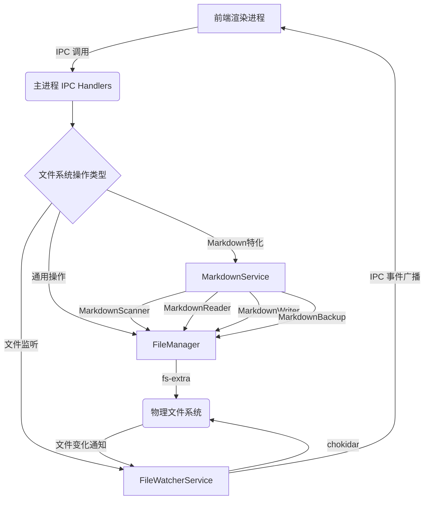

# Nimbria 文件系统与项目结构设计文档

**版本**: v1.0  
**创建时间**: 2025年10月11日  
**文档状态**: 反映实际实现  

---

## 📋 系统概述

Nimbria 的文件系统与项目结构管理系统负责在 Electron 主进程中安全、高效地管理项目文件，提供包括文件读写、目录操作、文件监听以及 Markdown 文件特化处理等功能。系统旨在为前端提供统一且类型安全的文件操作接口，同时确保文件操作的隔离性和安全性。

### 🎯 核心特性

- **项目文件系统隔离**: 每个项目窗口拥有独立的文件系统上下文，确保操作互不干扰。
- **通用文件操作**: 提供文件和目录的创建、读取、写入、删除、复制、移动等基本操作。
- **Markdown 文件特化**: 针对 Markdown 文件提供扫描、读写队列、版本备份等高级功能。
- **文件变更监听**: 实时监听项目文件变化，并通知前端更新 UI。
- **IPC 通信**: 所有文件操作均通过安全的 IPC 通道进行，实现前后端职责分离。
- **错误处理与回滚**: 文件写入支持原子性操作，失败时可回滚，并提供备份机制。

---

## 🏗️ 系统架构

### 主进程服务架构



### 项目文件结构

```
YourProjectName/
├── .nimbria/                        # Nimbria 专用配置和数据
│   ├── project.json                 # Nimbria 项目配置文件
│   └── .nimbria-backups/            # Markdown 文件备份目录
│       └── your-file.md.1678886400000.bak
├── .git/                            # Git 版本控制
├── node_modules/                    # 项目依赖
├── src/                             # 源代码
│   ├── documents/                   # 文档存放
│   │   ├── chapter1.md
│   │   └── images/
│   └── assets/
├── README.md
└── ... (其他项目文件)
```

---

## 📁 核心文件清单

### 主进程服务

| 文件路径 | 职责 |
|---------|------|
| `src-electron/services/file-service/file-manager.ts` | 通用文件管理器，提供文件和目录的增删改查、复制、移动、Glob 搜索等基本操作。 |
| `src-electron/services/file-service/file-watcher.ts` | 文件监听服务，基于 `chokidar` 实时监听文件系统变化，并通知前端。 |
| `src-electron/services/file-service/project-fs.ts` | 项目文件系统抽象层，封装 `FileManager` 和 `FileWatcherService`，提供项目上下文感知的文件操作。 |
| `src-electron/services/markdown-service/markdown-scanner.ts` | Markdown 文件扫描器，递归构建 Markdown 文件树，排除指定目录。 |
| `src-electron/services/markdown-service/markdown-reader.ts` | Markdown 文件读取器，支持文件内容读取和批量读取。 |
| `src-electron/services/markdown-service/markdown-writer.ts` | Markdown 文件写入器，支持原子性写入、备份创建和批量写入。 |
| `src-electron/services/markdown-service/markdown-backup.ts` | Markdown 备份管理器，负责创建、列出、恢复和清理 Markdown 文件备份。 |
| `src-electron/services/markdown-service/markdown-queue.ts` | Markdown 保存队列，管理并发写入任务，确保数据一致性。 |

### IPC 处理器

| 文件路径 | 职责 |
|---------|------|
| `src-electron/ipc/main-renderer/file-handlers.ts` | 注册文件创建、目录创建等通用文件操作的 IPC Handlers。 |
| `src-electron/ipc/main-renderer/markdown-handlers.ts` | 注册 Markdown 文件扫描、读写、备份等特化操作的 IPC Handlers。 |

### 类型定义

| 文件路径 | 职责 |
|---------|------|
| `src-electron/types/ipc.ts` | 定义所有前后端 IPC 通道及其请求/响应类型。 |
| `src-electron/services/file-service/types.ts` | `FileManager` 和 `FileWatcherService` 的类型定义。 |
| `src-electron/services/markdown-service/types.ts` | `MarkdownService` 及其子模块的类型定义。

---

## 🔧 技术实现细节

### 1. FileManager (通用文件操作)

#### 核心方法

- `readFile(filePath, projectId, encoding)`: 读取文件内容。
- `writeFile(filePath, content, projectId, encoding)`: 写入文件内容，确保目录存在。
- `readDir(dirPath, projectId)`: 读取目录内容，返回文件和文件夹列表。
- `createDir(dirPath, projectId)`: 创建目录。
- `delete(targetPath, projectId, recursive)`: 删除文件或目录。
- `copy(source, dest, projectId)`: 复制文件或目录。
- `move(source, dest, projectId)`: 移动文件或目录。
- `glob(pattern, projectId, options)`: 使用 `fast-glob` 进行文件搜索。

#### 安全与隔离

- **Project Context**: 使用 `projectContexts` Map (按 `windowId` 存储) 来管理每个项目的文件系统上下文。
- **路径解析**: `resolvePath` 方法确保所有文件操作都在项目根目录内，防止路径遍历攻击。

### 2. FileWatcherService (文件监听)

#### 核心功能

- `startWatch(watchPath, projectId, options)`: 使用 `chokidar` 启动文件/目录监听。
- `stopWatch(watcherId)`: 停止特定监听器。
- `stopProjectWatchers(projectId)`: 停止项目下的所有监听器。
- `addEventHandler(handler)` / `removeEventHandler(handler)`: 允许注册/移除文件变更事件处理器。

#### 事件广播

- 当文件系统发生 `add`, `change`, `unlink`, `addDir`, `unlinkDir` 等事件时，通过 `eventHandlers` 广播给所有注册的处理器。
- 前端可以通过 IPC 监听这些事件来更新文件树、刷新内容等。

### 3. MarkdownScanner (Markdown 文件树构建)

#### 核心方法

- `scanMarkdownTree(options)`: 递归扫描项目目录，构建 `MarkdownFile[]` 结构的文件树。
  - **排除目录**: 默认排除 `node_modules`, `.git`, `dist` 等，支持自定义排除列表。
  - **文件过滤**: 只包含 `.md` 和 `.markdown` 扩展名的文件。
  - **深度限制**: 可配置最大递归深度。

#### 文件ID生成

- 使用 `nanoid` 为每个文件和文件夹生成唯一的 `id`，便于前端进行状态管理和渲染。

### 4. MarkdownReader & MarkdownWriter (Markdown 文件读写)

#### MarkdownReader

- `readMarkdownFile(filePath, options)`: 读取单个 Markdown 文件内容。
- `batchReadFiles(filePaths, options)`: 批量读取多个 Markdown 文件内容。

#### MarkdownWriter (原子性写入)

- `writeMarkdownFile(filePath, content, options)`: 以原子性方式写入文件。
  - **临时文件**: 先写入 `.tmp` 文件，成功后再重命名覆盖原文件。
  - **备份**: 可选在写入前创建 `.bak` 备份文件。
  - **回滚**: 写入失败时，删除临时文件，并尝试恢复备份。
- `batchWriteFiles(files, options)`: 批量原子性写入多个文件，支持事务性回滚。

### 5. MarkdownBackup (文件备份)

#### 备份目录

- `.nimbria-backups/`: 在每个文件所在目录的子目录中创建备份，例如：`path/to/file/.nimbria-backups/file.md.1678886400000.bak`。

#### 核心方法

- `createBackup(filePath)`: 为指定文件创建带时间戳的备份。
- `listBackups(filePath)`: 列出文件的所有备份，按时间倒序排列。
- `restoreBackup(backupPath)`: 恢复指定备份文件到原位置。
- `cleanupOldBackups(filePath)`: 清理超出最大数量（默认为10）的旧备份。
- `deleteAllBackups(filePath)`: 删除文件的所有备份。

### 6. MarkdownSaveQueue (保存队列)

- 负责管理 Markdown 文件的并发写入任务，防止频繁保存导致的性能问题或文件冲突。
- `enqueue(task)`: 将保存任务加入队列。
- `waitUntilEmpty(timeout)`: 等待所有队列中的任务完成。

---

## 🔗 IPC 通信协议

### 通用文件操作 IPC (file-handlers.ts)

| 通道名 | 请求类型 | 响应类型 | 用途 |
|-------|---------|----------|------|
| `file:create` | `{ filePath: string, initialContent?: string }` | `FileOperationResult` | 创建文件 |
| `directory:create` | `{ dirPath: string }` | `FileOperationResult` | 创建目录 |
| `file:delete` | `{ targetPath: string, recursive?: boolean }` | `FileOperationResult` | 删除文件或目录 |
| `file:rename` | `{ oldPath: string, newPath: string }` | `FileOperationResult` | 重命名/移动文件或目录 |
| `file:copy` | `{ sourcePath: string, destPath: string }` | `FileOperationResult` | 复制文件或目录 |

### Markdown 文件操作 IPC (markdown-handlers.ts)

| 通道名 | 请求类型 | 响应类型 | 用途 |
|-------|---------|----------|------|
| `markdown:scan-tree` | `{ projectPath: string, options?: MarkdownTreeOptions }` | `IPCResponse<MarkdownFile[]>` | 扫描 Markdown 文件树 |
| `markdown:read-file` | `{ filePath: string }` | `IPCResponse<string>` | 读取 Markdown 文件内容 |
| `markdown:write-file` | `{ filePath: string, content: string, options?: WriteOptions }` | `IPCResponse<SaveResult>` | 写入 Markdown 文件内容 (通过队列) |
| `markdown:batch-write` | `{ files: Array<{ path: string; content: string }> }` | `IPCResponse<BatchSaveResult>` | 批量写入 Markdown 文件 |
| `markdown:create-backup` | `{ filePath: string }` | `IPCResponse<string>` | 创建 Markdown 文件备份 |
| `markdown:list-backups` | `{ filePath: string }` | `IPCResponse<BackupInfo[]>` | 列出 Markdown 文件备份 |
| `markdown:restore-backup` | `{ backupPath: string }` | `IPCResponse<FileOperationResult>` | 恢复 Markdown 文件备份 |

### 文件变更事件 IPC (file-watcher.ts -> app-manager.ts)

- `file-watcher:on-change`: 当 `FileWatcherService` 检测到文件系统变化时，通过 IPC `main-renderer` 通道广播给渲染进程。
- 前端 `MarkdownStore` 监听此事件，刷新文件树或更新文件内容。

---

## 🧪 测试策略

### 单元测试重点 (主进程)

1. **FileManager**: 覆盖所有文件操作方法的正确性、边界条件和错误处理。
2. **FileWatcherService**: 监听器的启动/停止、事件触发与广播、项目级停止功能。
3. **MarkdownScanner**: 文件树扫描的正确性、排除目录过滤、深度限制。
4. **MarkdownReader/Writer**: 文件读写、原子性操作、备份/恢复、错误回滚。
5. **MarkdownBackup**: 备份的创建、列表、恢复、清理逻辑。
6. **MarkdownSaveQueue**: 队列的入队/出队、并发控制、等待机制。

### 集成测试重点 (前后端 IPC)

1. **文件树更新**: 修改物理文件后，前端文件树能否实时更新。
2. **文件内容同步**: 编辑器保存后，文件内容能否正确写入磁盘；文件被外部修改后，编辑器能否提示刷新。
3. **备份功能**: 验证备份文件的创建、列表和恢复功能。
4. **错误场景**: 文件权限不足、磁盘空间不足等情况下的错误处理。

### E2E 测试场景

1. **项目生命周期**: 创建新项目 → 打开文件 → 编辑 → 保存 → 关闭项目 → 重新打开，验证文件完整性。
2. **多窗口文件操作**: 两个项目窗口同时操作文件，验证隔离性。
3. **外部文件编辑**: 在外部编辑器修改文件，验证 Nimbria 内部的响应。
4. **撤销/重做**: 结合 Markdown 编辑器功能，验证文件内容的完整性。

---

## 📊 监控与调试

### 关键指标

1. **文件操作延迟**: 读写、保存操作的响应时间。
2. **文件监听性能**: 大规模项目下的 CPU 和内存占用。
3. **保存队列长度**: 反映并发写入任务的压力。
4. **备份文件数量**: 确保备份清理机制正常工作。

### 调试工具

1. **主进程日志**: 详细记录所有文件操作和文件监听事件，通过 `logger` 输出到控制台。
2. **文件系统观察**: 使用外部文件浏览器或命令行工具监控文件变化。
3. **Electron DevTools**: 检查 IPC 通信消息、渲染进程的文件相关 Store 状态。

---

## 🔄 版本历史与路线图

### 当前版本 (v1.0)

- ✅ 通用文件读写、目录操作
- ✅ Markdown 文件扫描与文件树构建
- ✅ 原子性 Markdown 文件写入与备份
- ✅ 实时文件变更监听
- ✅ 完善的 IPC 通信协议

### 计划中的功能 (v1.1+)

- [ ] 文件重命名、移动、复制、粘贴的 UI 集成
- [ ] 冲突解决机制（文件被外部修改时）
- [ ] 版本历史 UI 展示与恢复
- [ ] 文件搜索功能优化（全文搜索、元数据搜索）
- [ ] 大文件处理优化（分块读写）

---

## 📖 相关文档

- [架构设计总览](./架构设计总览.md)
- [Markdown编辑系统设计文档](./Markdown编辑系统设计文档.md)
- [Pane分屏系统设计文档](./Pane分屏系统设计文档.md)
- [多窗口系统设计文档](./多窗口系统设计文档.md)

---

**最后更新**: 2025年10月11日  
**负责人**: Nimbria 开发团队
