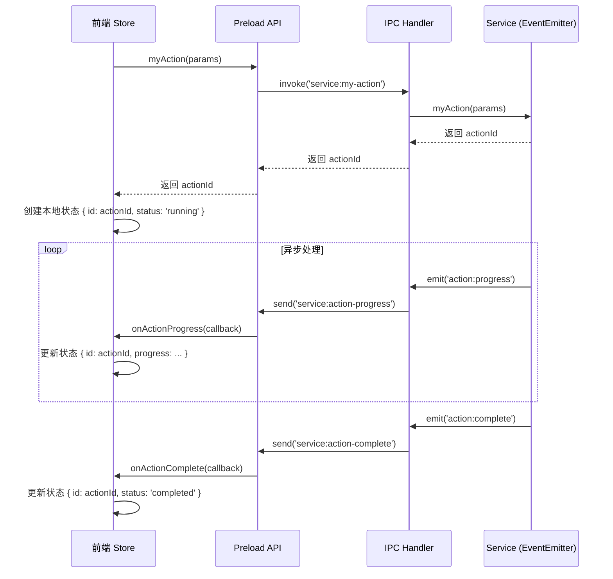

 ### 报告名称
`2025年10月15日15时33分19秒-LlmChat第一阶段开发总结.md`

### 存放位置
`Document/总结/`

### 报告内容

# LLM Chat 第一阶段开发总结

**报告时间**: 2025年10月15日 15:33:19 (东八区)
**项目阶段**: LLM Chat V1 核心功能实现
**负责人**: Nimbria 开发团队

---

## 📈 1. 已实现功能汇总

### 1.1 前端 UI
- **LLM 对话面板**: 完整 UI 布局，包含选项卡、消息区、输入区
- **多行选项卡**: 支持多个对话，横向滚动，超过6个显示"更多"
- **消息列表**: 支持 Markdown 渲染、用户/AI 角色区分、消息操作（复制、删除、重新生成）
- **模型选择器**:
  - 使用 `el-dropdown` 实现，样式简洁
  - 自动从后端获取活跃模型列表
  - 支持在对话中切换模型
  - 支持设置默认模型
- **动态输入区**:
  - 无对话时隐藏输入框，显示"创建对话"按钮
  - 有对话时显示输入框和发送按钮
- **左侧栏交互**:
  - 使用全局 Store (`leftSidebarStore`) 管理状态
  - 点击当前视图按钮可收起/展开内容区（48px <-> 365px）
  - 拖拽调整宽度

### 1.2 后端服务 (Electron 主进程)
- **LlmChatService**:
  - 核心服务类，使用 **EventEmitter 架构**，实现事件驱动
  - 集成 `LlmConfigManager`，自动获取模型配置
  - 实现对话管理、消息发送、重新生成等核心逻辑
- **LangChain 客户端**:
  - 封装 `ChatOpenAI`，支持流式和非流式响应
  - 使用 `tiktoken` 实现 Token 计数
- **上下文管理**:
  - 基于 `ModelConfig.contextLength` 实现智能上下文裁剪
  - 自动为生成预留 Token 空间
- **对话管理**:
  - 对话的增删改查
  - **通过 IPC → 渲染进程 LocalStorage 实现持久化**
- **IPC 通信**:
  - 完整的 IPC Handlers 和 Preload API，连接前后端
  - 使用事件转发模式处理流式响应

### 1.3 核心技术栈
- **核心框架**: LangChain
- **前端状态**: Pinia
- **UI库**: Quasar + Element Plus
- **通信**: Electron IPC
- **存储**: LocalStorage

---

## 📚 2. 项目规范与习惯

### 2.1 文件存放目录
- **后端服务**: `Nimbria/src-electron/services/{feature-name}/`
  - *示例*: `services/llm-chat-service/`
- **IPC Handlers**: `Nimbria/src-electron/ipc/main-renderer/`
  - *示例*: `ipc/main-renderer/llm-chat-handlers.ts`
- **Preload API**: `Nimbria/src-electron/core/`
  - *注意*: 项目窗口使用 `project-preload.ts`，主窗口使用 `main-preload.ts`
- **前端 Store**: `Nimbria/Client/stores/{feature-name}/`
  - *示例*: `stores/llmChat/llmChatStore.ts`
- **前端组件**: `Nimbria/Client/GUI/components/{page-name}/{feature-name}/`
  - *示例*: `components/ProjectPage.Shell/Navbar.content/LlmChat/`
- **前端类型**: `Nimbria/Client/Types/`
  - *示例*: `Types/llmChat.ts`

### 2.2 架构习惯
1. **前后端分离**: Electron 主进程处理重逻辑，渲染进程专注 UI
2. **事件驱动架构 (新范式)**:
   - Service 继承 `EventEmitter`，通过事件发射状态（如流式响应）
   - IPC Handler 监听 Service 事件并转发，职责单一
   - 异步操作立即返回 ID，通过事件更新后续状态
3. **全局 Store 管理 UI 状态**:
   - 跨组件/跨层级的 UI 状态（如侧边栏）由全局 Store 管理
   - 组件只读取状态，通过 Store 的 actions 修改状态
4. **依赖注入**:
   - `AppManager` 统一管理和初始化所有服务
   - Service 间的依赖通过构造函数注入
5. **配置驱动功能**:
   - 功能（如上下文长度、最大Token）由 `ModelConfig` 决定
   - 业务逻辑读取配置，而不是硬编码

### 2.3 命名习惯
- **Store**: `use{FeatureName}Store`，文件名 `{feature-name}.store.ts`
- **Service**: `{feature-name}-service.ts`
- **IPC 通道**: `{feature-name}:{action-name}`
- **CSS/SCSS**: BEM 风格，如 `class="chat-input"`

---

## 💣 3. 踩坑与经验总结

### 3.1 最大的坑：回调导致 `messageId` 循环依赖
- **问题**: IPC Handler 在 `await service.sendMessage()` 完成前，就在回调中使用了 `messageId`
- **教训**: 这是典型的异步流程设计缺陷。**回调模式在复杂异步（如流式）场景中极易出错。**
- **解决方案**: 重构为 **EventEmitter 架构**，将 Service 和 IPC Handler 彻底解耦，是解决此类问题的最佳实践。

### 3.2 搞错 Preload 文件
- **问题**: 修改了 `main-preload.ts`，但项目窗口使用 `project-preload.ts`，导致 API 未暴露。
- **教训**: Electron 多窗口项目，必须确认 **当前窗口加载的是哪个 Preload 脚本**。这是多窗口开发的常见陷阱。

### 3.3 前后端数据结构不一致
- **问题**: 前端猜测 `isActive`，但后端实际是 `status: 'active'`；`isSelected` vs `activeModels` 结构不同。
- **教训**: **永远不要猜测数据结构！** 直接查看类型定义或源代码是唯一可靠的方法。跨进程通信时，保持类型一致性至关重要。

### 3.4 Element Plus 样式问题
- **问题**: `el-popover` + `el-radio-group` 嵌套复杂，样式难以覆盖，导致奇怪的 padding。
- **教训**: **选择最简单的组件**。能用 `el-dropdown` 就不要用 `el-popover`。复杂的组件嵌套会带来大量的 `:deep()` 和 `!important`，难以维护。

### 3.5 依赖注入不匹配
- **问题**: `AppManager` 实例化 `LlmChatService` 的方式与 Service 构造函数签名不一致，导致 `llmConfigManager` 为 `undefined`。
- **教训**: 依赖注入的双方（注入方和被注入方）必须严格匹配。这是导致"看似正常，一跑就崩"的常见原因。

### 3.6 UI 状态管理混乱
- **问题**: 左侧栏的宽度和显示/隐藏状态由不同层级的组件管理，导致行为不一致。
- **教训**: 跨组件、跨层级的 UI 状态，必须提升到 **全局 Store** 中统一管理。

---

## 🚀 4. 后端服务集成标准流程

基于 LlmChat 的重构经验，总结出一个标准的、适用于 Electron 环境的 **异步/流式服务集成流程**：

### **Step 1: 定义事件和类型 (`types.ts`)**

为每个异步操作定义清晰的事件数据类型，取代原始的回调函数签名。

```typescript
// 定义事件数据类型
export interface ActionStartEvent  { actionId: string; ... }
export interface ActionProgressEvent { actionId: string; progress: number; ... }
export interface ActionCompleteEvent { actionId: string; result: any }
```

### **Step 2: 构建 EventEmitter Service**

1. **继承 EventEmitter**:
   ```typescript
   import { EventEmitter } from 'events'
   export class MyService extends EventEmitter { ... }
   ```
2. **异步方法立即返回 ID**:
   - 方法签名：`async myAction(params): Promise<string>`
   - 方法内部：
     - **立即**生成唯一 ID (`actionId`)
     - **立即**返回 `actionId`
     - 使用 `setImmediate()` 或 `process.nextTick()` 将耗时操作放入下一个事件循环
3. **通过事件发射状态**
   - 在异步操作的不同阶段，通过 `this.emit()` 发射事件：
     - `this.emit('action:start', { actionId, ... })`
     - `this.emit('action:progress', { actionId, ... })`
     - `this.emit('action:complete', { actionId, ... })`
     - `this.emit('action:error', { actionId, ... })`

### **Step 3: 实现轻量级 IPC Handler**

1. **职责：纯事件转发**
   - 在 `registerHandlers` 函数中，一次性注册对 Service 事件的监听。
   - 监听器内，将事件数据广播到所有前端窗口。
   ```typescript
   service.on('action:progress', (data) => {
     BrowserWindow.getAllWindows().forEach(win => {
       win.webContents.send('service:action-progress', data)
     })
   })
   ```
2. **简化IPC调用**
   - `ipcMain.handle` 只负责调用 Service 方法，并返回 `actionId`。
   - 不再需要处理复杂的回调函数。

### **Step 4: 实现 Preload API**

1. **暴露调用方法**
   - `myAction: (params) => ipcRenderer.invoke('service:my-action', params)`
2. **暴露事件监听器**
   - `onActionProgress: (callback) => ipcRenderer.on('service:action-progress', (_, data) => callback(data))`

### **Step 5: 前端 Store 消费事件**

1. **触发操作**
   - 调用 `window.api.service.myAction(params)` 获取 `actionId`
   - 在本地状态中创建该 `actionId` 对应的数据
2. **监听事件**
   - 在 `onMounted` 或 Store 初始化时，设置事件监听器 `window.api.service.onActionProgress(...)`
   - 根据 `actionId` 更新本地状态

### **流程图**



---

## 🎯 5. 下一阶段工作建议

1. **完善 LocalStorage 持久化**
   - 在 `llmChatStore` 中实现 `onStorageSave` 和 `onStorageLoadRequest` 的具体逻辑，将对话历史真正写入 LocalStorage。
2. **实现对话设置**
   - 在 UI 中添加入口，允许用户调整 `temperature`、`systemPrompt` 等。
   - 将设置保存到 `Conversation` 对象中。
3. **优化体验**
   - **对话标题自动生成**: 发送第一条消息后，自动截取内容作为标题。
   - **上下文使用可视化**: 在输入框附近显示 "已用 Token / 总 Token" 进度条。
4. **实现文件引用**
   - 允许用户在对话中通过 `@文件名` 引用项目文件。
   - 读取文件内容，并将其作为上下文发送给 LLM。

---

**总结完毕！**