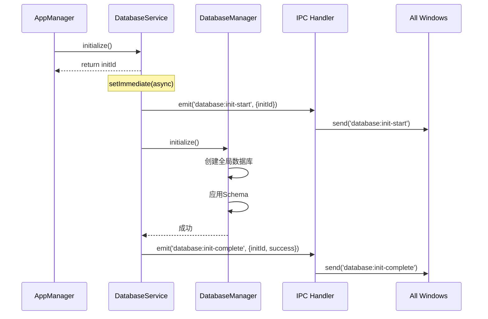
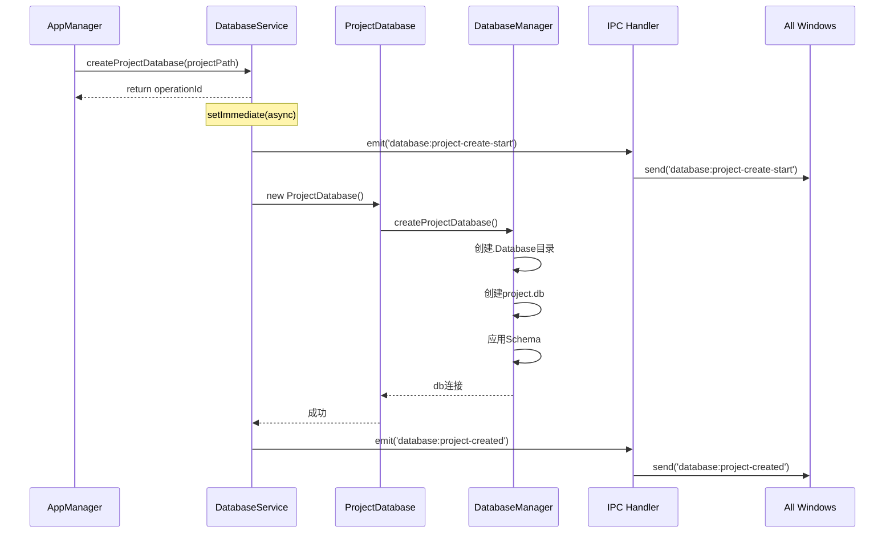

# Nimbria 数据库系统初始实现总结

**实现日期**: 2025年10月15日  
**实现内容**: SQLite数据库系统集成  
**架构范式**: 严格遵循事件驱动架构

---

## 📋 实现概览

本次实现完成了Nimbria项目的数据库系统基础架构，包括：

1. ✅ **全局数据库**：在Electron启动时自动创建（用户数据目录/.Database/nimbria.db）
2. ✅ **项目数据库**：在进入项目页时自动创建（项目根目录/.Database/project.db）
3. ✅ **事件驱动架构**：完全遵循Nimbria的EventEmitter模式
4. ✅ **TypeScript化Schema**：所有数据库定义使用.ts文件
5. ✅ **详细日志输出**：控制台显示完整的数据库创建过程

---

## 🗂️ 文件结构

```
Nimbria/src-electron/services/database-service/
├── database-service.ts              # 主服务类（EventEmitter）
├── database-manager.ts              # 数据库连接管理
├── project-database.ts              # 项目级数据库操作
└── schema/
    ├── base-schema.ts               # 基础Schema类型定义
    └── versions/
        ├── v1.0.0.schema.ts         # v1.0.0版本Schema
        └── index.ts                 # 版本导出管理

Nimbria/src-electron/ipc/main-renderer/
└── database-handlers.ts             # IPC处理器（事件转发）

Nimbria/src-electron/core/
└── app-manager.ts                   # [已修改] 集成数据库服务
```

---

## 🏗️ 核心实现

### 1. DatabaseService（主服务类）

**文件**: `database-service.ts`

**特性**:
- ✅ 继承`EventEmitter`
- ✅ 立即返回操作ID（initId、operationId）
- ✅ 使用`setImmediate()`延迟异步操作
- ✅ 通过事件发射状态更新

**关键方法**:

```typescript
// 初始化全局数据库（立即返回initId）
async initialize(): Promise<string>

// 创建项目数据库（立即返回operationId）
async createProjectDatabase(projectPath: string): Promise<string>

// 同步方法
getProjectDatabase(projectPath: string): ProjectDatabase | null
closeProjectDatabase(projectPath: string): Promise<void>
cleanup(): Promise<void>
```

**事件类型**:
- `database:init-start` - 初始化开始
- `database:init-complete` - 初始化完成
- `database:init-error` - 初始化失败
- `database:project-create-start` - 项目数据库创建开始
- `database:project-created` - 项目数据库创建完成
- `database:project-error` - 项目数据库创建失败

---

### 2. DatabaseManager（连接管理）

**文件**: `database-manager.ts`

**职责**:
- 管理全局数据库连接
- 管理项目数据库连接池
- 应用Schema到数据库
- 配置WAL模式优化

**核心功能**:

```typescript
// 初始化全局数据库（nimbria.db）
async initialize(): Promise<void>

// 创建项目数据库（project.db）
async createProjectDatabase(projectPath: string, schema: SchemaDefinition): Promise<Database.Database>

// 配置数据库优化
private configureDatabase(db: Database.Database): void {
  db.pragma('journal_mode = WAL')
  db.pragma('synchronous = NORMAL')
  db.pragma('cache_size = 1000')
  db.pragma('temp_store = memory')
  db.pragma('foreign_keys = ON')
}
```

**日志输出示例**:

```
📦 [DatabaseManager] 初始化全局数据库...
📍 [DatabaseManager] 全局数据库路径: C:\Users\XXX\AppData\Roaming\nimbria\.Database\nimbria.db
⚙️  [DatabaseManager] 配置数据库优化选项...
✅ [DatabaseManager] 数据库配置完成
📝 [DatabaseManager] 应用Schema v1.0.0...
  ├─ 创建表: app_settings
  │  └─ 创建 1 个索引
  ├─ 创建表: recent_projects
  │  └─ 创建 2 个索引
✅ [DatabaseManager] Schema应用完成
📌 [DatabaseManager] 设置Schema版本: v1.0.0
✅ [DatabaseManager] 全局数据库初始化成功
```

---

### 3. ProjectDatabase（项目数据库操作）

**文件**: `project-database.ts`

**提供的操作**:
- ✅ 基础SQL操作（query、execute、transaction）
- ✅ 项目元数据管理（getMetadata、setMetadata）
- ✅ 文档查询（getDocuments）
- ✅ 统计查询（getStats）

**示例方法**:

```typescript
// 获取项目统计
async getStats(): Promise<{
  totalDocuments: number
  totalChapters: number
  totalWords: number
}>

// 获取/设置项目元数据
async getMetadata(key: string): Promise<string | null>
async setMetadata(key: string, value: string, type?: string): Promise<void>
```

---

### 4. Schema定义（v1.0.0）

**文件**: `schema/versions/v1.0.0.schema.ts`

**全局数据库表**:
- `app_settings` - 应用配置
- `recent_projects` - 最近项目
- `user_preferences` - 用户偏好

**项目数据库表**:
- `project_metadata` - 项目元数据
- `documents` - 文档表
- `chapters` - 章节表
- `tags` - 标签表
- `document_tags` - 文档标签关联
- `project_stats` - 项目统计
- `writing_sessions` - 写作会话

**所有表都包含**:
- ✅ 完整的索引定义
- ✅ 外键约束
- ✅ 时间戳字段
- ✅ 合理的默认值

---

### 5. IPC处理器

**文件**: `ipc/main-renderer/database-handlers.ts`

**遵循事件驱动架构**:

```typescript
// ========== 事件监听器（只注册一次） ==========
databaseService.on('database:init-start', (data) => {
  // 广播到所有窗口
  BrowserWindow.getAllWindows().forEach(win => {
    win.webContents.send('database:init-start', data)
  })
})

// ========== IPC Handlers（纯调用，立即返回ID） ==========
ipcMain.handle('database:initialize', async (_event) => {
  const initId = await databaseService.initialize()
  return { success: true, initId }
})
```

**注册的IPC方法**:
- `database:initialize` - 初始化数据库服务
- `database:create-project` - 创建项目数据库
- `database:get-stats` - 获取项目统计
- `database:get-metadata` - 获取项目元数据
- `database:set-metadata` - 设置项目元数据

---

### 6. AppManager集成

**文件**: `src-electron/core/app-manager.ts`

**修改内容**:

1. **导入DatabaseService**:
   ```typescript
   import { DatabaseService } from '../services/database-service/database-service'
   import { registerDatabaseHandlers } from '../ipc/main-renderer/database-handlers'
   ```

2. **添加数据库服务成员**:
   ```typescript
   private databaseService!: DatabaseService
   ```

3. **启动时初始化**:
   ```typescript
   async boot() {
     // ...
     this.initializeFileSystem()
     await this.initializeDatabase()  // ✅ 新增
     this.initializeWindowManager()
     // ...
   }
   
   private async initializeDatabase() {
     this.databaseService = new DatabaseService()
     const initId = await this.databaseService.initialize()
     logger.info('Database service initialization started, initId:', initId)
   }
   ```

4. **关闭时清理**:
   ```typescript
   async shutdown() {
     if (this.databaseService) {
       await this.databaseService.cleanup()
     }
     // ...
   }
   ```

5. **创建项目窗口时自动创建数据库**:
   ```typescript
   ipcMain.handle('project:create-window', async (_event, request) => {
     const process = this.windowManager.createProjectWindow(request.projectPath)
     
     if (process.type === 'project') {
       // ✅ 自动创建项目数据库
       const operationId = await this.databaseService.createProjectDatabase(process.projectPath)
       logger.info(`Auto-started project database creation, operationId: ${operationId}`)
     }
     
     return { success: true, processId: process.id }
   })
   ```

---

## 📦 依赖配置

**文件**: `package.json`

**变更**:

1. **移动better-sqlite3到dependencies**:
   ```json
   "dependencies": {
     "better-sqlite3": "^12.2.0",
     // ...
   }
   ```

2. **添加@electron/rebuild到devDependencies**:
   ```json
   "devDependencies": {
     "@electron/rebuild": "^4.0.1",
     "@types/better-sqlite3": "^7.6.12",
     // ...
   }
   ```

3. **更新postinstall脚本**:
   ```json
   "scripts": {
     "postinstall": "quasar prepare && npx @electron/rebuild"
   }
   ```

---

## 🔄 事件驱动架构流程

### 全局数据库初始化流程



### 项目数据库创建流程



---

## 📊 控制台日志示例

### Electron启动日志

```
🎬 [DatabaseService] 开始初始化数据库服务...
📦 [DatabaseManager] 初始化全局数据库...
📍 [DatabaseManager] 全局数据库路径: C:\Users\XXX\AppData\Roaming\nimbria\.Database\nimbria.db
📁 [DatabaseManager] 创建数据库目录: C:\Users\XXX\AppData\Roaming\nimbria\.Database
⚙️  [DatabaseManager] 配置数据库优化选项...
✅ [DatabaseManager] 数据库配置完成
📝 [DatabaseManager] 应用Schema v1.0.0...
  ├─ 创建表: app_settings
  │  └─ 创建 1 个索引
  ├─ 创建表: recent_projects
  │  └─ 创建 2 个索引
  ├─ 创建表: user_preferences
  │  └─ 创建 1 个索引
✅ [DatabaseManager] Schema应用完成
📌 [DatabaseManager] 设置Schema版本: v1.0.0
✅ [DatabaseManager] 全局数据库初始化成功
✅ [DatabaseService] 数据库服务初始化成功
📡 [IPC] 注册Database IPC处理器...
📢 [IPC] 广播事件: database:init-start
📢 [IPC] 广播事件: database:init-complete
✅ [IPC] Database IPC处理器注册完成
```

### 进入项目页日志

```
🔵 [IPC] 调用: database:create-project, 项目路径: D:\Projects\MyNovel
🎬 [DatabaseService] 开始创建项目数据库: D:\Projects\MyNovel
📢 [IPC] 广播事件: database:project-create-start
🚀 [ProjectDatabase] 初始化项目数据库: D:\Projects\MyNovel
📦 [DatabaseManager] 创建项目数据库...
📍 [DatabaseManager] 项目路径: D:\Projects\MyNovel
📁 [DatabaseManager] 创建数据库目录: D:\Projects\MyNovel\.Database
⚙️  [DatabaseManager] 配置数据库优化选项...
✅ [DatabaseManager] 数据库配置完成
📝 [DatabaseManager] 应用Schema v1.0.0...
  ├─ 创建表: project_metadata
  │  └─ 创建 1 个索引
  ├─ 创建表: documents
  │  └─ 创建 4 个索引
  ├─ 创建表: chapters
  │  └─ 创建 3 个索引
  ├─ 创建表: tags
  │  └─ 创建 1 个索引
  ├─ 创建表: document_tags
  │  └─ 创建 2 个索引
  ├─ 创建表: project_stats
  │  └─ 创建 1 个索引
  ├─ 创建表: writing_sessions
  │  └─ 创建 2 个索引
✅ [DatabaseManager] Schema应用完成
📌 [DatabaseManager] 设置Schema版本: v1.0.0
✅ [DatabaseManager] 项目数据库创建成功: D:\Projects\MyNovel\.Database\project.db
✅ [ProjectDatabase] 项目数据库初始化成功
✅ [DatabaseService] 项目数据库创建成功
📢 [IPC] 广播事件: database:project-created
```

---

## ✅ 实现检查清单

- [x] **全局数据库**：Electron启动时自动创建
- [x] **项目数据库**：进入项目页时自动创建
- [x] **目录结构**：`.Database/`目录正确创建
- [x] **事件驱动架构**：严格遵循EventEmitter模式
- [x] **立即返回ID**：所有异步方法立即返回操作ID
- [x] **事件发射**：通过事件反馈状态更新
- [x] **多窗口支持**：事件自动广播到所有窗口
- [x] **详细日志**：控制台显示完整创建过程
- [x] **WAL模式优化**：数据库配置优化
- [x] **TypeScript化Schema**：所有Schema使用.ts文件
- [x] **依赖配置**：better-sqlite3和@electron/rebuild正确配置

---

## 🔮 后续开发计划

### 已规划功能

1. **前端Store集成**
   - 创建`useDatabaseStore`
   - 监听数据库事件
   - 提供UI状态更新

2. **迁移系统**
   - 实现`MigrationManager`
   - 支持版本间迁移
   - 提供回滚功能

3. **数据操作API**
   - 文档CRUD操作
   - 章节管理
   - 标签系统
   - 统计功能

4. **备份和恢复**
   - 自动备份
   - 手动备份
   - 备份恢复

5. **性能优化**
   - 连接池管理
   - 查询优化
   - 批量操作

---

## 📚 参考文档

- [数据库系统设计文档](../Design/数据库系统/数据库系统设计文档.md)
- [数据库模板修改工作流](../Design/数据库系统/数据库模板修改工作流.md)
- [事件驱动架构范式总结文档](../Workflow/事件驱动架构范式总结文档.md)
- [Better SQLite3 官方文档](https://github.com/WiseLibs/better-sqlite3)

---

**实现完成时间**: 2025年10月15日  
**下一步**: 运行`npm install`安装依赖，然后启动Electron测试数据库创建功能

