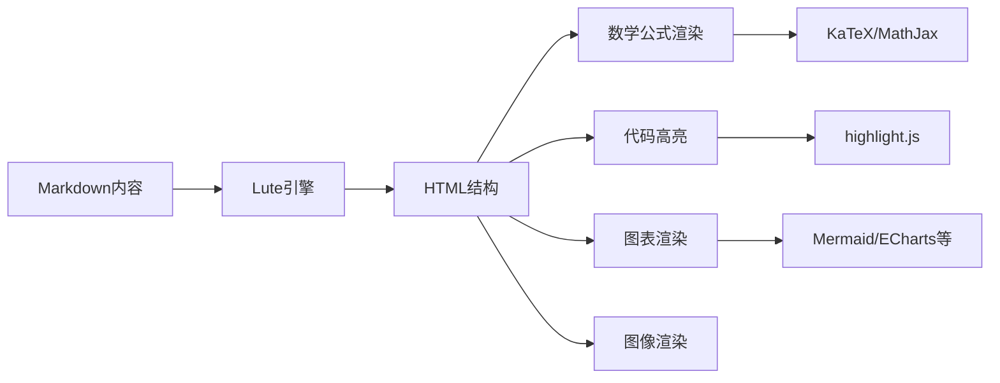

好的Boss！我使用MCP来查看Vditor的详细信息。

[2 tools called]

好的Boss！我已经通过MCP查看了Vditor的完整文档。让我为您详细介绍Vditor的功能、集成方式以及自定义接口。

## 📋 Vditor 核心功能总结

### 🎨 **三种编辑模式**

| 模式 | 特点 | 适用场景 |
|------|------|---------|
| **WYSIWYG** (所见即所得) | Markdown语法隐藏,直接显示渲染结果 | 喜欢富文本编辑,想看到最终效果的用户 |
| **IR** (即时渲染) | 类似Typora,显示Markdown语法但同时渲染 | 想看格式但又想保留Markdown语法的用户 |
| **SV** (分屏模式) | 经典左右分屏,左侧Markdown源码,右侧预览 | 喜欢传统Markdown编辑器的用户 |

### ⭐ **核心渲染能力**



**支持的特殊内容类型:**
- ✅ **数学公式**: KaTeX (快速) 或 MathJax (功能全面)
- ✅ **代码高亮**: 支持36+主题,可显示行号
- ✅ **图表**: Mermaid, Flowchart, ECharts, Mindmap
- ✅ **科学图形**: GraphViz, PlantUML, ABC音乐记谱
- ✅ **化学式**: SMILES渲染

---

## 🛠️ 集成方式

### **方式一: NPM安装 (推荐)**

```bash
npm install vditor
```

```javascript
import Vditor from 'vditor';
import 'vditor/dist/index.css';

const vditor = new Vditor('vditor', {
  height: 500,
  mode: 'ir',  // wysiwyg | ir | sv
  placeholder: '开始写作...',
  toolbar: ['emoji', 'headings', 'bold', 'italic', 'link'],
  upload: {
    url: '/api/upload'
  }
});
```

### **方式二: CDN引入**

```html
<!DOCTYPE html>
<html>
<head>
  <link rel="stylesheet" href="https://cdn.jsdelivr.net/npm/vditor/dist/index.css" />
  <script src="https://cdn.jsdelivr.net/npm/vditor/dist/index.min.js"></script>
</head>
<body>
  <div id="vditor"></div>
  <script>
    const vditor = new Vditor('vditor', {
      height: 600,
      mode: 'wysiwyg'
    });
  </script>
</body>
</html>
```

### **方式三: Vue集成**

```vue
<template>
  <div id="vditor"></div>
</template>

<script setup>
import { onMounted, onBeforeUnmount, ref } from 'vue'
import Vditor from 'vditor'
import 'vditor/dist/index.css'

const vditor = ref(null)

onMounted(() => {
  vditor.value = new Vditor('vditor', {
    height: 500,
    mode: 'ir',
    after: () => {
      vditor.value.setValue('## Hello Vditor!')
    }
  })
})

onBeforeUnmount(() => {
  vditor.value?.destroy()
})
</script>
```

---

## 🔧 自定义接口详解

### **1. 工具栏自定义**

```javascript
const vditor = new Vditor('vditor', {
  toolbar: [
    'emoji',
    'headings',
    'bold',
    'italic',
    '|',  // 分隔符
    'list',
    'ordered-list',
    {
      name: 'more',
      toolbar: [  // 二级菜单
        'fullscreen',
        'preview',
        'help'
      ]
    },
    {
      name: 'custom-button',
      icon: '<svg>...</svg>',
      tip: '自定义按钮',
      click: (vditor) => {
        // 自定义逻辑
        console.log('自定义按钮点击')
      }
    }
  ]
})
```

### **2. 文件上传自定义**

```javascript
const vditor = new Vditor('vditor', {
  upload: {
    url: '/api/upload/editor',
    accept: 'image/*,.mp3,.wav,.zip',
    token: 'your-auth-token',
    
    // 文件名处理
    filename(name) {
      return name.replace(/[^(a-zA-Z0-9\u4e00-\u9fa5\.)]/g, "")
    },
    
    // 自定义上传处理器
    handler(files) {
      // 完全自定义上传逻辑
      console.log('上传文件:', files)
      // 返回 true 或错误信息字符串
      return true
    },
    
    // 自定义验证
    validate(files) {
      // 自定义验证逻辑
      return true  // 或错误信息
    },
    
    // 格式化服务器响应
    format(files, responseText) {
      const response = JSON.parse(responseText)
      return {
        code: 0,
        data: {
          succMap: {
            'file.jpg': 'https://example.com/file.jpg'
          }
        }
      }
    },
    
    // 成功回调
    success(editor, responseText) {
      console.log('上传成功:', responseText)
    },
    
    // 错误回调
    error(errorMessage) {
      console.error('上传失败:', errorMessage)
    }
  }
})
```

### **3. 提示/自动完成扩展**

```javascript
const vditor = new Vditor('vditor', {
  hint: {
    // 自定义emoji
    emoji: {
      "smile": "😊",
      "heart": "❤️"
    },
    
    // 扩展自定义提示
    extend: [
      {
        key: "@",  // 触发字符
        hint: (searchTerm) => {
          // 模拟用户搜索
          const users = ['Alice', 'Bob', 'Charlie']
          return users
            .filter(u => u.toLowerCase().includes(searchTerm.toLowerCase()))
            .map(u => ({
              value: `@${u}`,
              html: ` ${u}`
            }))
        }
      },
      {
        key: "#",  // 标签提示
        hint: (searchTerm) => {
          const tags = ['前端', '后端', 'Vue', 'React']
          return tags
            .filter(t => t.includes(searchTerm))
            .map(t => ({
              value: `#${t}`,
              html: `<span class="tag">#${t}</span>`
            }))
        }
      }
    ],
    
    parse: true,  // 是否解析插入的内容为Markdown
    delay: 200    // 延迟显示(ms)
  }
})
```

### **4. 主题自定义**

```javascript
const vditor = new Vditor('vditor', {
  // 编辑器主题
  theme: 'dark',  // 'dark' | 'classic'
  
  preview: {
    // 内容主题
    theme: {
      current: 'light',
      list: {
        'light': '浅色主题',
        'dark': '深色主题',
        'custom': '自定义主题'
      },
      path: 'https://example.com/themes'  // 主题CSS路径
    },
    
    // 代码高亮主题
    hljs: {
      enable: true,
      style: 'github',  // 36+主题可选
      lineNumber: true,  // 显示行号
      defaultLang: 'javascript'
    }
  }
})

// 动态切换主题
Vditor.setCodeTheme('dracula')
Vditor.setContentTheme('dark', 'https://example.com/themes')
```

### **5. 渲染器自定义**

```javascript
const vditor = new Vditor('vditor', {
  preview: {
    markdown: {
      toc: true,           // 生成目录
      mark: true,          // ==标记==
      footnotes: true,     // 脚注
      autoSpace: true,     // 中英文之间自动空格
      fixTermTypo: true,   // 修正术语拼写
      chinesePunct: true,  // 矫正标点
      inlineMathDigit: false, // 行内数字转数学公式
      linkBase: '/',       // 链接基础路径
      listStyle: true      // 列表样式
    },
    
    math: {
      engine: 'KaTeX',  // 'KaTeX' | 'MathJax'
      inlineDigit: false,
      macros: {
        '\\RR': '\\mathbb{R}'  // 自定义宏
      }
    }
  }
})
```

### **6. 核心API方法**

```javascript
// 内容管理
vditor.getValue()           // 获取Markdown
vditor.getHTML()            // 获取HTML
vditor.setValue('# Hello')  // 设置内容
vditor.insertValue('text')  // 插入文本

// 模式控制
vditor.getCurrentMode()     // 获取当前模式
vditor.setMode('ir')        // 切换模式

// UI控制
vditor.focus()              // 聚焦
vditor.blur()               // 失焦
vditor.disabled()           // 禁用
vditor.enable()             // 启用

// 渲染控制
vditor.renderPreview()      // 渲染预览

// 工具方法
vditor.getCursorPosition()  // 获取光标位置
vditor.getSelection()       // 获取选中内容
vditor.clearCache()         // 清除缓存
vditor.destroy()            // 销毁实例

// 静态方法 (无需实例)
Vditor.md2html(markdown, options)  // Markdown转HTML
Vditor.preview(element, markdown, options)  // 预览渲染
```

---

## 📦 完整配置示例

```javascript
const vditor = new Vditor('vditor', {
  // 基础配置
  height: 600,
  width: '100%',
  placeholder: '开始创作...',
  mode: 'ir',  // wysiwyg | ir | sv
  
  // 工具栏
  toolbar: ['emoji', 'headings', 'bold', 'italic', '|', 'list', 'ordered-list'],
  
  // 计数器
  counter: {
    enable: true,
    type: 'text'  // 'markdown' | 'text'
  },
  
  // 大纲
  outline: {
    enable: true,
    position: 'right'  // 'left' | 'right'
  },
  
  // 打字机模式
  typewriterMode: true,
  
  // 缓存
  cache: {
    enable: true,
    id: 'vditor-cache'
  },
  
  // 预览
  preview: {
    delay: 1000,
    mode: 'both',  // 'both' | 'editor'
    markdown: { toc: true, mark: true },
    math: { engine: 'KaTeX' },
    hljs: { style: 'github', lineNumber: true }
  },
  
  // 上传
  upload: {
    url: '/api/upload',
    max: 10 * 1024 * 1024,  // 10MB
    accept: 'image/*'
  },
  
  // 提示
  hint: {
    extend: [/* ... */]
  },
  
  // 回调
  after: () => {
    console.log('编辑器初始化完成')
  },
  input: (value) => {
    console.log('内容变化:', value)
  },
  focus: (value) => {
    console.log('聚焦')
  },
  blur: (value) => {
    console.log('失焦')
  }
})
```
松集成到您的项目中

