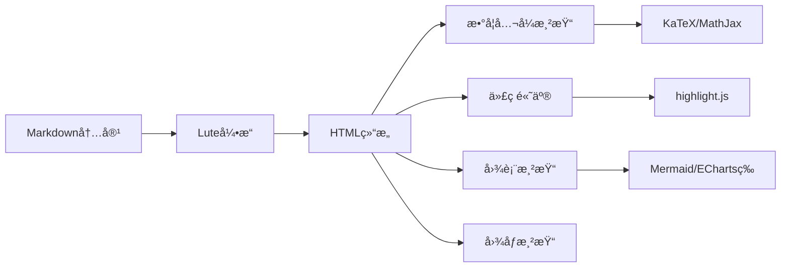

好的Bossï¼æˆ‘使用MCPæ¥æŸ¥çœ‹Vditor的详细信æ¯ã€‚

[2 tools called]

好的Bossï¼æˆ‘å·²ç»é€šè¿‡MCP查看了Vditor的完整文档。让我为您详细介ç»Vditor的功能ã€é›†æˆæ–¹å¼ä»¥åŠè‡ªå®šä¹‰æ¥å£ã€‚

## 📋 Vditor 核心功能总结

### 🨠**三ç§ç¼–辑模å¼**

| æ¨¡å¼ | 特点 | 适用场景 |
|------|------|---------|
| **WYSIWYG** (所è§å³æ‰€å¾—) | Markdown语法éšè—,ç›´æ¥æ˜¾ç¤ºæ¸²æŸ“ç»“æœ | 喜欢富文本编辑,想看到最终效æœçš„用户 |
| **IR** (å³æ—¶æ¸²æŸ“) | 类似Typora,显示Markdown语法但åŒæ—¶æ¸²æŸ“ | 想看格å¼ä½†åˆæƒ³ä¿ç•™Markdown语法的用户 |
| **SV** (分å±æ¨¡å¼) | ç»å…¸å·¦å³åˆ†å±,左侧Markdownæºç ,å³ä¾§é¢„览 | 喜欢传统Markdown编辑器的用户 |

### ⭠**核心渲染能力**



**支æŒçš„特殊内容类å‹:**
- ✅ **数学公å¼**: KaTeX (快速) 或 MathJax (功能全é¢)
- ✅ **代ç é«˜äº®**: 支æŒ36+主题,å¯æ˜¾ç¤ºè¡Œå·
- ✅ **图表**: Mermaid, Flowchart, ECharts, Mindmap
- ✅ **科学图形**: GraphViz, PlantUML, ABC音ä¹è®°è°±
- ✅ **化学å¼**: SMILES渲染

---

## ğŸ› ï¸ é›†æˆæ–¹å¼

### **æ–¹å¼ä¸€: NPM安装 (æ¨è)**

```bash
npm install vditor
```

```javascript
import Vditor from 'vditor';
import 'vditor/dist/index.css';

const vditor = new Vditor('vditor', {
  height: 500,
  mode: 'ir',  // wysiwyg | ir | sv
  placeholder: '开始写作...',
  toolbar: ['emoji', 'headings', 'bold', 'italic', 'link'],
  upload: {
    url: '/api/upload'
  }
});
```

### **æ–¹å¼äºŒ: CDN引入**

```html
<!DOCTYPE html>
<html>
<head>
  <link rel="stylesheet" href="https://cdn.jsdelivr.net/npm/vditor/dist/index.css" />
  <script src="https://cdn.jsdelivr.net/npm/vditor/dist/index.min.js"></script>
</head>
<body>
  <div id="vditor"></div>
  <script>
    const vditor = new Vditor('vditor', {
      height: 600,
      mode: 'wysiwyg'
    });
  </script>
</body>
</html>
```

### **æ–¹å¼ä¸‰: Vue集æˆ**

```vue
<template>
  <div id="vditor"></div>
</template>

<script setup>
import { onMounted, onBeforeUnmount, ref } from 'vue'
import Vditor from 'vditor'
import 'vditor/dist/index.css'

const vditor = ref(null)

onMounted(() => {
  vditor.value = new Vditor('vditor', {
    height: 500,
    mode: 'ir',
    after: () => {
      vditor.value.setValue('## Hello Vditor!')
    }
  })
})

onBeforeUnmount(() => {
  vditor.value?.destroy()
})
</script>
```

---

## 🔧 自定义æ¥å£è¯¦è§£

### **1. 工具æ è‡ªå®šä¹‰**

```javascript
const vditor = new Vditor('vditor', {
  toolbar: [
    'emoji',
    'headings',
    'bold',
    'italic',
    '|',  // 分隔符
    'list',
    'ordered-list',
    {
      name: 'more',
      toolbar: [  // 二级èœå•
        'fullscreen',
        'preview',
        'help'
      ]
    },
    {
      name: 'custom-button',
      icon: '<svg>...</svg>',
      tip: '自定义按钮',
      click: (vditor) => {
        // 自定义逻辑
        console.log('自定义按钮点击')
      }
    }
  ]
})
```

### **2. 文件上传自定义**

```javascript
const vditor = new Vditor('vditor', {
  upload: {
    url: '/api/upload/editor',
    accept: 'image/*,.mp3,.wav,.zip',
    token: 'your-auth-token',
    
    // 文件å处ç†
    filename(name) {
      return name.replace(/[^(a-zA-Z0-9\u4e00-\u9fa5\.)]/g, "")
    },
    
    // 自定义上传处ç†å™¨
    handler(files) {
      // 完全自定义上传逻辑
      console.log('上传文件:', files)
      // è¿”å› true 或错误信æ¯å­—符串
      return true
    },
    
    // 自定义验è¯
    validate(files) {
      // 自定义验è¯é€»è¾‘
      return true  // 或错误信æ¯
    },
    
    // æ ¼å¼åŒ–æœåŠ¡å™¨å“应
    format(files, responseText) {
      const response = JSON.parse(responseText)
      return {
        code: 0,
        data: {
          succMap: {
            'file.jpg': 'https://example.com/file.jpg'
          }
        }
      }
    },
    
    // æˆåŠŸå›è°ƒ
    success(editor, responseText) {
      console.log('上传æˆåŠŸ:', responseText)
    },
    
    // 错误å›è°ƒ
    error(errorMessage) {
      console.error('上传失败:', errorMessage)
    }
  }
})
```

### **3. æ示/自动完æˆæ‰©å±•**

```javascript
const vditor = new Vditor('vditor', {
  hint: {
    // 自定义emoji
    emoji: {
      "smile": "😊",
      "heart": "â¤ï¸"
    },
    
    // 扩展自定义æ示
    extend: [
      {
        key: "@",  // 触å‘字符
        hint: (searchTerm) => {
          // 模拟用户æœç´¢
          const users = ['Alice', 'Bob', 'Charlie']
          return users
            .filter(u => u.toLowerCase().includes(searchTerm.toLowerCase()))
            .map(u => ({
              value: `@${u}`,
              html: ` ${u}`
            }))
        }
      },
      {
        key: "#",  // 标签æ示
        hint: (searchTerm) => {
          const tags = ['å‰ç«¯', 'å端', 'Vue', 'React']
          return tags
            .filter(t => t.includes(searchTerm))
            .map(t => ({
              value: `#${t}`,
              html: `<span class="tag">#${t}</span>`
            }))
        }
      }
    ],
    
    parse: true,  // 是å¦è§£ææ’入的内容为Markdown
    delay: 200    // 延迟显示(ms)
  }
})
```

### **4. 主题自定义**

```javascript
const vditor = new Vditor('vditor', {
  // 编辑器主题
  theme: 'dark',  // 'dark' | 'classic'
  
  preview: {
    // 内容主题
    theme: {
      current: 'light',
      list: {
        'light': '浅色主题',
        'dark': '深色主题',
        'custom': '自定义主题'
      },
      path: 'https://example.com/themes'  // 主题CSS路径
    },
    
    // 代ç é«˜äº®ä¸»é¢˜
    hljs: {
      enable: true,
      style: 'github',  // 36+主题å¯é€‰
      lineNumber: true,  // 显示行å·
      defaultLang: 'javascript'
    }
  }
})

// 动æ€åˆ‡æ¢ä¸»é¢˜
Vditor.setCodeTheme('dracula')
Vditor.setContentTheme('dark', 'https://example.com/themes')
```

### **5. 渲染器自定义**

```javascript
const vditor = new Vditor('vditor', {
  preview: {
    markdown: {
      toc: true,           // 生æˆç›®å½•
      mark: true,          // ==标记==
      footnotes: true,     // 脚注
      autoSpace: true,     // 中英文之间自动空格
      fixTermTypo: true,   // 修正术语拼写
      chinesePunct: true,  // 矫正标点
      inlineMathDigit: false, // 行内数字转数学公å¼
      linkBase: '/',       // 链æ¥åŸºç¡€è·¯å¾„
      listStyle: true      // 列表样å¼
    },
    
    math: {
      engine: 'KaTeX',  // 'KaTeX' | 'MathJax'
      inlineDigit: false,
      macros: {
        '\\RR': '\\mathbb{R}'  // 自定义å®
      }
    }
  }
})
```

### **6. 核心API方法**

```javascript
// 内容管ç†
vditor.getValue()           // è·å–Markdown
vditor.getHTML()            // è·å–HTML
vditor.setValue('# Hello')  // 设置内容
vditor.insertValue('text')  // æ’入文本

// 模å¼æ§åˆ¶
vditor.getCurrentMode()     // è·å–当å‰æ¨¡å¼
vditor.setMode('ir')        // 切æ¢æ¨¡å¼

// UIæ§åˆ¶
vditor.focus()              // èšç„¦
vditor.blur()               // 失焦
vditor.disabled()           // ç¦ç”¨
vditor.enable()             // å¯ç”¨

// 渲染æ§åˆ¶
vditor.renderPreview()      // 渲染预览

// 工具方法
vditor.getCursorPosition()  // è·å–光标ä½ç½®
vditor.getSelection()       // è·å–选中内容
vditor.clearCache()         // 清除缓存
vditor.destroy()            // 销æ¯å®ä¾‹

// é™æ€æ–¹æ³• (无需å®ä¾‹)
Vditor.md2html(markdown, options)  // Markdown转HTML
Vditor.preview(element, markdown, options)  // 预览渲染
```

---

## 📦 完整é…置示例

```javascript
const vditor = new Vditor('vditor', {
  // 基础é…ç½®
  height: 600,
  width: '100%',
  placeholder: '开始创作...',
  mode: 'ir',  // wysiwyg | ir | sv
  
  // 工具æ 
  toolbar: ['emoji', 'headings', 'bold', 'italic', '|', 'list', 'ordered-list'],
  
  // 计数器
  counter: {
    enable: true,
    type: 'text'  // 'markdown' | 'text'
  },
  
  // 大纲
  outline: {
    enable: true,
    position: 'right'  // 'left' | 'right'
  },
  
  // 打字机模å¼
  typewriterMode: true,
  
  // 缓存
  cache: {
    enable: true,
    id: 'vditor-cache'
  },
  
  // 预览
  preview: {
    delay: 1000,
    mode: 'both',  // 'both' | 'editor'
    markdown: { toc: true, mark: true },
    math: { engine: 'KaTeX' },
    hljs: { style: 'github', lineNumber: true }
  },
  
  // 上传
  upload: {
    url: '/api/upload',
    max: 10 * 1024 * 1024,  // 10MB
    accept: 'image/*'
  },
  
  // æ示
  hint: {
    extend: [/* ... */]
  },
  
  // å›è°ƒ
  after: () => {
    console.log('编辑器åˆå§‹åŒ–完æˆ')
  },
  input: (value) => {
    console.log('内容å˜åŒ–:', value)
  },
  focus: (value) => {
    console.log('èšç„¦')
  },
  blur: (value) => {
    console.log('失焦')
  }
})
```
æ¾é›†æˆåˆ°æ‚¨çš„项目中

