我来用 Mermaid 为你绘制详细的架构图和数据流图。

## LLM 翻译系统 Mermaid 架构图

### 1. **系统整体架构图**

```mermaid
graph TB
    subgraph Frontend["🖥️ 前端渲染进程 (Vue 3)"]
        HomePage["HomePage.vue<br/>(配置+创建)"]
        TaskManage["TaskManagePage.vue<br/>(进度+管理)"]
        ExportPage["ExportPage.vue<br/>(结果导出)"]
        Store["Pinia Store<br/>(translate.store)"]
        Composables["Composables<br/>useTaskManagement<br/>useBatchManagement<br/>useExportService"]
    end

    subgraph IPCLayer["🔗 IPC 通信层"]
        Handlers["IPC Handlers<br/>(llm-translate-handlers.ts)<br/>22+ 事件广播<br/>18+ Handler 接口"]
    end

    subgraph ElectronMain["⚙️ Electron 主进程 (服务层)"]
        LlmService["LlmTranslateService<br/>(核心服务)"]
        TransExec["TranslationExecutor<br/>(任务队列+并发)"]
        TaskState["TaskStateManager<br/>(状态管理)"]
        ExportSvc["ExportService<br/>(导出)"]
        BatchSched["BatchScheduler<br/>(批次调度)"]
    end

    subgraph DataLayer["💾 数据持久化层"]
        DB["SQLite ProjectDB<br/>Llmtranslate_batches<br/>Llmtranslate_tasks<br/>Llmtranslate_stats"]
    end

    subgraph LLMLayer["🤖 LLM 调用层"]
        LlmChat["LlmChatService<br/>(本地LLM/API)"]
        LlmClient["LlmTranslationClient<br/>(流式翻译)"]
    end

    HomePage -->|config| Store
    TaskManage -->|batch/task ops| Store
    ExportPage -->|export ops| Store
    Composables -->|state mutations| Store
    
    Store -->|IPC invoke| Handlers
    HomePage -->|IPC listen| Handlers
    TaskManage -->|IPC listen| Handlers
    ExportPage -->|IPC listen| Handlers
    
    Handlers -->|dispatch| LlmService
    Handlers -->|dispatch| TransExec
    Handlers -->|dispatch| ExportSvc
    
    LlmService -->|manage| DB
    LlmService -->|control| TransExec
    LlmService -->|track| TaskState
    LlmService -->|broadcast events| Handlers
    
    TransExec -->|execute| LlmClient
    TransExec -->|update state| TaskState
    
    TaskState -->|sync| DB
    TaskState -->|emit events| LlmService
    
    LlmClient -->|call| LlmChat
    LlmChat -->|stream response| LlmClient
    
    Handlers -->|broadcast| Frontend
    
    style Frontend fill:#e1f5ff
    style IPCLayer fill:#fff3e0
    style ElectronMain fill:#f3e5f5
    style DataLayer fill:#e8f5e9
    style LLMLayer fill:#fce4ec
```



---

### 2. **创建批次流程序列图**

```mermaid
sequenceDiagram
    actor User
    participant FE as Frontend<br/>(HomePage.vue)
    participant Store as Pinia Store
    participant DS as DataSource
    participant IPC as Electron IPC
    participant Handler as IPC Handler
    participant Service as LlmTranslateService
    participant DB as SQLite DB

    User->>FE: 输入配置，点击"创建批次"
    FE->>Store: store.createBatch(config)
    
    Store->>DS: datasource.createBatch(config)
    DS->>IPC: window.nimbria.llmTranslate.createBatch()
    Note over IPC: 序列化 config 为纯对象
    
    IPC->>Handler: ipcMain.handle('llm-translate:create-batch')
    
    Handler->>Service: llmTranslateService.createBatch(config, content)
    
    par 后端异步处理
        Service->>Service: 生成 batchId (#20250120)
        Service->>Service: 分块处理 content
        Service->>Service: 生成 Task 列表
        Service->>Service: 估算每个 Task Token
        
        Service->>DB: INSERT INTO Llmtranslate_batches
        Service->>DB: INSERT INTO Llmtranslate_tasks (N rows)
        
        Service->>Service: emit('batch:created', event)
    end
    
    Note over Handler: 轮询等待 5 秒
    Service-->>Handler: batchId
    Handler->>DB: SELECT * FROM Llmtranslate_batches WHERE id=batchId
    
    Handler-->>IPC: { success: true, data: { batch } }
    
    IPC-->>DS: 返回 batch 对象
    DS-->>Store: batch 数据
    
    Store->>Store: batchList.push(batch)
    Store-->>FE: 状态更新
    
    FE->>FE: 重新渲染显示新批次
    User->>User: 看到创建成功
```



---

### 3. **任务提交与执行流程序列图**

```mermaid
sequenceDiagram
    actor User
    participant FE as Frontend<br/>(TaskManagePage)
    participant Store as Pinia Store
    participant IPC as Electron IPC
    participant Handler as IPC Handler
    participant Service as LlmTranslateService
    participant TransExec as TranslationExecutor
    participant TaskState as TaskStateManager
    participant LlmClient as LlmTranslationClient
    participant LlmChat as LlmChatService
    participant DB as SQLite DB

    User->>FE: 选择任务，点击"提交"
    FE->>Store: store.submitTasks(selectedTaskIds)
    
    Store->>IPC: window.nimbria.llmTranslate.submitTasks()
    IPC->>Handler: ipcMain.handle('llm-translate:submit-tasks')
    
    Handler->>Service: llmTranslateService.submitTasks(batchId, taskIds)
    
    Service->>Service: 生成 submissionId
    Service->>Service: emit('task:submit-start')
    
    Note over Service: 异步执行，立即返回
    
    par 后端异步执行
        Service->>TransExec: executeTasks(batchId, taskIds, config, concurrency)
        
        loop 启动 N 个 Worker (N = concurrency)
            TransExec->>TransExec: worker(batchId, config)
            
            loop FIFO 队列处理
                TransExec->>TransExec: 从队列取 taskId
                
                TransExec->>TransExec: runTask(taskId)
                
                TransExec->>TaskState: updateState('sending')
                TaskState->>TaskState: emit('task:state-changed')
                
                TransExec->>LlmClient: executeTranslation(task)
                
                LlmClient->>LlmChat: chat(systemPrompt, content)
                LlmChat-->>LlmClient: stream<br/>(Token 流)
                
                loop 监听流事件 (每个 Token)
                    LlmClient->>LlmClient: 累积 translation
                    LlmClient->>LlmClient: 计算 progress %
                    
                    LlmClient->>TaskState: updateProgress()
                    TaskState->>TaskState: emit('task:progress-updated')<br/>(节流 100ms)
                    
                    TaskState->>Service: 转发事件
                    Service->>Service: emit('task:progress', data)
                    Service->>Handler: 事件监听器触发
                    
                    Handler->>IPC: BrowserWindow.send('llm-translate:task-progress')
                    IPC-->>FE: 实时进度事件
                    FE->>Store: 更新进度
                    FE->>FE: 实时渲染 progress bar
                end
                
                Note over LlmClient: 流结束，计算总成本
                LlmClient->>DB: UPDATE Llmtranslate_tasks<br/>translation, tokens, cost, status=completed
                LlmClient->>DB: UPDATE Llmtranslate_batches<br/>completed_tasks++, total_cost+=cost
                
                LlmClient->>Service: emit('task:complete')
                Service->>Handler: 事件监听器触发
                Handler->>IPC: BrowserWindow.send('llm-translate:task-complete')
                IPC-->>FE: 任务完成事件
                FE->>Store: 更新任务状态
                FE->>FE: 重新渲染表格
            end
        end
        
        Service->>Service: 所有 Worker 完成
        Service->>Service: emit('scheduler:completed')
    end
    
    Handler-->>IPC: 立即返回 { success: true, data: { submissionId } }
    IPC-->>Store: 返回结果
    FE->>User: 显示"任务已提交"
```



---

### 4. **事件驱动广播 (多窗口同步)**

```mermaid
sequenceDiagram
    participant Worker as Worker Process<br/>(LLM 执行)
    participant Service as LlmTranslateService
    participant Handler as Event Listeners<br/>(ipc handlers)
    participant Win1 as Window 1<br/>(渲染进程)
    participant Win2 as Window 2<br/>(渲染进程)
    participant Store as Pinia Store<br/>(共享状态)

    Worker->>Service: emit('task:progress', {taskId, progress})
    
    Service->>Handler: llmTranslateService.on('task:progress')
    
    Handler->>Win1: win1.webContents.send('llm-translate:task-progress')
    Handler->>Win2: win2.webContents.send('llm-translate:task-progress')
    
    Note over Win1,Win2: 多个窗口同时收到
    
    Win1->>Store: store.updateProgress(data)
    Win2->>Store: store.updateProgress(data)
    
    Note over Store: Pinia 状态单一真实来源
    
    Store->>Win1: 触发 reactivity
    Store->>Win2: 触发 reactivity
    
    Win1->>Win1: 重新渲染 UI
    Win2->>Win2: 重新渲染 UI
    
    Note over Win1,Win2: 两个窗口显示同步的数据
```



---

### 5. **数据库表结构关系图**

```mermaid
erDiagram
    LLMTRANSLATE_BATCHES ||--o{ LLMTRANSLATE_TASKS : contains
    LLMTRANSLATE_BATCHES ||--o| LLMTRANSLATE_STATS : has

    LLMTRANSLATE_BATCHES {
        string id PK
        string status
        string config_json
        int total_tasks
        int completed_tasks
        int failed_tasks
        int throttled_tasks
        int waiting_tasks
        int unsent_tasks
        real total_cost
        int total_input_tokens
        int total_output_tokens
        timestamp created_at
        timestamp started_at
        timestamp completed_at
        timestamp updated_at
    }

    LLMTRANSLATE_TASKS {
        string id PK
        string batch_id FK
        string status
        string content
        string translation
        int input_tokens
        int reply_tokens
        int predicted_tokens
        real progress
        string error_message
        string error_type
        int retry_count
        real cost
        string metadata_json
        timestamp created_at
        timestamp sent_time
        timestamp reply_time
        timestamp updated_at
    }

    LLMTRANSLATE_STATS {
        string batch_id PK-FK
        string fastest_task_id
        real fastest_time
        string slowest_task_id
        real slowest_time
        timestamp updated_at
    }
```

---

### 6. **状态机：任务生命周期**

```mermaid
stateDiagram-v2
    [*] --> unsent: 创建任务
    
    unsent --> waiting: 提交任务
    unsent --> [*]: 删除任务
    
    waiting --> sending: 开始发送到 LLM
    waiting --> error: 网络错误
    waiting --> throttled: 触发限流
    
    sending --> completed: LLM 返回结果
    sending --> error: 连接中断
    sending --> throttled: API 限流
    
    throttled --> waiting: 恢复
    throttled --> error: 重试失败
    
    error --> waiting: 手动重试
    error --> [*]: 删除任务
    
    completed --> [*]: 导出或删除
    
    note right of waiting
        等待发送
        Task 在队列中
    end note
    
    note right of sending
        流式接收中
        累积 translation
        实时更新进度
    end note
    
    note right of throttled
        API 限流
        等待恢复
    end note
    
    note right of completed
        任务完成
        已保存到数据库
    end note
```



---

### 7. **批次生命周期**

```mermaid
stateDiagram-v2
    [*] --> running: 创建批次
    
    running --> paused: 暂停
    running --> completed: 所有任务完成
    running --> failed: 批次异常
    
    paused --> running: 恢复
    paused --> completed: 完成暂停的任务
    paused --> failed: 继续出错
    
    completed --> [*]: 导出或删除
    failed --> running: 重试失败任务
    failed --> [*]: 删除批次
    
    note right of running
        任务执行中
        Worker 并发处理
        实时流式进度
    end note
    
    note right of paused
        暂时停止
        可恢复执行
    end note
    
    note right of completed
        所有任务完成
        可导出结果
    end note
```



---

### 8. **数据流完整链路图**

```mermaid
graph LR
    subgraph Input["📥 输入"]
        File["文件上传"]
        Text["文本输入"]
    end

    subgraph Config["⚙️ 配置"]
        Model["选择模型"]
        Prompt["系统提示词"]
        Chunk["分块策略"]
        Concur["并发数"]
    end

    subgraph Frontend["🖥️ 前端"]
        UI["HomePage.vue"]
        Store["Pinia Store"]
    end

    subgraph Backend["⚙️ 后端服务"]
        Batch["创建 Batch"]
        Split["内容分块"]
        Token["Token 估算"]
        Task["生成 Task"]
    end

    subgraph Execution["🚀 执行"]
        Queue["任务队列<br/>FIFO"]
        Exec["TranslationExecutor<br/>N 并发 Worker"]
        Stream["流式处理<br/>Token 累积"]
    end

    subgraph LLM["🤖 LLM"]
        Chat["LlmChatService<br/>本地或 API"]
        Resp["流式响应<br/>Token 流"]
    end

    subgraph Processing["📊 数据处理"]
        Progress["进度计算<br/>动态更新"]
        Tokens["Token 统计<br/>输入/输出"]
        Cost["成本计算"]
    end

    subgraph Storage["💾 存储"]
        Cache["内存缓存<br/>TaskStateManager"]
        DB["SQLite DB<br/>持久化"]
    end

    subgraph Output["📤 输出"]
        Export["导出结果<br/>JSON/CSV/XLSX"]
        Display["实时显示<br/>前端更新"]
    end

    Input --> Config
    Config --> Frontend
    
    Frontend --> Backend
    
    Backend --> Batch
    Batch --> Split
    Split --> Token
    Token --> Task
    Task --> Execution
    
    Execution --> Queue
    Queue --> Exec
    Exec --> Stream
    
    Stream --> LLM
    LLM --> Chat
    Chat --> Resp
    Resp --> Processing
    
    Processing --> Progress
    Processing --> Tokens
    Processing --> Cost
    
    Progress --> Storage
    Tokens --> Storage
    Cost --> Storage
    
    Storage --> Cache
    Cache --> DB
    
    DB --> Output
    DB --> Export
    Cache --> Display
    
    Display --> Output

    style Input fill:#e3f2fd
    style Config fill:#f3e5f5
    style Frontend fill:#e1f5ff
    style Backend fill:#fff3e0
    style Execution fill:#fce4ec
    style LLM fill:#f3e5f5
    style Processing fill:#e8f5e9
    style Storage fill:#fce4ec
    style Output fill:#c8e6c9
```



---

### 9. **并发控制与队列处理**

```mermaid
graph TB
    subgraph Control["🎮 并发控制"]
        Concur["concurrency: 3"]
        Queue["taskQueue: [T1, T2, T3, T4, T5...]"]
        Workers["Worker 1, Worker 2, Worker 3"]
    end

    subgraph Worker1["👷 Worker 1"]
        T1["取任务 T1"]
        Run1["执行 T1"]
        Next1["T1 完成<br/>回队列取 T4"]
    end

    subgraph Worker2["👷 Worker 2"]
        T2["取任务 T2"]
        Run2["执行 T2"]
        Next2["T2 完成<br/>回队列取 T5"]
    end

    subgraph Worker3["👷 Worker 3"]
        T3["取任务 T3"]
        Run3["执行 T3"]
        Next3["T3 完成<br/>等待队列"]
    end

    Concur --> Workers
    Queue --> Worker1
    Queue --> Worker2
    Queue --> Worker3

    Worker1 --> T1 --> Run1 --> Next1
    Worker2 --> T2 --> Run2 --> Next2
    Worker3 --> T3 --> Run3 --> Next3

    Next1 -->|回队列| Queue
    Next2 -->|回队列| Queue
    Next3 -->|回队列| Queue

    style Control fill:#fff3e0
    style Worker1 fill:#c8e6c9
    style Worker2 fill:#c8e6c9
    style Worker3 fill:#c8e6c9
```



---

### 10. **IPC 通信通道映射**

```mermaid
graph LR
    subgraph Invoke["📤 Invoke (请求-响应)"]
        I1["createBatch"]
        I2["getBatches"]
        I3["getTasks"]
        I4["submitTasks"]
        I5["pauseBatch"]
        I6["exportBatch"]
        I7["deleteBatch"]
    end

    subgraph Events["📨 Events (单向广播)"]
        E1["batch:created"]
        E2["task:progress"]
        E3["task:complete"]
        E4["task:error"]
        E5["batch:paused"]
        E6["scheduler:throttled"]
        E7["export:complete"]
    end

    subgraph Frontend["🖥️ 前端监听"]
        L1["store.updateBatch()"]
        L2["store.updateTaskProgress()"]
        L3["store.markTaskComplete()"]
        L4["store.markTaskError()"]
        L5["store.pauseBatch()"]
        L6["UI: 显示限流"]
        L7["UI: 下载导出文件"]
    end

    subgraph Throttle["⏱️ 节流机制"]
        T1["进度更新节流<br/>100ms"]
        T2["事件节流<br/>防止过度更新"]
    end

    I1 -.-> Invoke
    I2 -.-> Invoke
    I3 -.-> Invoke
    I4 -.-> Invoke
    I5 -.-> Invoke
    I6 -.-> Invoke
    I7 -.-> Invoke

    E1 --> L1
    E2 --> L2
    E3 --> L3
    E4 --> L4
    E5 --> L5
    E6 --> L6
    E7 --> L7

    E2 --> T1
    E2 --> T2

    style Invoke fill:#bbdefb
    style Events fill:#c8e6c9
    style Frontend fill:#ffe0b2
    style Throttle fill:#f8bbd0
```



---

这些 Mermaid 图表全面展示了：
- 🏗️ **系统架构**：分层设计、组件关系
- ⏱️ **时序流程**：创建、执行、广播的完整流程
- 📊 **数据结构**：数据库表的关系
- 🔄 **状态管理**：任务和批次的生命周期
- 🚀 **并发控制**：队列处理和 Worker 机制
- 🔌 **IPC 通信**：invoke 和 events 的双通道模式

你可以复制这些代码到 Mermaid 编辑器或集成到文档中。